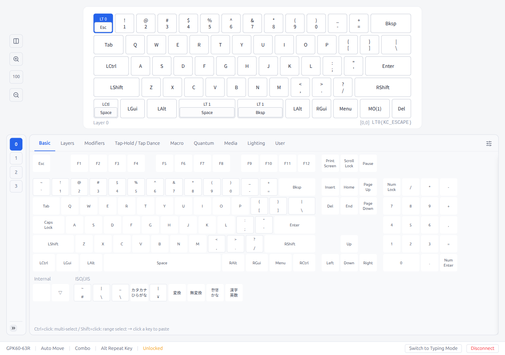

# Pipette

Refining the way you interact with your Vial-powered keyboards.

Pipette is an independent, Electron-based keymap editor compatible with [Vial](https://get.vial.today/).  \
Communicates with Vial keyboards via USB HID to configure keymaps, macros, lighting, and more.

[](https://www.electronjs.org/)
[](https://react.dev/)
[](https://www.typescriptlang.org/)
[](https://tailwindcss.com/)
[](https://vitejs.dev/)
[](https://vitest.dev/)
[](https://playwright.dev/)
[](https://pnpm.io/)

## Screenshot

<p align="center">
  
</p>

## Installation

Download the latest release for your platform:

- **Windows (x64)**  
  https://github.com/darakuneko/pipette-desktop/releases/latest/download/Pipette-win-x64.exe

- **macOS (Apple Silicon)**  
  https://github.com/darakuneko/pipette-desktop/releases/latest/download/Pipette-mac-arm64.dmg

- **Linux (x86_64 AppImage)**  
  https://github.com/darakuneko/pipette-desktop/releases/latest/download/Pipette-linux-x86_64.AppImage

> Linux users: make the AppImage executable before launching.
> ```bash
> chmod +x Pipette-linux-x86_64.AppImage
> ```

---

### Distribution Policy

Pipette is officially distributed only as an AppImage on Linux.

We do not provide or document distro-specific packages (.deb, .rpm, AUR, Flatpak, Snap, etc.) in order to keep the maintenance and support scope focused on the AppImage release.

Community-maintained packages may exist, but they are not officially supported.

## Usage

### Quick Start

1.  Connect your Vial-compatible keyboard via USB.
2.  Launch Pipette.
3.  The keyboard will be detected automatically.
4.  Select a layer and start editing key assignments.

### Detailed Guide

For complete instructions with screenshots:

-   [Operation Guide](docs/OPERATION-GUIDE.md)


## Features

### Keyboard Configuration

- **Keymap Editor** — Layer-based key assignment with drag & drop, auto-advance, and a searchable keycode palette with Mod Mask/Mod-Tap wrapper modes
- **Layout Editor** — Physical layout switching via slide-out panel (split backspace, bottom row variants, etc.)
- **Tap Dance** — Multi-tap key behaviors (tap, hold, double-tap, tap+hold, custom tapping term) with inline favorites
- **Combo** — Simultaneous key-press to trigger output keys; 2-screen flow (tile grid → detail editor with inline favorites)
- **Key Override** — Replace key output when specific modifiers are held; 2-screen flow with inline favorites
- **Alternate Repeat Key** — Context-aware alternate repeat key bindings; 2-screen flow with inline favorites
- **Macro Editor** — Create and record macros with text, tap, hold, release, and delay actions (v1/v2 protocol) with inline favorites
- **RGB Lighting** — QMK Backlight, RGBLight, and VialRGB configuration
- **QMK Settings** — Dynamic firmware settings with boolean/integer fields
- **Matrix Tester** — Real-time key switch verification (20 ms polling)

### Data Management

- **Snapshots** — Save and restore complete keyboard states (keymap, macros, dynamic entries, QMK settings)
- **Favorites** — Inline favorites panel in every editor for saving/loading reusable configurations; not tied to a specific keyboard, so saved entries can be loaded on any compatible keyboard. Per-entry export, bulk import/export supported
- **Data Modal** — Centralized favorite and Hub post management from the device selection screen
- **Export** — Download keymap as `.vil`, `.pipette`, `keymap.c`, or PDF cheat sheet
- **Import** — Load `.vil` files to restore keyboard state

### Cloud Sync (Google Drive appDataFolder)

Sync your snapshots, favorites, and per-keyboard settings across devices via [Google Drive appDataFolder](https://developers.google.com/workspace/drive/api/guides/appdata).  \
The appDataFolder is **not** regular Google Drive storage — it is a hidden, app-specific folder that only Pipette can access. Your personal Drive files are never touched.

See [Data Guide](docs/Data.md) for details on what is synced and how your data is protected.

### Pipette Hub

Upload and share your keymaps on [Pipette Hub](https://pipette-hub-worker.keymaps.workers.dev), a community keymap gallery.

See [Data Guide](docs/Data.md) for details on how Hub authentication works.

### Utilities

- **Typing Test** — Built-in typing test with WPM/accuracy tracking, downloadable language packs, and per-keyboard history
- **Multilingual UI** — Multiple languages supported; selectable in Settings
- **Light / Dark / System theme**
- **Keyboard layout override** (QWERTY, Dvorak, etc.) for correct label display
- **Configurable panel side** (left / right)
- **Auto-lock timer**

## Setup

```bash
pnpm install
```

## Development

```bash
pnpm dev          # Start Electron dev server
pnpm build        # Production build
pnpm test         # Run tests
pnpm test:watch   # Tests (watch mode)
pnpm lint         # ESLint
pnpm format       # Prettier
```

## Build & Distribution

```bash
pnpm dist         # Package for all platforms
pnpm dist:linux   # Linux (AppImage)
pnpm dist:win     # Windows (NSIS installer)
pnpm dist:mac     # macOS (dmg)
```

### Linux: udev Rules

udev rules are required to access keyboards:

```bash
sudo cp scripts/99-vial.rules /etc/udev/rules.d/
sudo udevadm control --reload-rules && sudo udevadm trigger
```

## Architecture

Raw HID I/O runs in the **main process** via `node-hid`. Protocol logic runs in the **preload** layer and delegates HID I/O through IPC.

```
Main Process        — node-hid transport, CSP, file I/O, window management,
                      cloud sync, Hub API, snapshot/favorite stores
Preload (sandbox)   — IPC bridge, VIA/Vial protocol, Keyboard state
Renderer            — React UI (Tailwind CSS)
Shared              — Types, constants, IPC channels
```

## Data & Privacy

See the [Data Guide](docs/Data.md) for a complete guide on what data Pipette stores, how cloud sync works, and the security measures in place for external services.

## Donate

A cup of coffee keeps the commits coming ☕

[Amazon Wishlist](https://www.amazon.co.jp/hz/wishlist/ls/66VQJTRHISQT) | [Ko-fi](https://ko-fi.com/darakuneko)

## Contributing

Contributions are welcome! In particular:

- **Translations** — Add a locale JSON file to `src/renderer/i18n/locales/` and register it in `src/renderer/i18n/index.ts`.
  PRs for new languages or corrections to existing translations are appreciated.
- **Bug reports & feature requests** — Open an issue to let us know.

## Acknowledgments

Pipette is built upon the foundation laid by [Vial](https://get.vial.today/) and [Vial GUI](https://github.com/vial-kb/vial-gui).
The VIA/Vial protocol implementation, keyboard definition format, and overall design philosophy originate from these projects.
We are deeply grateful to the Vial team and contributors for making open-source keyboard configuration accessible to everyone.

The Typing Test feature is based on [Monkeytype](https://github.com/monkeytypegame/monkeytype) (GPL-3.0).
Thank you to the Monkeytype team for their excellent open-source typing test.

## License

[GPL-3.0-or-later](LICENSE)
