# Pipette Operation Guide

[日本語版はこちら](OPERATION-GUIDE.ja.md)

This document explains how to use the Pipette desktop application.
Screenshots were taken using the software-emulated GPK60-63R keyboard, displayed as "Virtual Keyboard", unless otherwise noted.

---

## Table of Contents

- [System Requirements](#system-requirements)
- [Feature Availability](#feature-availability)
- [1. Device Connection](#1-device-connection)
  - [1.1 Device Selection Screen](#11-device-selection-screen)
  - [1.2 Connecting a Keyboard](#12-connecting-a-keyboard)
  - [1.3 Data](#13-data)
  - [1.4 Analyze](#14-analyze)
- [2. Keymap Editor](#2-keymap-editor)
  - [2.1 Screen Layout](#21-screen-layout)
  - [2.2 Changing Keys](#22-changing-keys)
  - [2.3 Layer Switching](#23-layer-switching)
  - [2.4 Key Popover](#24-key-popover)
  - [2.5 Layout Options](#25-layout-options)
  - [2.6 View Matrix](#26-view-matrix)
- [3. Keycode Palette](#3-keycode-palette)
  - [3.1 Basic](#31-basic)
  - [3.2 Layers](#32-layers)
  - [3.3 Modifiers](#33-modifiers)
  - [3.4 System](#34-system)
  - [3.5 Lighting](#35-lighting)
  - [3.6 Tap-Hold / Tap Dance](#36-tap-hold--tap-dance)
  - [3.7 Macro](#37-macro)
  - [3.8 Combo](#38-combo)
  - [3.9 Key Override](#39-key-override)
  - [3.10 Alt Repeat Key](#310-alt-repeat-key)
  - [3.11 Behavior](#311-behavior)
  - [3.12 User](#312-user)
  - [3.13 Keyboard (Device Picker)](#313-keyboard-device-picker)
  - [3.14 Keycodes Overlay Panel](#314-keycodes-overlay-panel)
- [4. Toolbar](#4-toolbar)
  - [4.1 Zoom](#41-zoom)
  - [4.2 Undo / Redo (Keymap History)](#42-undo--redo-keymap-history)
  - [4.3 Typing Test](#43-typing-test)
- [5. Detail Setting Editors](#5-detail-setting-editors)
  - [5.1 Lighting Settings](#51-lighting-settings)
  - [5.2 Combo](#52-combo)
  - [5.3 Key Override](#53-key-override)
  - [5.4 Alt Repeat Key](#54-alt-repeat-key)
  - [5.5 Favorites](#55-favorites)
  - [5.6 JSON Editor](#56-json-editor)
- [6. Editor Settings Panel](#6-editor-settings-panel)
  - [6.1 Cloud Sync (Google Drive appDataFolder)](#61-cloud-sync-google-drive-appdatafolder)
  - [6.2 Key Labels Manage](#62-key-labels-manage)
  - [6.3 Language Packs Manage](#63-language-packs-manage)
  - [6.4 Theme Packs Manage](#64-theme-packs-manage)
  - [6.5 Zoom (UI Scale)](#65-zoom-ui-scale)
  - [6.6 Launch at Login / Stay in System Tray](#66-launch-at-login--stay-in-system-tray)
- [7. Pipette Hub](#7-pipette-hub)
  - [7.1 Hub Setup](#71-hub-setup)
  - [7.2 Uploading a Keymap](#72-uploading-a-keymap)
  - [7.3 Uploading Favorite Entries](#73-uploading-favorite-entries)
  - [7.4 Uploading Analytics](#74-uploading-analytics)
  - [7.5 Hub Website](#75-hub-website)
- [8. Modal Interactions](#8-modal-interactions)
  - [Escape to Close](#escape-to-close)
  - [Unlock Dialog Protection](#unlock-dialog-protection)
  - [Escape Suppression During Busy Flows](#escape-suppression-during-busy-flows)
- [9. Status Bar](#9-status-bar)

---

## System Requirements

Pipette's window has a minimum size of **1280×1024**, and defaults to **1440×1024** (or larger is recommended) on first launch.

It might feel a bit large — but keyboards are wide, so this is what it takes to work with them comfortably. Sorry!

---

## Feature Availability

What you can do depends on whether you connect a Google account. Editing and most local features work with no integration at all; signing in unlocks cross-device Cloud Sync, and connecting Pipette Hub additionally lets you share to the community.

| Feature | No Integration | Google Account Integration |
|---|:---:|:---:|
| Keymap / macro / tap-dance / combo / key-override / alt-repeat editing | ✅ | ✅ |
| RGB lighting · QMK settings · Matrix tester | ✅ | ✅ |
| Snapshots & Favorites (local save / load) | ✅ | ✅ |
| Import / Export (`.vil` · `.pipette` · `keymap.c` · PDF) | ✅ | ✅ |
| Offline editing (`.pipette` without a keyboard) | ✅ | ✅ |
| Typing Test & Typing View | ✅ | ✅ |
| Analyze — typing analytics (heatmaps · ergonomics · bigrams · layout comparison · per-app) | ✅ | ✅ |
| Download community language / theme / key-label packs from Hub | ✅ | ✅ |
| Cloud Sync — snapshots / favorites / settings across devices | ❌ | ✅ |
| Download remote-only keyboards on demand | ❌ | ✅ |
| Sync typing analytics across devices | ❌ | ✅ |
| Share keymaps to Hub | ❌ | ✅ (Hub) |
| Share favorites (tap dance · macro · combo · …) to Hub | ❌ | ✅ (Hub) |
| Share typing analytics to Hub | ❌ | ✅ (Hub) |
| Publish your own language / theme / key-label packs | ❌ | ✅ (Hub) |

> **Pipette Hub requires a connected Google account.** Rows marked **(Hub)** need Hub connected (set a Display Name in Settings → Data) in addition to Google sign-in. Cloud Sync also needs a sync encryption password. **Downloading community packs from Hub needs no sign-in at all.**

---

## 1. Device Connection

### 1.1 Device Selection Screen

When you launch the app, a list of connected Vial-compatible keyboards is displayed.

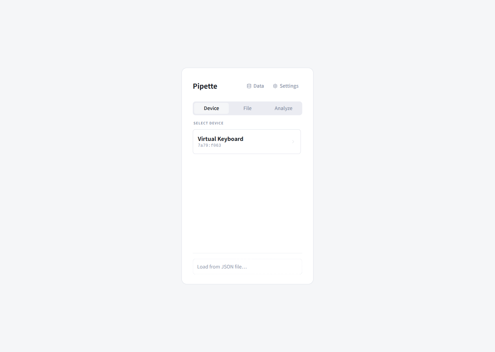

- USB-connected keyboards are automatically detected
- If multiple keyboards are connected, select one from the list
- On Linux, udev rules may need to be configured if no devices are found

**File Tab**

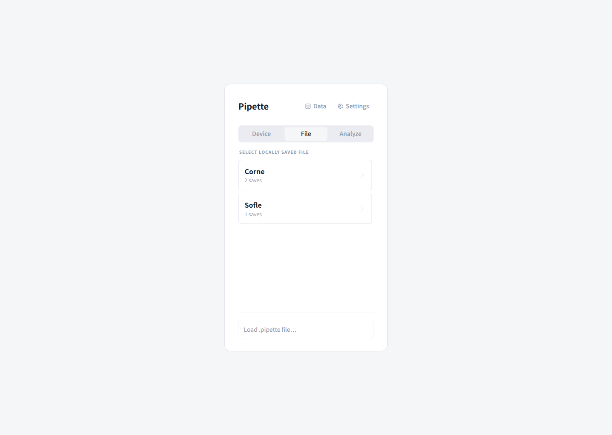

The File tab allows offline editing of `.pipette` files without a physical keyboard connected:

- Browse previously saved keyboards and select an entry to load
- Load an external `.pipette` file from disk
- A virtual keyboard is created from the embedded definition in the file
- An unsaved changes indicator is shown when edits have not been saved

> **Use case:** You want to tweak your keyboard's keymap, but the keyboard isn't with you right now. If you've previously saved its data, you can load it from the File tab, make your edits offline, and later connect the keyboard and load the modified data to apply your changes.

> **Tip — Save a shared file under your own name:** Load a community or shared `.pipette` file (for example, one downloaded from Pipette Hub or sent by a friend), then open the Save panel (§3.14) and use **Save Current State** to store it under a name of your choice. It joins your saved keyboards and becomes selectable as a **File** source in the Keyboard tab (§3.13) — even for hardware you don't own.

**Feature Availability: Device vs File Mode**

| Feature | Device (USB) | File (.pipette) |
|---------|:------------:|:---------------:|
| Keymap editing | Yes | Yes |
| Macro / Tap Dance editing | Yes | Yes |
| Combo / Key Override / Alt Repeat Key | Yes | Yes |
| QMK Settings | Yes (device) | Yes (local data) |
| Typing Test | Yes | Yes |
| Export (.vil / .c / .pdf) | Yes | Yes |
| Lighting control | Yes | No |
| Matrix Tester | Yes | No |
| Lock / Unlock | Yes | No |
| Snapshot save / load | Yes | Yes |
| Hub upload | Yes | Yes |
| JSON sideload | Yes | No |
| Device probe (Keyboard tab) | Yes | No |
| Cloud Sync | Yes | No |

### 1.2 Connecting a Keyboard

Click a keyboard name in the list to open the keymap editor. A connecting overlay shows loading progress while the keyboard data is read.

If Cloud Sync is configured, sync progress is also displayed during connection (favorites first, then keyboard-specific data).

### 1.3 Data

The Data button on the device selection screen opens the Data panel for centralized management of keyboards, favorites, sync data, and Hub posts.

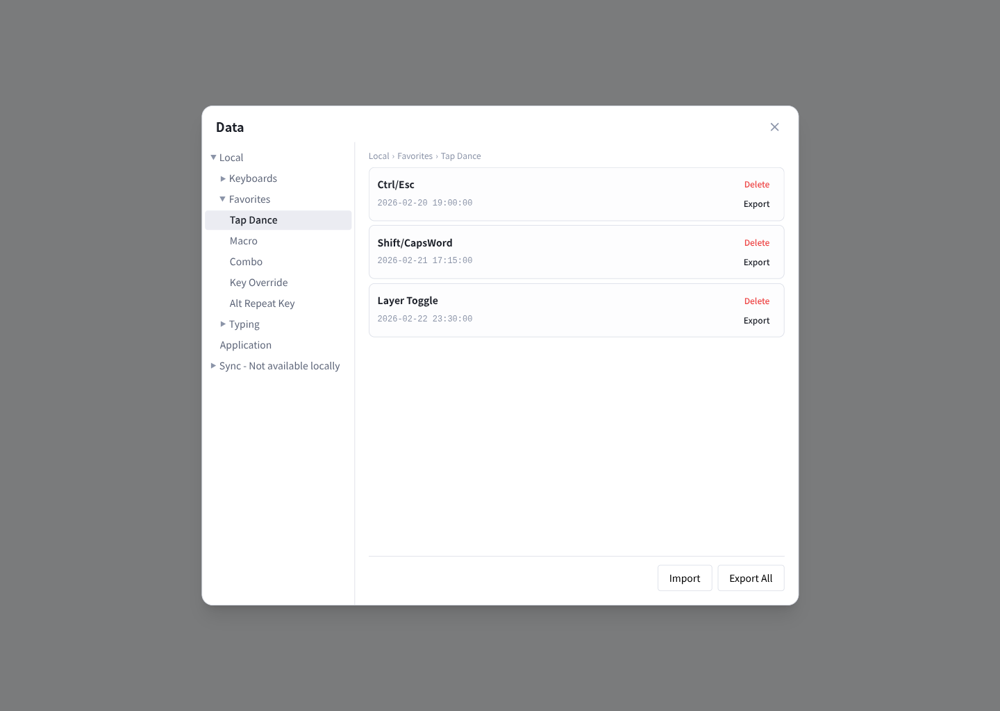

The left sidebar provides a **tree navigation** with the following structure:

- **Local**
  - **Keyboards**: Browse saved keyboard snapshots. Click a keyboard to view, load, export, or delete entries
  - **Typing**: Recorded typing-analytics data per keyboard — a per-day list (date, keystrokes, active time) with day selection for deleting, plus export / import of the recorded days
  - **Favorites**: Tap Dance, Macro, Combo, Key Override, Alt Repeat Key — each type shows its saved entries with rename, delete, export, and Hub actions
  - **Application**: Import/export local data, or reset application settings
- **Sync** (when Cloud Sync is configured): Lists keyboards that exist only in Google Drive (not yet downloaded on this device). Each entry is labeled with the keyboard's real name, resolved from the synced name index rather than from the raw UID. Click a remote-only keyboard to download it on demand — a spinner is shown while fetching, and a failure message appears inline if the download cannot complete. Once downloaded, the keyboard moves into the **Local › Keyboards** branch
  - **Cloud Data**: Reset targets that aren't tied to one keyboard — Favorites, Language Packs, Theme Packs, Key Labels, and imported Typing Test Texts. Only the targets actually present on Google Drive are listed. Each row has its own **Reset** button with a two-step confirmation (click Reset, then confirm or cancel); resetting removes that target's data from Google Drive only — local copies on this device are untouched, and a local copy that still exists re-uploads on the next sync (the same behavior Favorites already has). This is also where **Undecryptable Files** are listed and cleaned up: files that cannot be decrypted with the current password (e.g. encrypted with a forgotten previous password) appear as their own rows with a filename and a **Delete** button (two-step confirmation, one file at a time)
- **Hub** (when Hub is connected): Manage Hub posts grouped by keyboard name

Keyboards are shown by display name everywhere in this panel: on connect, a keyboard that has no saved name yet is automatically named from its USB product name, so even keyboards that never saved anything show a real name instead of a raw uid — including in the **Sync** list. Every keyboard list is sorted A–Z by display name (case-insensitive).

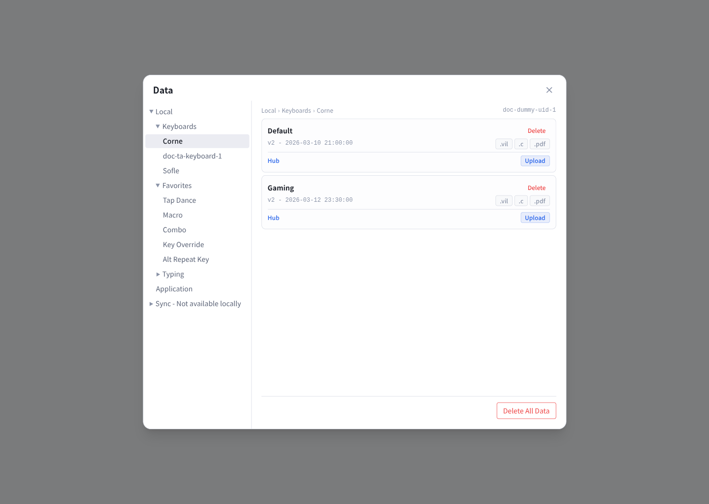

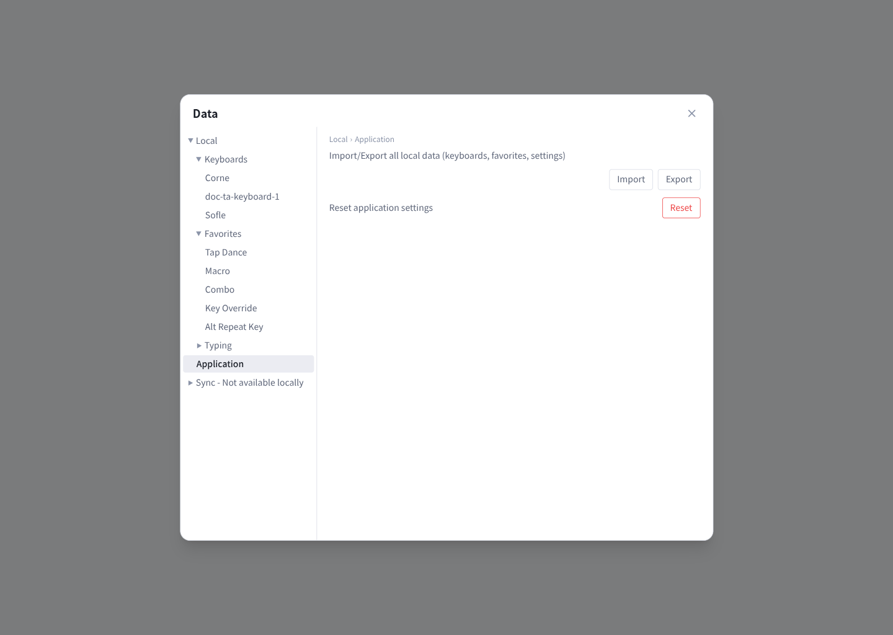

Per-entry actions in the favorites list:
- Click to rename, delete, or **Export** individual entries
- **Hub actions**: When Hub is connected, each entry shows **Upload to Hub** / **Update on Hub** / **Remove from Hub** buttons. Uploading opens a Public / Private confirmation dialog (§7.2)
- **Import** / **Export All** buttons at the footer for bulk operations

A **breadcrumb navigation** at the top of the content area shows the current path (e.g., "Local › Favorites › Tap Dance")

### 1.4 Analyze

The Analyze page shows how you actually type — per-key heatmaps, WPM trends, inter-keystroke intervals, hour-by-day activity, per-finger load, key-pair (bigram) timing, and per-layer usage. Data comes from two sources feeding the same stream: typing tests run in the editor are always recorded (each keystroke tagged with the test material and run), regardless of the Record toggle. Ambient (untagged) typing is recorded whenever the footer's **Record** control (§4.3) is set to Start and the keyboard is unlocked — Record is a keymap-editor footer button, not scoped to any one screen, so it now records on the plain editor as well as Typing View and Typing Test. Key Tester is the one screen that stays excluded even with Record on. A locked keyboard never records at all; see **Typing Record** (§4.3) for how Record interacts with the Unlock dialog.

**Access**

There are two entry points:

- **Analyze tab** on the device selection screen — open the page without connecting a keyboard. Useful for reviewing data from keyboards that are currently unplugged
- **Analyze** button in the Typing Test pane — jumps to Analyze for the keyboard you are currently using, then returns to the typing view when you go back

**Keyboard selector**

The **Keyboard** row inside the filter conditions modal (see **Filter conditions modal** below) lists every keyboard that has recorded typing data — pick one to populate the charts. Keyboards with no data never appear in the list. Switching keyboards there resets the Device / Source / Keymap / Period rows below it to that keyboard's own defaults, since a device or app picked for the previous keyboard may not even apply to the new one.

**Footer bar**

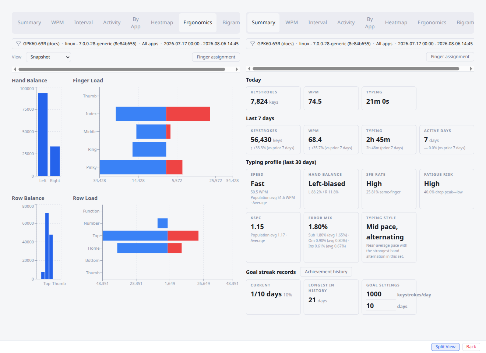

A docked footer bar (the same visual treatment as the keymap editor's status bar) sits below the page content, not inside its scroll area:

- A truncating skip-warning message on the left, shown when part of the selected range had to be skipped
- **Split View** — shows a second, fully independent Analyze pane side by side with the first, each with its own keyboard / filter / tab selection (only the fetched keyboard list is shared). The choice resets every time you reopen Analyze. The toggle is disabled below roughly 1280px of window width, with a tooltip explaining the window is too narrow
- **Back** — returns to the previous view (e.g. the device selector)

**Analysis tabs**

The tab bar above the chart groups ten analyses by intent — overview, performance, behavior, load, and optimization:

| Group | Tab | What it shows |
|-------|-----|---------------|
| Overview | **Summary** | Today / last-7-days deltas, typing profile cards (Speed / Hand balance / SFB / Fatigue), goal streak record |
| Performance | **WPM** | Words-per-minute over time, or by hour of day |
| Performance | **Interval** | Keystroke interval percentiles (min / p25 / median / p75 / max), as a time series or a distribution |
| Behavior | **Activity** | Hour × day-of-week grid or sliding-month calendar, colored by keystrokes / WPM / sessions |
| Behavior | **By App** | Active-application breakdown — App Usage Distribution donut and WPM by App horizontal bars. Requires Monitor App data |
| Load | **Heatmap** | Press count per physical key, overlaid on the keymap (per layer). Requires a keymap snapshot in range |
| Load | **Ergonomics** | Per-finger keystroke totals, with a manual finger-assignment editor and a Learning curve view. Requires a snapshot |
| Load | **Bigrams** | Top key-pair/triple counts, pair-interval ranking with SD, per-finger IKI bar chart, and a hand-usage / word-position breakdown (2/3-gram toggle) |
| Load | **Layer** | Per-layer keystroke counts or layer-op activations |
| Optimization | **Layout Comparison** | Simulate how your recorded typing would land on alternative layouts (Colemak / Dvorak / etc.). Requires a snapshot |

The Heatmap, Ergonomics, Bigrams > Finger IKI, Bigrams > Bigram patterns' Hand usage rows, Layout Comparison, and Layer > Activations views need a keymap snapshot that overlaps the selected range. Pipette saves a snapshot automatically when typing recording is enabled on the keyboard; the empty state tells you when to start a recording session to capture one.

**Filter summary chip**

The filter row is a single collapsed chip — `keyboard · device · source · period`. Each segment truncates a long value with an ellipsis; hover the chip to see the full text. Click the chip to open the filter conditions modal — every common condition, including the keymap snapshot, is edited there (the modal's **Keymap** row is the only place to change snapshots).

When the **Source** dimension is set to **TypingTest** and its **Results** drill-down narrows the selection to exactly one run for the currently-connected keyboard, an **Open timeline** button appears next to the chip. It leaves Analyze, re-enters the Typing Test view for that keyboard, and opens the **Keystroke Timeline** for the selected run — the same view a History row's **Timeline** link opens (see **Keystroke Timeline** under §4.3). The button is hidden whenever more than one run is selected, or when Analyze is showing a keyboard other than the one physically connected (there is no typing test view to jump back into for it).

**Filter conditions modal**

The modal edits a draft copy of the filters — nothing on the page changes until you press **Save**. **Reset** returns the Device and Source rows (and the App/TypingTest toggle) to their defaults — the Keyboard, Keymap, and Period rows keep their current draft values. Pressing Esc, the close button, or clicking outside the modal discards the whole draft instead. Rows, top to bottom:

- **Keyboard** — see **Keyboard selector** above
- **Device** — multi-select. Pick any combination of `This device` and remote-machine hashes to merge or isolate per-machine data. Replaced with an explanatory note when the Interval tab's View is set to Distribution (distribution bins are always computed from this device alone)
- **Source** — a segmented **App / TypingTest** toggle switches this row between two mutually exclusive dimensions (a typing test always runs inside some app, so only one dimension filters at a time). Replaced with an explanatory note on the **By App** tab, whose charts aggregate across every source regardless of the App or TypingTest selection:
  - **App** — multi-select dropdown listing every active application name observed during the range. Defaults to **All apps** (no filter); selecting one or more apps narrows every chart to minutes tagged with one of the chosen apps. The dropdown only populates after Monitor App has been enabled and at least one minute has been tagged with an app name. Persisted per keyboard
  - **TypingTest** — multi-select dropdown listing the typing tests that produced data in the selected range and device scope. File Import tests are listed by their text name; MonkeyType tests as "mode (language)". Picking one or more tests narrows every chart to those runs, and a second **Results** select appears beside it to drill down to individual runs
  - Typing-test names and other long option labels are ellipsized in both selects (and in the chip); hover to see the full text
- **Keymap** — the snapshot timeline, shown only when the selected keyboard has recorded snapshots. Editing Period below stays inside the chosen snapshot's active window so charts that need a snapshot (Heatmap / Ergonomics / Bigrams Finger IKI / Layer activations) never mix two layouts in one view
- **Period** — the **From** / **To** range to analyze, clamped to the active snapshot's window (or to the most recent 7 days when the keyboard has no snapshot recorded yet)

Individual tabs still add their own filters above the chart (view mode, granularity, unit, etc.), outside the modal; those are described per tab in the sections below. The Heatmap tab keeps its **Normalize** / **Aggregate** / **Group** / **Top N** controls with the ranking row underneath the keyboard itself.

**Saved search conditions**

The bookmark icon in the panel header opens the **Saved search conditions** side panel. Save the active filters under a label, restore a saved set later, rename / delete entries, or export the current condition's chart data as CSV. Each saved entry shows a one-line summary of the filters (device, app, snapshot, range) under its label; the entry itself captures the full filter state — including the App / TypingTest dimension and its test / run selections — and restores all of it on Load.

- Up to **50 entries per keyboard** — the panel surfaces a cap warning when you reach the limit; delete an existing entry to make room
- Synced via Cloud Sync (when enabled) so the same set is available on other signed-in machines
- Loading an entry written by a newer Pipette release shows an unsupported-version error rather than guessing at unknown fields
- **Overwrite**: typing a label that already exists swaps the Save button to a danger-styled **Overwrite?** + Cancel pair. Editing the label clears the pending confirmation so you cannot overwrite a different entry by accident
- **Load behavior**: loading a saved entry always opens on the **Summary** tab regardless of which tab was active when the condition was saved
- **Hub actions**: when Pipette Hub is connected, each saved entry shows an additional Hub row with **Upload to Hub** / **Update on Hub** / **Remove from Hub** + **Open in Browser**. The row is labelled **Hub (Public)** or **Hub (Private)**, and uploading opens the Public / Private confirmation dialog — the same pattern as the keymap and favorites save panels (see §7.2, §7.4)

#### Summary

The Summary tab is the default landing view. It collects four read-only cards built from the same minute-bucket aggregates as the rest of the page, so you can scan the latest highs / averages / streaks before drilling into a specific tab.

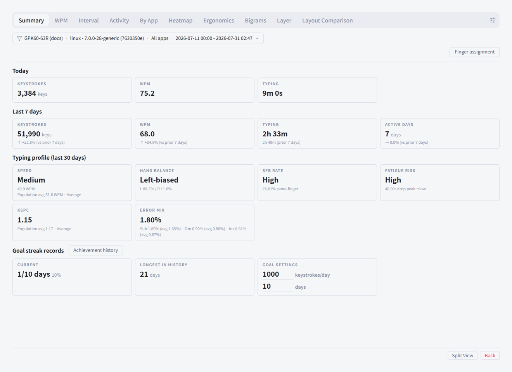

- **Today** — Keystrokes, WPM, Typing duration for the current local day
- **Last 7 days** — Keystrokes, WPM, Typing duration, Active days, each with a delta arrow comparing the prior 7 days. Insufficient prior data renders as `—`
- **Typing profile (last N days)** — Seven qualitative read-outs computed over the recent window:
  - **Speed** — overall WPM bucketed into Slow (<30) / Medium (30–50) / Fast (≥50). A second line below the WPM figure shows the population average and a direction-neutral position label (Far below average / Below average / Average / Above average / Far above average) based on standard-deviation distance from that average — hidden whenever the bucket itself reads `Not enough data`
  - **Hand balance** — share of bigram keystrokes per hand. Within ±5% of 50/50 reads as Balanced
  - **SFB rate** — share of bigrams typed with the same finger. <4% Low / 4–8% Medium / ≥8% High
  - **Fatigue risk** — drop from peak hour to slowest hour WPM. Wider gap = higher risk
  - **KSPC** — keystrokes per confirmed character (Backspace counts as a keystroke), char-weighted across every saved Typing Test result whose date falls in the window — never a plain average of each run's own ratio. A second line shows the population average and the same position label used by Speed. Reads `Not enough data` when no saved result in the window carries this figure (e.g. every run predates it, or hit an IME composition mid-run). Unlike this card's other five read-outs, KSPC is **not filtered by Device/App** — it always reads every locally saved Typing Test result for the keyboard within the window, since it comes from History rather than the recorded keystroke stream
  - **Error mix** — substitution / omission / insertion rates (each a share of the target characters classified), char-weighted the same way as KSPC across every saved Typing Test result in the window. Each rate's population average is shown alongside as plain text — unlike Speed and KSPC, this card doesn't show a position label here: with three rates packed into one grid cell, three long labels (Far below average / Below average / Average / Above average / Far above average) would triple the cell's height, and there's no compact form to fall back on. Each rate's position label is shown instead in the Typing Test's own History → Error mix rows (see below). Reads `Not enough data` when no saved result in the window carries this figure. Like KSPC, it's **not filtered by Device/App**, and Romaji-input runs are excluded — a Romaji run's committed text is always one of the accepted spellings for its target, so there's no target/typed difference left to classify
  - **Typing style** — the nearest population typing-style profile to your recent speed, rhythm, and error patterns (rollover is not part of the comparison). Shows one of a small set of named styles, `No match` (your typing doesn't closely resemble any reference profile) or `Between styles` (it sits about equally between two of them), or `Not enough data` when there isn't yet enough speed/rhythm data to compare. The tooltip notes when a match didn't use any error data (e.g. no qualifying saved Typing Test results in the window)
- **Goal streak record** — Current cycle progress (`current / goalDays`), longest historical streak, and editable Goal settings (consecutive days × keystrokes/day). Changing the goal clears the current cycle counter. The **Achievement history** button opens a modal that lists every completed cycle with period, goal, days, total keystrokes, and average per day

The Summary tab respects the App filter — selecting one or more apps narrows every card to minutes tagged with those apps (the Typing profile card's KSPC and Error mix read-outs are the exception — see above; Typing style sits in between, since its speed/rhythm inputs follow the App filter but its error-pattern input comes from the same unfiltered History source as Error mix).

#### Heatmap

The Heatmap tab paints per-physical-key data on the keymap layout, one layer at a time. A **Count / Speed / Duration** toggle above the keymap panel switches what's painted; Layer and Period filters apply to all three modes.

**Count mode**

The default mode counts every press per physical key. It's useful for spotting over- or under-used keys per layer and for tuning the layout.

Keys are tinted by press count (dim = low, saturated accent = high). When a keyboard has more than one layer, a layer toggle bar appears above the panel (**Layer 0**, **Layer 1**, …) and each button shows the per-layer count. Hovering a key opens a tooltip inside the chart with the bound keycode and the count; the tooltip never spills outside the heatmap frame.

Below the heatmap is a ranking table. Four filters control what it shows:

- **Normalize** — `Absolute` (raw count), `Per hour` (count ÷ active hours), `Share of total` (% of total presses in range)
- **Aggregate** — `By cell` collapses every press of the same physical cell; `By character` collapses every press of the same keycode regardless of where on the keymap it sits
- **Group** — `All`, `Character`, `Modifier`, `Layer op`
- **Top N** — 10 / 20 / 30 / … / 100

Columns are **Key**, **Layer** (only when the group spans multiple layers), **Matrix**, **Count**.

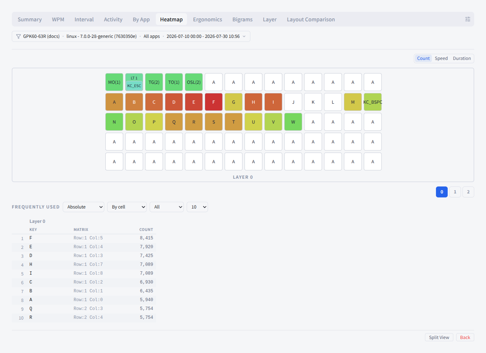

**Speed mode**

Speed recolours the same keyboard by how slow the average reach into each key is, built from the same bigram data as the Bigrams tab: each key is tinted by the average interval (avg IKI) between the previous keystroke and a press landing on that key — cool (blue) keys are reached quickly, warm (red) keys are reached slowly. Keys reached fewer than 5 times in range stay uncoloured; a caption under the ranking table repeats that threshold. On very large ranges the same 5,000-pair fetch cap as the Bigrams tab applies — a caveat appears next to the threshold caption when the averages are computed from the most frequent pairs only.

The **Normalize** and **Aggregate** controls disappear in Speed mode (both are count-specific); **Group** and **Top N** still apply. The ranking table's columns switch to **Key**, **Avg IKI**, **Count**, sorted slowest-reach-first.

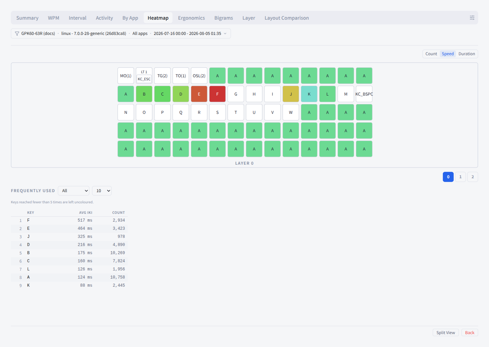

**Duration mode**

Duration recolours the same keyboard by average keypress duration — the time between pressing a key and releasing it — using the same per-cell capture the Interval tab's keypress-duration histogram (see below) is built from: cool (blue) keys are held briefly, warm (red) keys are held longer. Unlike Speed mode this data already carries a layer tag, so each layer panel paints from its own recorded cells rather than resolving through a shared keycode. Keys with fewer than 5 duration samples in range stay uncoloured, same threshold and caption convention as Speed mode.

The **Normalize** and **Aggregate** controls disappear in Duration mode (both are count-specific); **Group** and **Top N** still apply. The ranking table's columns switch to **Key**, **Avg Duration**, **Count**, sorted longest-duration-first, scoped to whichever layers are currently selected.

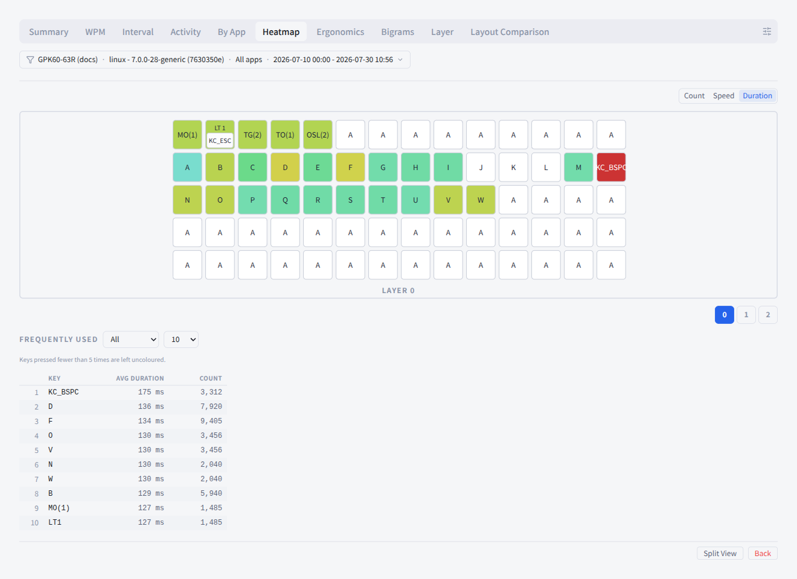

**Empty states**

- **No snapshot** — "No keymap snapshot recorded for this range. Start a record session to capture one."
- **No layout** — "Layout data not available for this snapshot." The snapshot exists but lacks KLE geometry
- **No activity** — "No key presses in this range." Ranking table only (Count mode)
- **No reach-speed data** — "No reach-speed data in this range yet." Ranking table only (Speed mode)
- **No keypress-duration data** — "No keypress-duration data in this range yet." Ranking table only (Duration mode); durations are only recorded while typing in matrix mode with the keyboard unlocked, so ranges predating that capture (or with recording off) show no data

#### WPM

The WPM tab charts Words Per Minute — keystrokes per minute divided by 5 — either as a time series or binned by hour of day.

**View Mode**

- **Time series** — WPM over the selected range as a line chart. A red dashed **Bksp %** line is always overlaid on a secondary right-hand axis (0–100 %) so speed and error rate sit together; click the Bksp legend entry to hide it if you only want the WPM line

  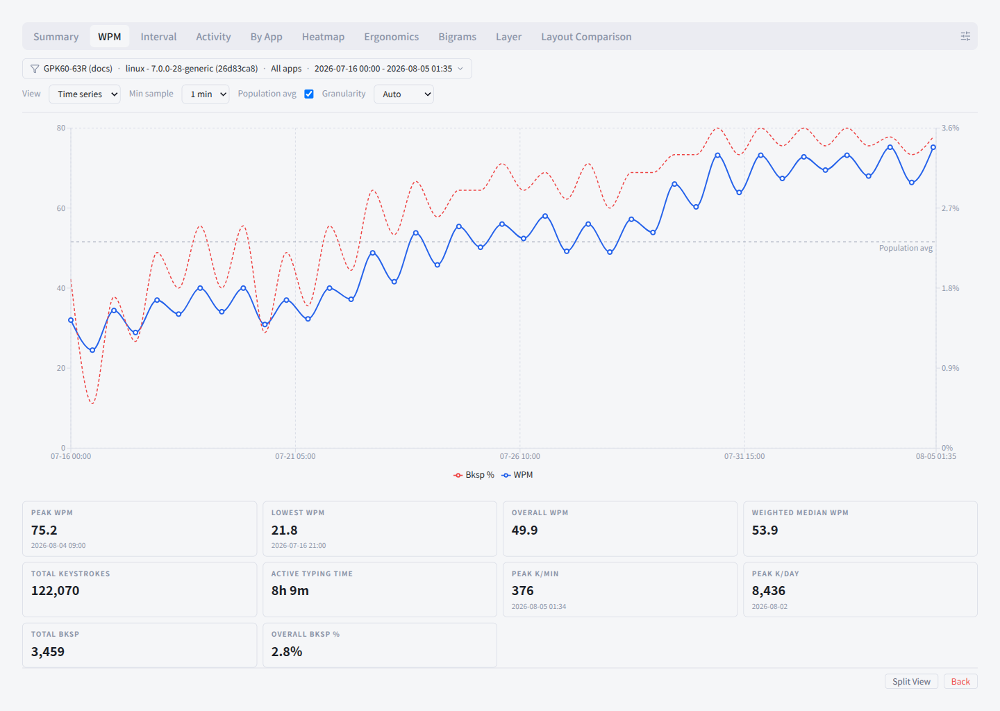

- **Time of day** — Bar chart of the 24 hours in the local day. Each bar is the average WPM for that hour across the range. Bars that did not meet **Min sample** render in a muted tone

  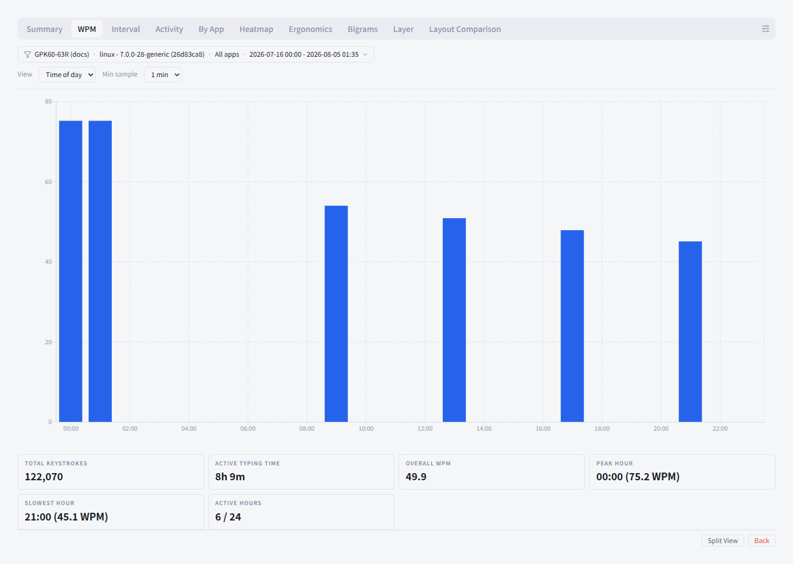

**Min sample** (both views)

`30s`, `1 min`, `2 min`, `5 min`. Minutes with fewer keystrokes than the chosen WPM-worth-of-keys threshold are dropped from the chart so very light sessions don't skew the line.

**Population avg** (Time series only)

A checkbox next to Min sample toggles a dashed **Population avg** reference line drawn at the population-average WPM. The line's axis rescales automatically if your data sits entirely above or below it, so it never gets clipped out of the chart. The same checkbox controls the Interval tab's own reference line, and the choice is persisted per keyboard (defaults to on).

**Granularity** (Time series only)

Bucket width of the time series (`Auto`, `1 min`, `5 min`, … `1 week`, `1 month`).

**Summary cards**

- **Time series** — Total keystrokes, Active typing time, Overall WPM, Peak WPM, Lowest WPM, Weighted median WPM, Peak K/min, Peak K/day, Total Bksp, Overall Bksp %
- **Time of day** — Total keystrokes, Active typing time, Overall WPM, Peak hour, Slowest hour, Active hours (N / 24)

#### Interval

The Interval tab visualizes the time between consecutive keystrokes, either as percentile lines over time or as a distribution histogram.

**View Mode**

- **Time series** — Five percentile lines on a log-scale Y axis: **Min**, **p25**, **Median**, **p75**, **Max**. The Median line is drawn thickest. Click a legend entry to hide a line. The Y-axis label reads `sec (log)` or `ms (log)` depending on Display

  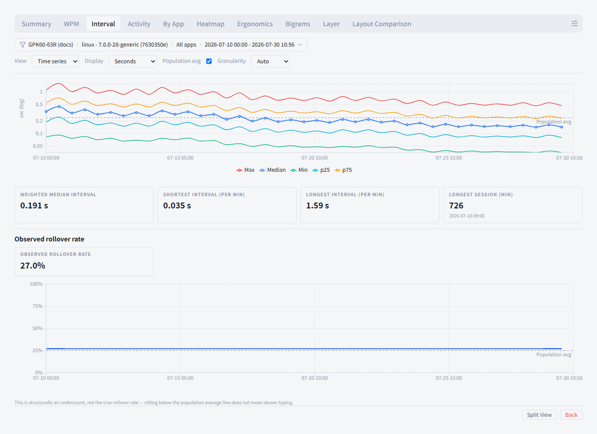

- **Distribution** — a **Section** select appears in the controls row, right after View: **Interval distribution**, **Keypress duration**, or **Tapping Term diagnosis** (each described below). Only the picked section renders, instead of stacking all three. The **Device** filter is hidden in this mode because bins are always computed from this device alone

  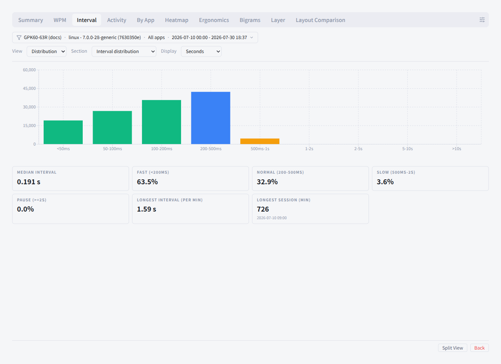

**Display** (both views)

`Seconds` / `Milliseconds`. Switches the unit used in tooltips and on the Y axis. The distribution bin labels stay in their native unit.

**Population avg** (Time series only)

Same checkbox as the WPM tab (see WPM tab) — draws a dashed **Population avg** reference line at the population-average interval. The line always sits at the raw millisecond mean regardless of the Display unit: only the axis tick labels switch between seconds and milliseconds, the underlying chart data stays in ms.

**Granularity** (Time series only)

Same options as WPM.

**Summary cards**

- **Time series** — Total keystrokes, Active typing time, Weighted median interval, Shortest interval (per min), Longest interval (per min)
- **Interval distribution** — Total keystrokes, Median interval, Fast (<200ms) share, Normal (200–500ms) share, Slow (500ms–2s) share, Pause (≥2s) share, Longest interval (per min), Longest session

**Observed rollover rate** (Time series only)

Below the percentile chart, a second subsection reports how often you pressed a key while the previous one was still held down — commonly called rollover, or n-key rollover.

- **Trend chart** — the rate bucketed over the range on a fixed 0–100% Y axis. A bucket with no observed-overlap data shows as a gap in the line rather than a false 0%
- **Population avg** — same checkbox as the WPM/Interval reference line above (see WPM tab); draws a dashed reference line at the population-average rollover rate when on
- Because the underlying sampling can only detect overlaps at least as long as the polling period, the figure is a **structural undercount**. A persistent note under the chart reminds you that sitting below the population-average line does not mean you type slower — it more often reflects the sampling period than your technique
- **Stat card** — "Observed rollover rate" shows the share of sampled key-pairs where the previous key was still down. Its caption reports the effective sampling period (median p50 / worst-case p95): the polling cadence that sets a floor on how short an overlap can be detected. Overlaps shorter than that period simply aren't observed

Distribution mode's body is driven by the **Section** select named above, showing exactly one of the sections below at a time. The **Tapping Term diagnosis** option only appears when the current keymap has at least one Layer-Tap / Mod-Tap / Swap-Hands-Tap key, and picking a section that later becomes unavailable (e.g. switching to a keyboard without one) falls back to **Interval distribution**. The pick is remembered per keyboard, same persistence as this tab's other filters.

**Interval distribution** (Distribution only)

Bar chart of nine fixed bins (`<50ms`, `50-100ms`, `100-200ms`, `200-500ms`, `500ms-1s`, `1-2s`, `2-5s`, `5-10s`, `>10s`). Bars are colored by band: **Fast** (green, <200ms), **Normal** (blue, 200–500ms), **Slow** (orange, 500ms–2s), **Pause** (red, ≥2s). This is the default Distribution section, shown in the screenshot above.

**Keypress duration** (Distribution only)

Breaks down how long you hold each key down — press to release — independent of the interval-between-keys metric above.

- **Histogram** — a bar chart of eight fixed buckets (`<50`, `50–79`, `80–109`, `110–139`, `140–179`, `180–249`, `250–399`, `≥400 ms`), tighter than the interval bins above since keypress durations cluster in a much narrower range
- **Stat cards** — Mean duration, SD, Samples. The Mean card's caption always shows the population-average duration alongside a neutral position label (below / average / above); unlike the rollover section's reference line, this comparison has no sampling bias and is shown unconditionally — clustering close to "average" is itself the finding this metric surfaces
- **Empty state** — "No keypress-duration data in this range." Durations are only recorded while typing in matrix mode with the keyboard unlocked, so ranges predating that capture (or with recording off) show no data — the message doesn't try to distinguish the two, since they're indistinguishable from the recorded data alone

  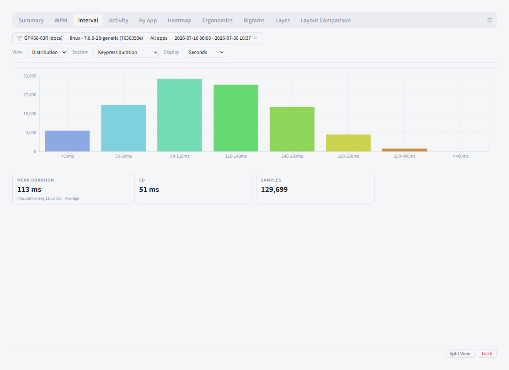

**Tapping Term diagnosis** (Distribution only, tap-hold keys only)

Checks whether the connected keyboard's Tapping Term (the tap/hold decision window used by Layer-Tap, Mod-Tap and Swap-Hands-Tap keys) fits how you actually type. It's built entirely from the keypress-duration data above, split at the current Tapping Term, so the **Section** select only offers this option when the keymap on screen has at least one Layer-Tap / Mod-Tap / Swap-Hands-Tap key — a keymap with none omits it entirely.

- **Current / Assumed term**, **Observed tap p95** (shown as a range, since the underlying histogram buckets can only bound a percentile, not pin it to one millisecond), **Samples**, and **Recorded tap / hold** (the press counts recorded for these keys — classified against whatever term was active when each press happened, not necessarily the current one, so this row is shown for context only and never drives the diagnosis)
- One of four findings: the term looks well matched; a candidate lower value based on your own typing (never a guarantee — nothing here writes it back for you); "long taps and fast holds are hard to tell apart at this term" (mass sits close enough to the term on either side that the two can't be told apart); or "not enough data yet" — which covers three distinct causes rather than one generic message: too few tap-hold presses recorded so far, every recorded press on these keys already resolving as a hold at the current term (nothing to compare a tap length against), or the typical tap length happening to fall in the same measured bucket as the term itself, so the data can't tell which side of it your taps actually land on
- **Connection states** — with the keyboard connected and reporting its Tapping Term, the card shows the live value plus a pointer to where to change it (the editor's **Tap-Hold / Tap Dance** tab → **Tap-Hold**). If the firmware doesn't report Tapping Term through QMK Settings at all, the diagnosis runs against the assumed QMK default (200ms) instead, with a note that changing it requires rebuilding the firmware. Without a matching connected keyboard, the card shows a prompt to connect one instead of a diagnosis
- There is no button to apply a suggested value — every suggestion here is a read-only observation about your own recorded data, not a setting Pipette will write for you

  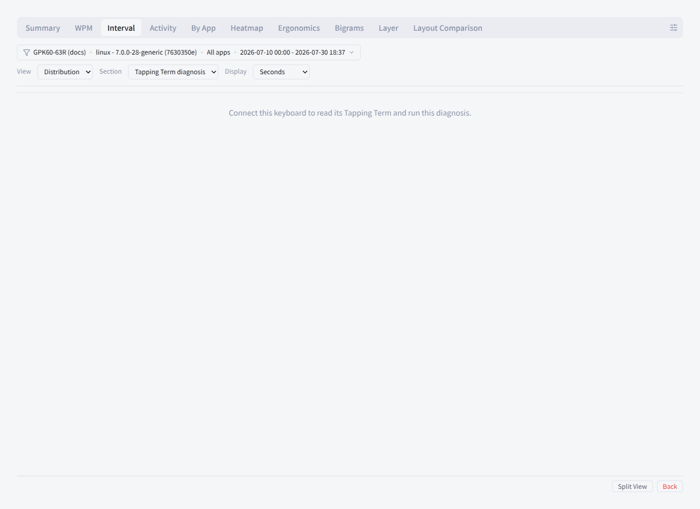

  This screenshot happens to show the connect-a-keyboard prompt rather than a live diagnosis, since Analyze can be opened straight from the device selection screen, before any keyboard is connected — the card's other two states look the same as described above, just with the prompt replaced by the stat cards and the finding.

#### Activity

The Activity tab groups typing by day-of-week × hour so you can see when you actually type. The filter row offers two orthogonal pickers: **View** (chart geometry) and **Metric** (what each cell measures).

**View**

- **Hour** — the historical 24 × 7 hour-of-day × day-of-week grid (or sessions histogram when Metric = Sessions). Driven by the top-level Period picker
- **Day** — sliding-window day calendar. Adds a **Range** selector (1 / 3 / 6 / 12 months) plus prev / next month cursor buttons so you can browse the month-by-month heatmap. For 3 / 6 / 12-month ranges the current month stops at today so future days stay blank; the 1-month range shows the full calendar month including future empty days

**Metric**

- **Keystrokes** — keystroke count. Empty cells are dim, the busiest cell is fully saturated. In Grid view a non-empty cell tooltip shows both the raw count and its share of the range total (e.g. `Mon 09:00 — 1,234 keys (5.2% of total)`)

  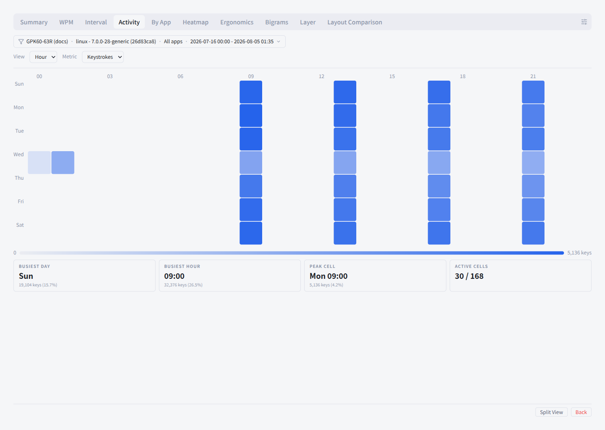

- **WPM** — average WPM per cell. In Grid view, cells that don't meet **Min sample** are desaturated instead of pinning the color scale
- **Sessions** — In Grid view this swaps to a histogram of session lengths in seven bins (`<5 min`, `5-15 min`, `15-30 min`, `30-60 min`, `1-2 h`, `2-4 h`, `>4 h`); in Calendar view each cell counts the **sessions whose start fell on that date** (not sessions active on that date)

**Day-only controls** (View = Day)

- **Normalize** — `Absolute` colors by the peak day in the rendered window, `Share of week` divides each cell by the column's weekly total, `Share of total` divides by the grand total of the rendered range
- **Range** — `1 month`, `3 months`, `6 months`, `12 months`. Sets the visible window relative to the cursor month
- **Prev / Next month buttons** — slide the visible window one month earlier or later. The current month is the right-most column; future days stay blank (except in the 1-month view which shows the full month)

  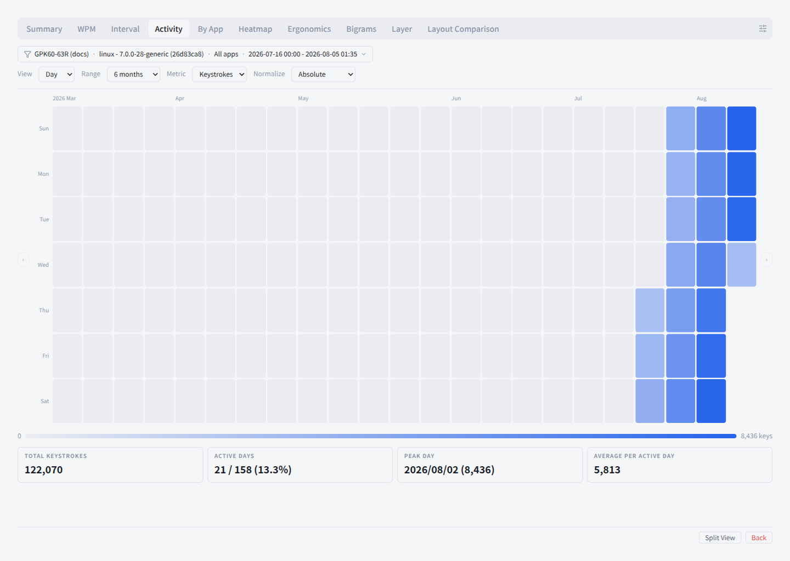

A gradient legend bar below the calendar shows the color scale from low to peak value, so the intensity mapping is always visible at a glance.

Clicking a populated cell jumps the rest of the Analyze pane to that single day. The snapshot picker auto-selects the snapshot that contains the date so dependent tabs (Heatmap, Ergonomics, Layer activations) stay aligned with the keymap that was active.

**Min sample** (View = Grid, Metric = WPM)

Same options as the WPM tab.

**Peak records**

Four stat cards above the grid summarize the peaks across the selected range: Peak WPM, Peak K/min, Peak K/day, Longest session (min). They stay visible for every metric so you always see the overall highs at a glance.

**Summary cards**

Under the grid, the summary depends on the metric:

- **Keystrokes** — Total keystrokes, Active typing time, Busiest day, Busiest hour, Peak cell, Active cells (N / 168). The count context under each card also carries its share of the range total (e.g. `800 keys (40.0%)`)
- **WPM** — Total keystrokes, Active typing time, Overall WPM, Peak cell, Slowest cell, Active cells (N / 168)
- **Sessions** — Session count, Total duration, Mean duration, Median duration, Longest session, Shortest session

#### Ergonomics

The Ergonomics tab reports the physical load of your typing — per finger, per hand, per row — based on the key → finger assignment in the snapshot keymap.

Like Heatmap, this view needs a keymap snapshot that overlaps the range.

**Sections**

Three bar charts stack vertically:

1. **Finger Load** — 10 vertical bars, one per finger from left pinky to right pinky
2. **Hand Balance** — 2 horizontal bars (Left / Right)
3. **Row Usage** — 6 horizontal bars (Function / Number / Top / Home / Bottom / Thumb)

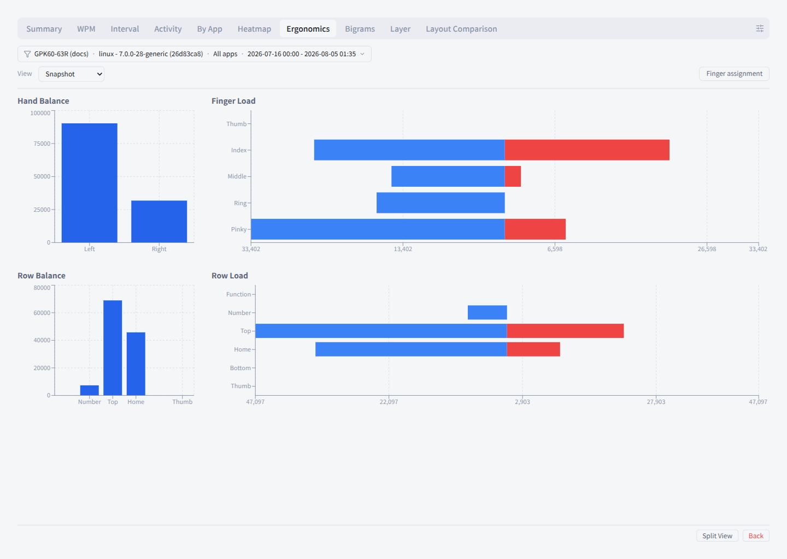

**Finger assignment**

Each key is auto-assigned to a finger based on the layout's KLE metadata (column position and the standard column-to-finger mapping). The **Finger assignment** button sits right-aligned in the tab's filter row on every finger-based tab — Summary, Ergonomics, Bigrams, and Layout Comparison — and shows whenever a keymap snapshot is available. Click it to override any key manually:

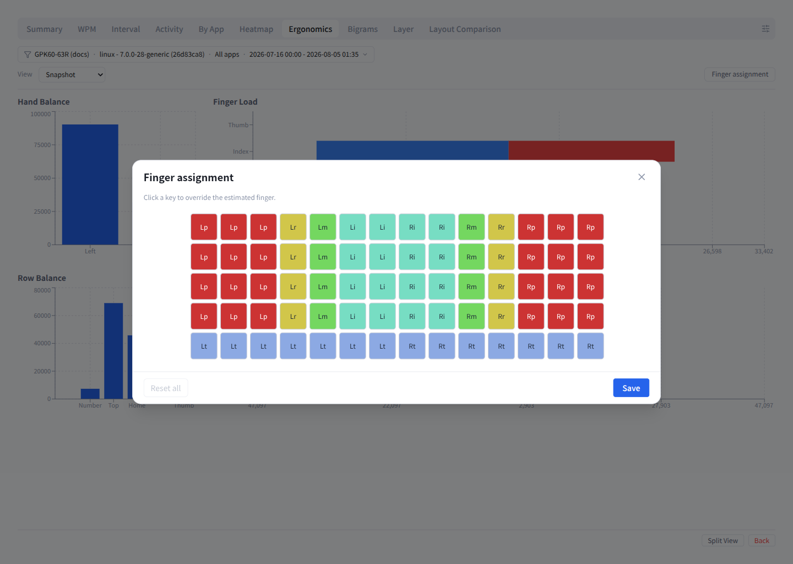

- Each key shows a short finger code (`Lp`, `Lr`, `Lm`, `Li`, `Lt` / `Rt`, `Ri`, `Rm`, `Rr`, `Rp`). Manually overridden keys are prefixed with `*`
- Click a key → popover to pick a finger
- **Save** persists the overrides; **Reset all** clears every override (disabled when there are none). **Reset to estimate** in the per-key popover clears just that key
- Overrides apply immediately once you close the modal. On this tab, Finger Load, Hand Balance, and Row Load (its per-hand split derives from the overridden finger) all recompute right away — only Row Usage stays unchanged, since row categories themselves are never overridden. The same overrides also feed the Summary tab's typing-profile cards, the Bigrams tab's finger classification, and Layout Comparison's simulations

**Learning curve**

Set the **View** filter to **Learning curve** to swap the four-pane snapshot for a weekly / monthly trend chart. The view buckets per-day matrix counts into the chosen **Period** (week / month) and folds each bucket into three sub-scores plus a composite score:

- **Finger load** — how evenly the 10 fingers share the load (1 = perfectly even, 0 = one-finger lock-in)
- **Hand balance** — how close the left / right split is to 50 / 50
- **Home row stay** — fraction of keystrokes on the home row

The bold line is the composite **Overall** score (weighted mean of the three sub-scores); the dashed lines are the individual sub-scores. The summary cards at the top show the latest bucket's overall score, the delta against the prior buckets, and the qualified bucket count (a bucket is qualified once its keystroke total clears the min-sample threshold; below-threshold buckets stay visible but are flagged in the tooltip).

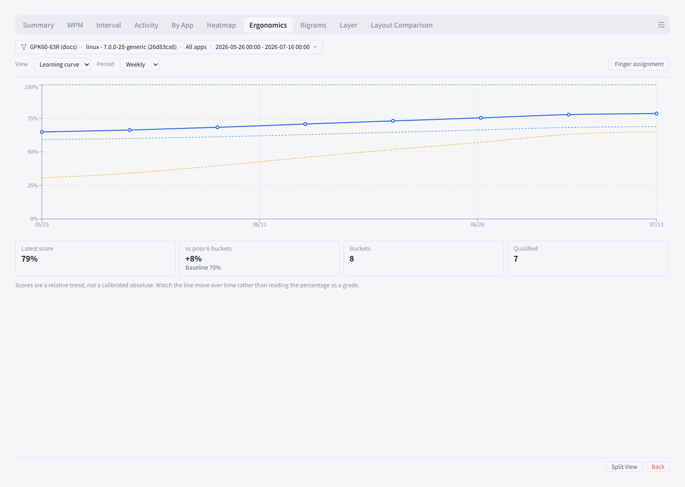

> The composite score is a **relative trend indicator**, not a calibrated absolute metric. The weights are heuristic and finger-stddev is sensitive to layout choices. Read the curve as "is my distribution improving over time?" rather than as a numeric grade.

**Empty states**

- **No snapshot** — same message as Heatmap
- **No layout** — "Layout data not available for this snapshot."
- **No activity** — "No keystrokes recorded in this range."
- **No data** (Learning curve only) — "Not enough matrix activity in this range. Type more or widen the period filter."

#### Bigrams

The Bigrams tab analyzes consecutive key-press sequences and the inter-key interval (IKI) between them. A toggle in the top-right corner switches the tab between **2-gram** (key pairs, the default) and **3-gram** (key triples) granularity. Both are aggregated per minute as the typing happens, so the tab works over any selected range without re-scanning raw events.

An interval longer than **5 seconds** is not counted: a gap that long is a pause, not a typing interval, so the pair or triple spanning it is left out of the aggregate entirely. Keystrokes recorded before this rule took effect are not re-processed, so a range that straddles the change can show a small step in pair counts and averages.

**Quadrant layout**

At 2-gram the view is a 2×2 grid of four quadrants. **Top pairs**, **Pair interval**, and **Finger IKI** each have their own list-size selector (10 / 20 / 30 / … / 100); Top pairs and Pair interval render as plain tables, while Finger IKI's bars are rendered with recharts so its tooltips track the cursor. **Bigram patterns** has no list-size selector since it always folds every fetched pair into a fixed set of rows rather than a ranked list. At 3-gram both **Finger IKI** and **Bigram patterns** disappear — a finger-pair mapping and a hand-usage / word-position split aren't defined concepts for a 3-key sequence, and a trigram's own Avg IKI is already the average of its two internal transitions rather than a single one to classify — and **Top pairs** / **Pair interval** expand to fill the freed row instead of leaving an empty cell.

| Quadrant | What it shows |
|----------|---------------|
| **Top pairs** | Ranking by total occurrence count. Click **Count**, **Avg IKI**, **SD**, or **Rollover** (2-gram only) to re-sort |
| **Pair interval** | Ranking by average IKI (slowest first). Click any of **Count**, **Avg IKI**, **SD**, **p95**, or **Rollover** (2-gram only) to re-sort. The Avg interval threshold (see Common filters) hides faster-than-threshold rows |
| **Finger IKI** (2-gram only) | Per-(from-finger → to-finger) average IKI bar chart. Bars are coloured blue for left-hand starts and red for right-hand starts. Same Avg interval threshold applies |
| **Bigram patterns** (2-gram only) | One table, split into two independently-scoped row groups that classify the same pairs along two different axes — their row counts don't add up to a single total. See below |

At 3-gram, **Avg IKI** is the average of the two intervals inside the triple (key1→key2 and key2→key3) — not the total elapsed time across all three keystrokes. Hover the column header for this reminder.

The **SD** column is the standard deviation of the underlying IKI samples for that pair/triple — low SD means a consistent rhythm, high SD means erratic timing. It reads as "—" per row: a pair/triple shows "—" when it has fewer than 2 samples in the range, or when any of its data in the range was recorded before this column shipped — a true SD needs the raw sum/sum-of-squares that older rows don't carry, and mixing a partial sum in would silently understate the result. Other pairs in the same range keep their SD; pick a range recorded entirely after the update to see values on every row.

The **Rollover** column (2-gram only) shows this pair's own observed rollover rate — the share of its recorded presses where the previous key was still held down when this one was pressed. It reads "—" when the pair has no determined-overlap sample in the range; a real 0% renders as `0.0%`, distinct from "—". Like the Interval tab's Observed rollover rate subsection, this is a sampled, structurally-undercounted figure rather than a precise measurement — see that subsection for the sampling-period caveat. The column doesn't appear at all at 3-gram: overlap sampling only has meaning for a key pair.

**Bigram patterns rows**

- **Hand usage** — **Left** / **Right** (both keys land on the same hand — including two different keys sharing one finger, e.g. a thumb cluster), **Alternation** (the two keys are on opposite hands), **Repetition** (the same key struck twice in a row). Needs a keymap snapshot because it has to resolve each key to a finger; a coverage line above the table ("N% of pairs classified") reports how much of the data resolved to one of the four classes
- **Word position** — **Initiation** (the first pair typed right after a word-ending separator — Space or Enter) and **In-word** (every other pair). Bare Space/Enter always count as a separator; a dual-role key (Layer-Tap / Mod-Tap / Swap-Hands-Tap) that sends Space or Enter on tap counts too, but only when a keymap snapshot supplies the protocol info needed to resolve it — which is why this row group works without a snapshot (unlike Hand usage), just more precisely once one is available
- **ΔLeft** / **ΔRight** / **ΔInitiation**, listed below the table — signed ms deltas: ΔLeft = Left − Alternation, ΔRight = Right − Alternation, ΔInitiation = Initiation − In-word. A positive value means the first-named class was slower
- Pairs ending at a separator are excluded from both Word position rows — they're the end of a word, not its start or a continuation of it — and their count is reported instead as a footnote below the table
- Not affected by the Avg interval threshold (Common filters below); that threshold only hides rows in Pair interval and Finger IKI
- The bigram CSV export (see Export / Upload) carries this same classification as two extra columns

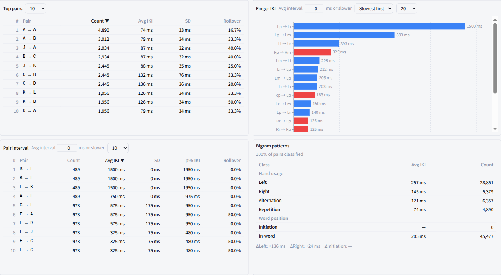

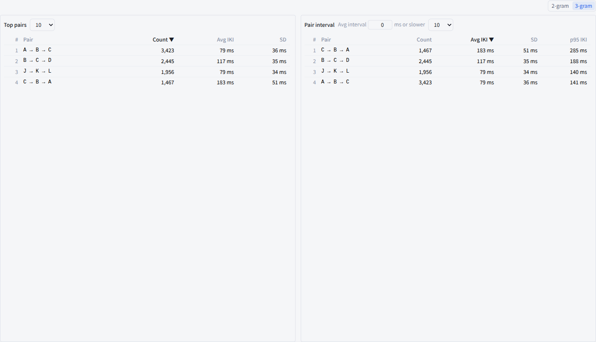

**Snapshot requirement**

The **Finger IKI** quadrant and **Bigram patterns**' Hand usage row group both need a keymap snapshot — each has to map a numeric keycode in the pair to a finger, which depends on the snapshot's keymap and layout. Bigram patterns' Word position row group needs no snapshot: it only compares keycodes against a small separator set. Since every snapshot-dependent piece only exists at 2-gram, the 3-gram view never needs a snapshot at all. The Top pairs and Pair interval quadrants both render directly from the recorded counts and work without a snapshot at either gram size.

**Common filters**

- **Range** — same `From` / `To` pickers as the rest of Analyze. The view re-aggregates over the chosen window
- **Device** — `This device` only or all synced devices, identical to the other tabs
- **Avg interval (ms or slower)** — minimum-IKI threshold rendered inline in the Pair interval quadrant header, and also in the Finger IKI quadrant header at 2-gram. Rows whose average IKI is below the threshold are hidden from both of those quadrants at once (the input is shared, so editing it in one quadrant updates the other); Top pairs and Bigram patterns are never filtered by it. `0` disables the filter; the value is persisted per keyboard via `PipetteSettings`. The IKI used for comparison is approximate (histogram bucket-center weighted average), so the cut-off is best treated as a coarse "ignore rows faster than ~N ms" filter

**Empty states**

- **No bigram data** — "No bigram data in this range yet. Record some typing and try again." Shown when the range has no recorded activity for the selected gram size
- **No snapshot (Finger IKI quadrant only, 2-gram)** — "Finger interval needs a keymap snapshot. Start a record session or pick a range with one." The other quadrants still render
- **No snapshot (Bigram patterns' Hand usage row group only, 2-gram)** — "Hand usage needs a keymap snapshot. Start a record session or pick a range with one." Word position still renders below it, and the rest of the tab is unaffected
- **Threshold filtered everything out** — when **Avg interval** is set high enough that no row survives, Pair interval (and Finger IKI at 2-gram) fall back to "No bigram data in this range yet." Lower the threshold to bring rows back
- **Very large ranges** — when the selected range holds more distinct pairs/triples than the single-fetch cap (5,000), Pair interval, Finger IKI, and Bigram patterns show "Computed from the 5000 most frequent pairs — rare pairs may be missing." Top pairs stays exact; narrow the range to bring rare rows back

#### By App

The By App tab breaks the recorded data down by the active application name captured during typing. It only populates after Monitor App has been enabled in the Typing View and at least one minute has been tagged with an app name. This tab intentionally **ignores the App filter** — applying it would collapse the chart to a single slice / bar.

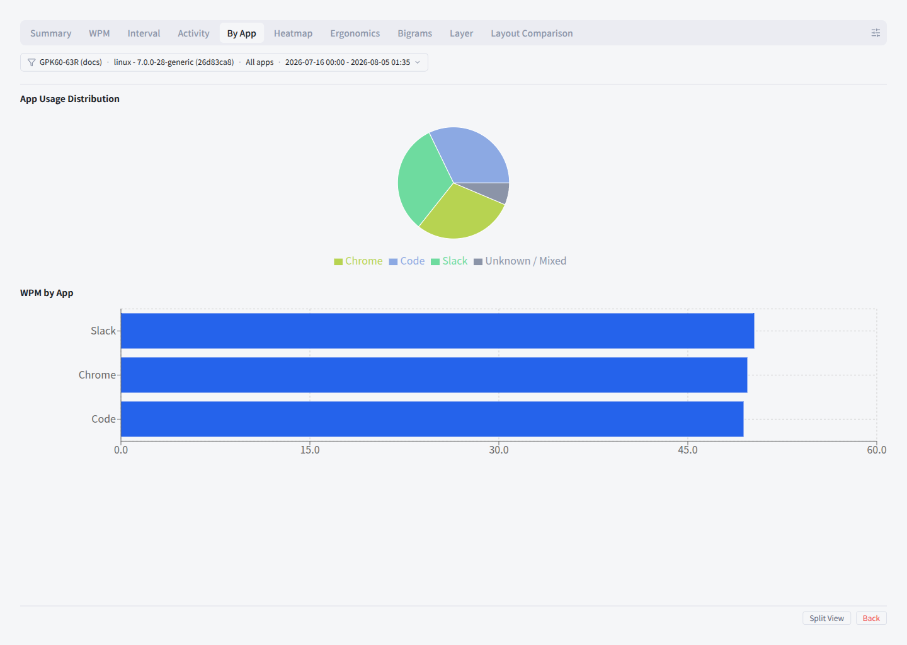

**App Usage Distribution** (donut)

Per-app share of total keystrokes for the selected range. Minutes tagged with multiple apps fold into an `Unknown / Mixed` slice; minutes that pre-date Monitor App or were captured while it was disabled go to `Other`. Hover for the tooltip with the per-slice keystrokes count and share percentage.

**WPM by App** (horizontal bars)

Per-app median WPM as a horizontal bar chart, ranked by share of activity. Bars below the configured min-sample threshold render in a muted tone. Hover for the per-bar WPM and keystroke count.

**Empty state**

- "No app data — turn on Monitor App and start REC to populate this chart." Shown when no app-tagged minutes exist in the range

#### Layout Comparison

The Layout Comparison simulates how your recorded typing would land on a different keyboard layout — Colemak, Dvorak, Colemak DH, and 30+ others — without touching your firmware. Pick a candidate from the dropdown and the tab folds your matrix activity through that layout's character map to show how your finger / hand / row workload would shift.

**Pickers**

- **Current layout** — what character convention to interpret your recorded events with. Defaults to QWERTY; change it if your firmware fires keycodes for a different layout natively
- **Compare to** — the candidate layout to simulate against. Picks are persisted per keyboard so the comparison reopens to the same target after a reload

**Panels**

Once a target is picked, all three panels render at once so you can read the spatial, per-finger, and tabular views together without flipping a sub-view:

| Panel | What it shows |
|-------|---------------|
| **Heatmap diff** (top, full width) | Per-physical-key delta painted over the keyboard. Red shades where the candidate sends more activity to that key, blue shades where it sends less |
| **Finger diff** (bottom-left) | Per-finger signed delta bar chart. Red bars mark fingers that take more load on the candidate, green bars mark fingers that take less |
| **Metric table** (bottom-right) | Side-by-side share-of-events table with finger load (per finger), hand balance (left / right), row distribution, and home-row stay rate |

Manual finger assignments (see **Finger assignment** under Ergonomics above) are honored here too — the Finger diff and the Metric table's finger load / hand balance use your overrides instead of the automatic column-based estimate. Row distribution is unaffected, since finger overrides don't change row categories.

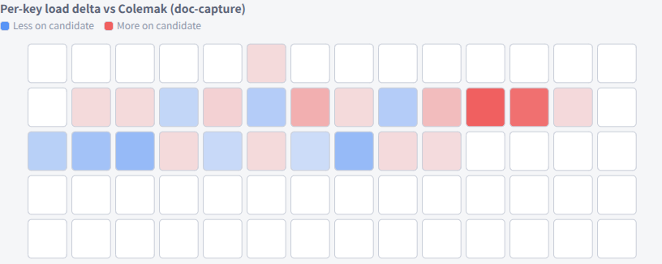

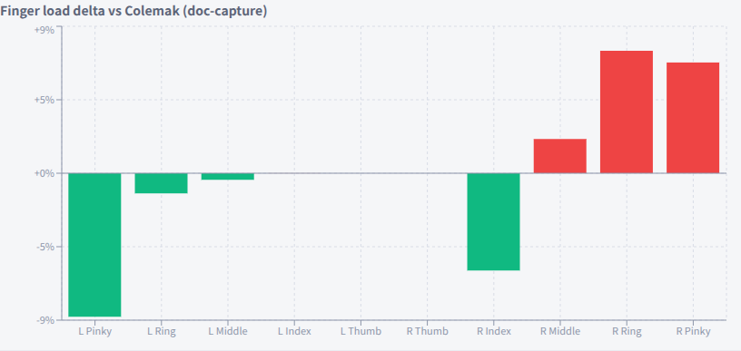

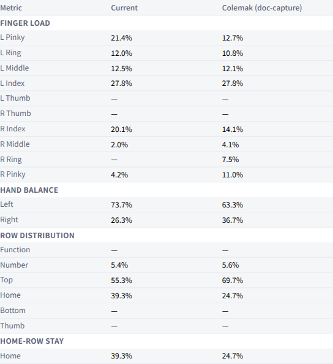

**Skip-rate warning**

Some events can't be mapped onto a candidate — for example, when the source character has no equivalent on the target layout, or the firmware hasn't bound the candidate's keycode anywhere. When that share rises above 5% the view shows a warning so you know the metrics are approximate.

**Empty states**

- **No snapshot** — same empty state as the rest of the snapshot-bound tabs. Start a record session in the chosen range to capture one
- **No target picked** — the empty hint stays until you pick a comparison layout from the dropdown
- **Fetch error** — generic "failed to compute the layout comparison" message; reload or pick a smaller range and retry

#### Layer

The Layer tab breaks usage down by keyboard layer.

**View Mode**

- **Keystrokes** — sums every press at the layer that was active at the time. Reflects `MO`, `LT`, `TG`, and any other layer op live, because the active layer is recorded when the press happens. Works with or without a keymap snapshot

  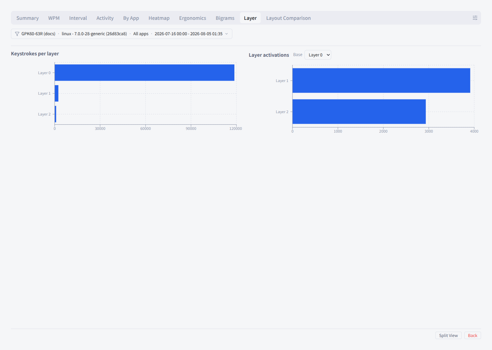

- **Activations** — counts how many times each layer was *reached* through a layer-op keycode. Requires a keymap snapshot so the layer-op target can be resolved:
  - `MO` / `TG` / `TO` / `DF` / `PDF` / `OSL` / `TT` — counted on press
  - `LT` / `LM` — counted only on hold (so a tapped `LT0(KC_ESC)` doesn't look like a layer transition)

  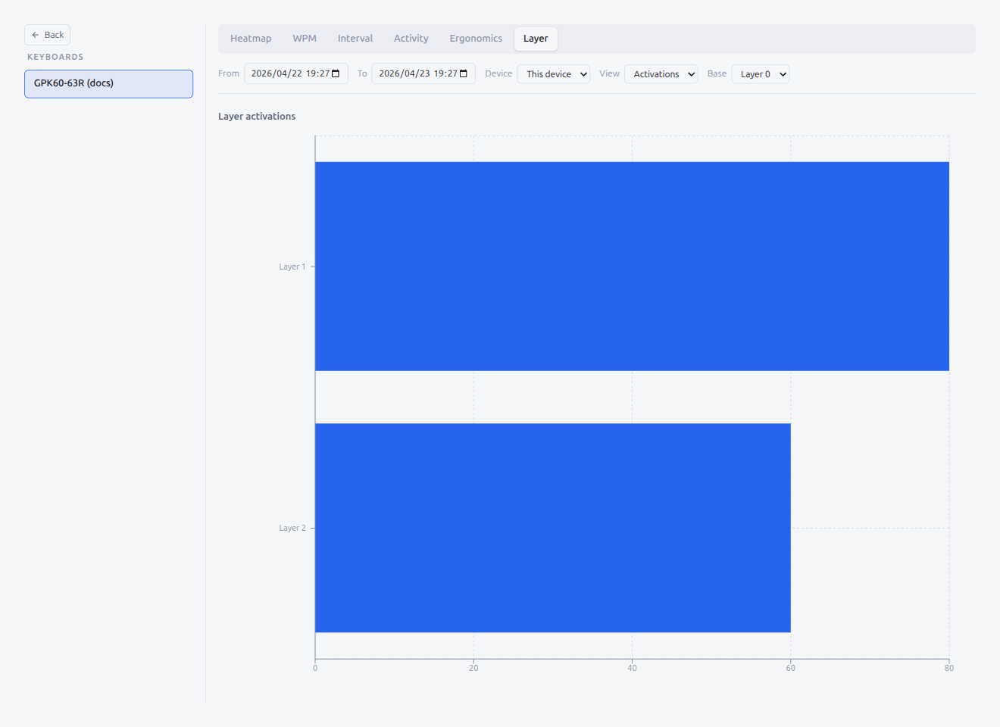

**Base Layer**

Appears only in Activations mode on keyboards with two or more layers. Selects the layer you are analyzing from — that layer is dropped from the bar list so a "hold the same layer you're already on" press (e.g., `LT0(KC_ESC)` while base = 0) doesn't show up as a transition.

**Layer names**

If you have named layers in the layer panel (see §2.3), the name is appended to the axis label (e.g., `Layer 0 · Base`) so you can tell layers apart without counting.

**Empty states**

- **Keystrokes, no activity** — nothing pressed in range
- **Activations, no activity** — no layer-op keys pressed in range
- **Activations, no snapshot** — "Layer activations need a keymap snapshot. Start a record session in this range to capture one." Keystrokes mode keeps working without a snapshot

#### Export / Upload

The **Export** button on the panel header opens a category-pick modal that writes the chart data for the active filters as a `.csv` file. Ten categories can be ticked independently:

- **Summary** — today / last-7-days overview cards
- **WPM** — per-bucket WPM time series
- **Interval** — per-bucket interval percentiles. In Distribution mode this also writes a second file: the eight-bucket keypress-duration histogram (`bucket_id`, `upper_bound_ms`, `center_ms`, `count`, `share_percent`), matching the Interval tab's own keypress-duration subsection
- **Activity** — hour × day-of-week or day-cell counts depending on the View setting
- **By App** — per-application breakdown
- **Heatmap** — per-cell press counts (snapshot-bound). Every ranking row also carries `avg_duration_ms` / `duration_samples` columns regardless of which Count/Speed/Duration mode is active on screen — blank when the key has no duration data in range. A masked (tap-hold) key position exports as two rows (hold and tap split), and both repeat the same blended duration values — the recorded data can't be split by tap vs. hold
- **Ergonomics** — per-finger / per-hand / per-row totals (snapshot-bound)
- **Bigrams** — Top pairs / Pair interval rows (Count, Avg IKI, SD, plus the Bigram patterns classification as `class` and `word_position` columns, and the per-pair observed rollover rate as `observed_rollover_percent`); Finger IKI has no CSV column. `class` is blank at 3-gram and whenever there's no keymap snapshot for the range; `word_position` is blank only at 3-gram; `observed_rollover_percent` is blank at 3-gram and whenever the pair has no determined-overlap sample in the range. Exports whichever gram size (2-gram or 3-gram) is currently selected in the tab — the id column is named `bigram_id` or `trigram_id` to match
- **Layer** — per-layer keystroke or activation counts
- **Layout Comparison** — per-finger / row / hand deltas (snapshot-bound; reflects manual finger overrides)

The modal lists the active conditions (Device, App, Keymap, Period) above the category list so the file you save is unambiguous about which slice it captures. Heatmap, Ergonomics, and Layout Comparison entries are unavailable when the range has no overlapping snapshot — the modal shows a "snapshot missing" notice for those categories. Manual finger overrides are noted next to the Ergonomics row.

**Upload mode**

The same modal opens in **upload mode** when triggered from a saved entry's Hub action row (Upload to Hub / Update on Hub). In this mode the confirm button reads **Upload** or **Update** and the data is sent to Pipette Hub instead of written to a CSV file. Upload mode adds two additional selectors:

- **Layout Comparison targets** — a multi-select popover listing all installed key-label sets and built-in layouts. Pick one or more target layouts to include in the Hub post; the Layout Comparison toggle is disabled when no targets are selected
- **Per-app data** — a multi-select popover listing every app observed in the range. Select which apps to include as per-app breakdowns on Hub

See §7.4 for the full analytics upload flow and validation rules.

---

## 2. Keymap Editor

### 2.1 Screen Layout

The keymap editor consists of two main areas: the keyboard layout display and the keycode palette.


- Top area: Physical keyboard layout (shows the current keycode assigned to each key)
- Left side: Toolbar (zoom, undo/redo, etc.)
- Bottom area: Keycode palette (tabbed interface) with overlay panel toggle
- Right side (when open): Keycodes Overlay Panel (tools, save, layout options)
- Bottom bar: Status bar

### 2.2 Changing Keys

1. Click a key on the keyboard layout to select it
2. Click a keycode from the keycode palette to assign it
3. The key display updates immediately
4. Changes are automatically sent to the keyboard

- Ctrl+click to select multiple keys
- Shift+click for range selection
- Press Escape to deselect all keys

**Instant Key Selection** controls how keycode assignment behaves:

- **ON** (default): A single click on a keycode immediately assigns it and closes the selection. Fast workflow for quick edits.
- **OFF**: A single click selects a keycode (highlighted), double-click or press Enter to confirm and assign. A hint is shown at the bottom of the palette. Useful when you want to browse keycodes before committing.

This setting can be toggled per-keyboard in the Keycodes Overlay Panel (§3.14), and the global default can be set in Settings → Defaults (§6.1).

### 2.3 Layer Switching

Layer switching buttons are located on the left side of the keyboard layout.

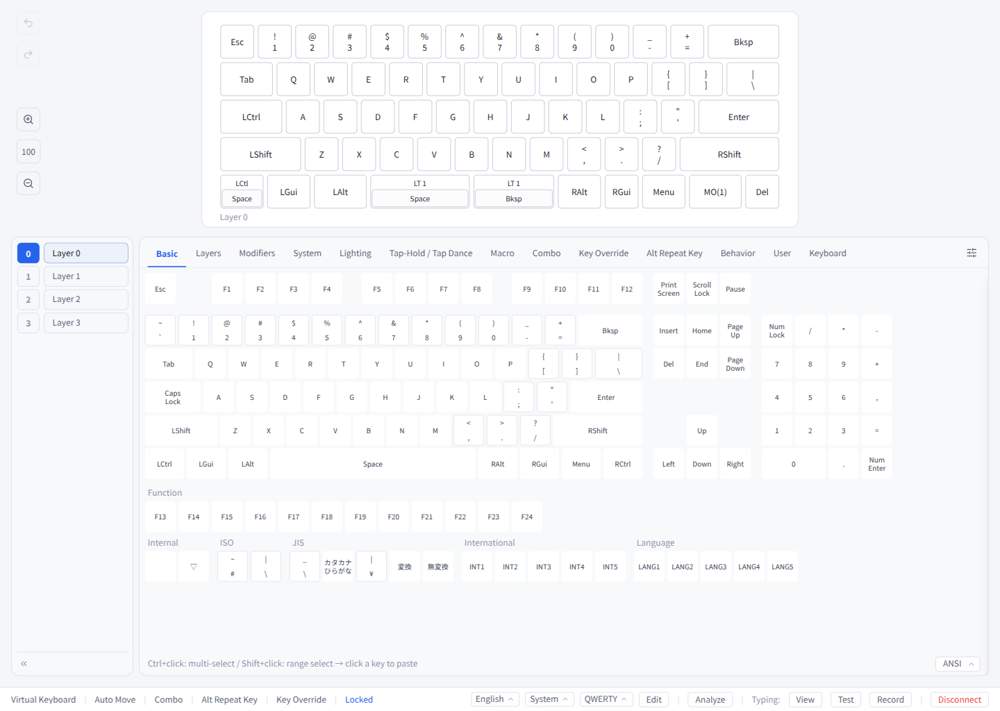

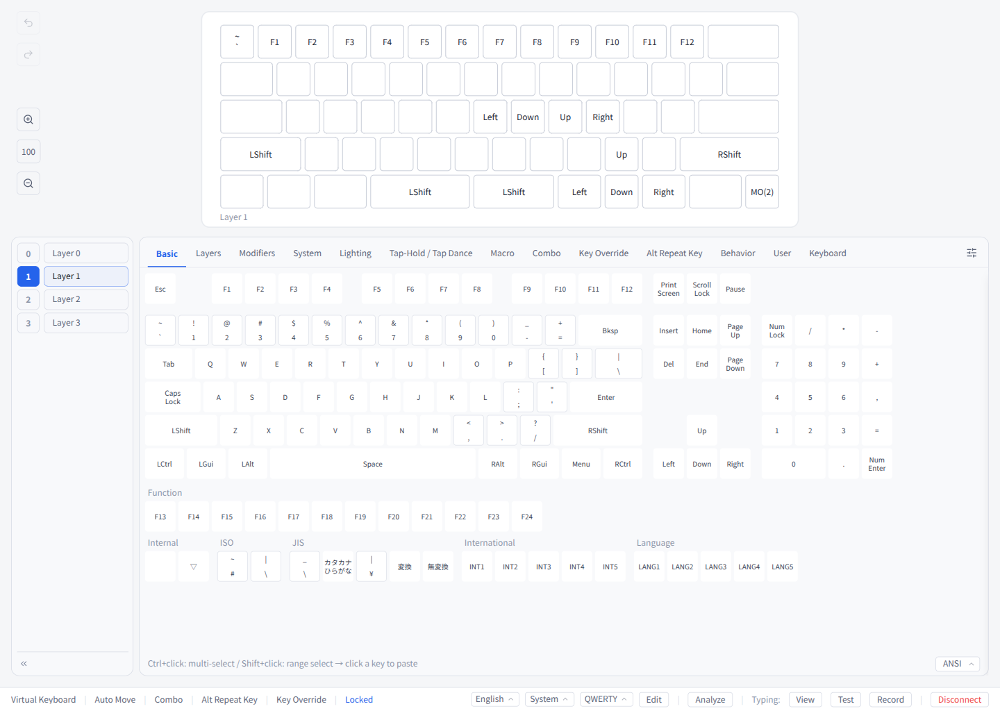

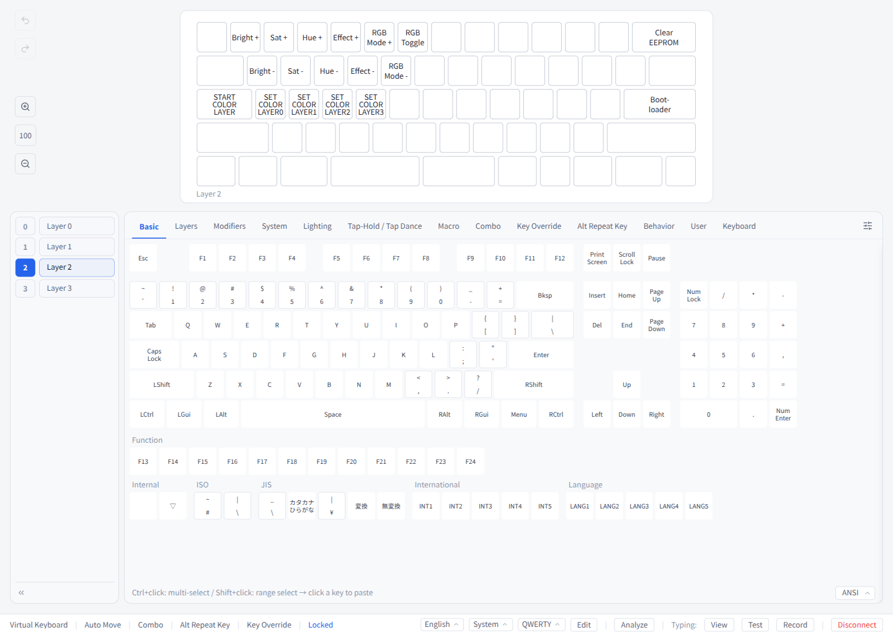

- Click layer number buttons to switch between layers
- Layer 0 is the default layer
- The number of available layers depends on the keyboard configuration

The layer panel can be collapsed to save space:

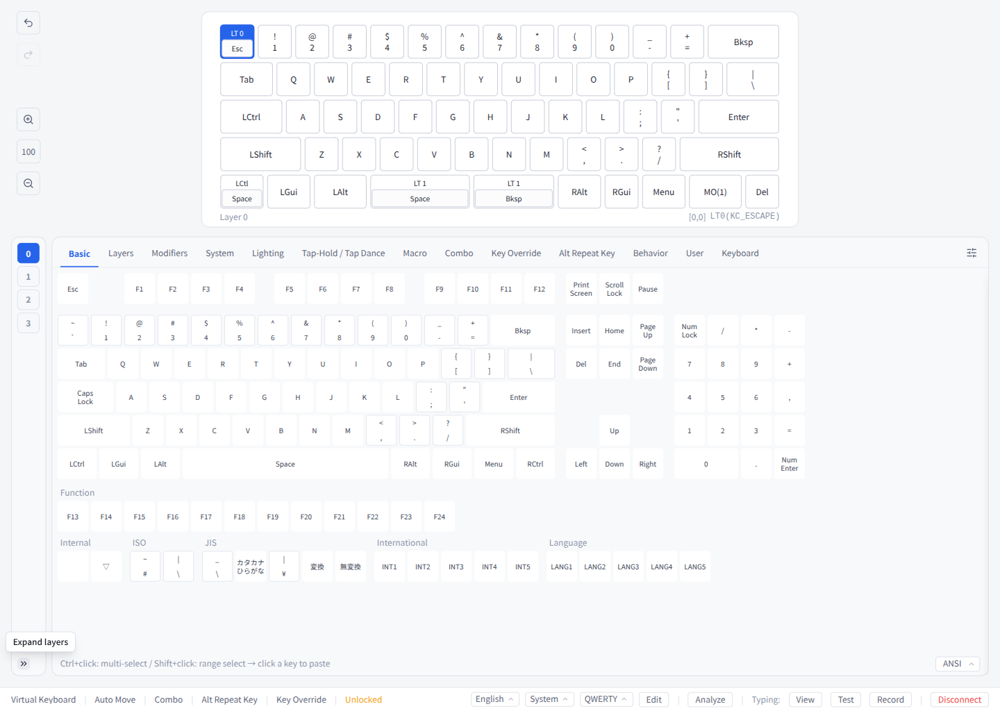

Click the collapse button (chevron) to minimize the layer panel to just numbers. Click the expand button to restore full layer names.

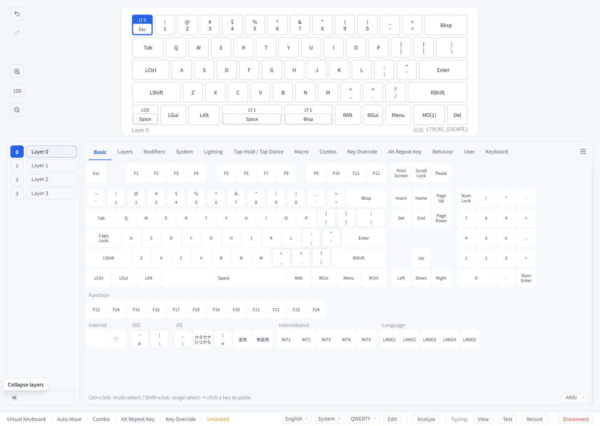

### 2.4 Key Popover

Double-click a key on the keyboard layout to open the Key Popover — a quick way to search and assign keycodes without scrolling through the palette.

**Layer Sidebar**


A vertical layer sidebar appears on the left side of the popover, matching the layer panel buttons. Click a layer number to switch layers without closing the popover. If the number of layers exceeds the popover height, the sidebar scrolls independently.

**Key Tab**

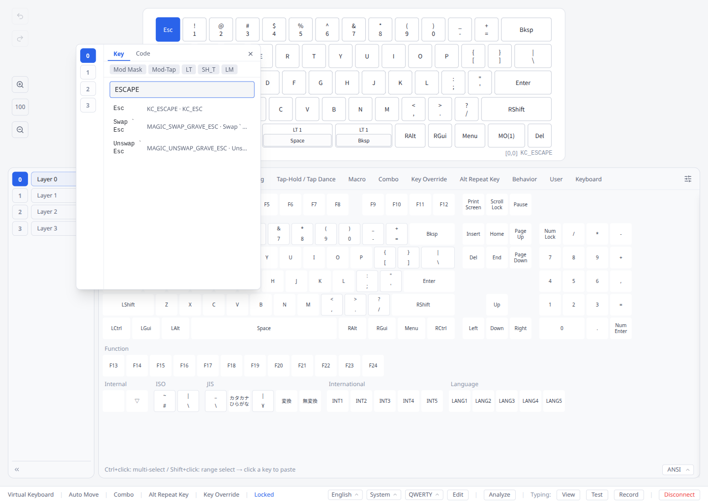

- The search input is pre-filled with the current keycode name
- Type to search by name, keycode name, or alias — results are ranked by relevance
- With a Key Label pack active that doesn't qualify as a clean, closed QWERTY permutation — the same eligibility check that decides whether a pack can be Rewritten at all (JIS shift-pair legends, kana, and any partial/non-closed swap are common examples), a result whose legend the pack overrides shows that pack's text (colored the same as its remapped keycap in the grid) and is also searchable by it — e.g. searching a symbol the pack draws on a key finds that key even if its default keycode name doesn't contain it. A pack that does qualify as a clean closed permutation (Colemak, Dvorak, Eucalyn, …) leaves these results on their standard legends, same as the keycode grid
- Click a result to assign it immediately
- The popover also appears when double-clicking key fields in detail editors (Tap Dance, Combo, Key Override, etc.) — those pickers are not Key Label pack-aware

**Code Tab**

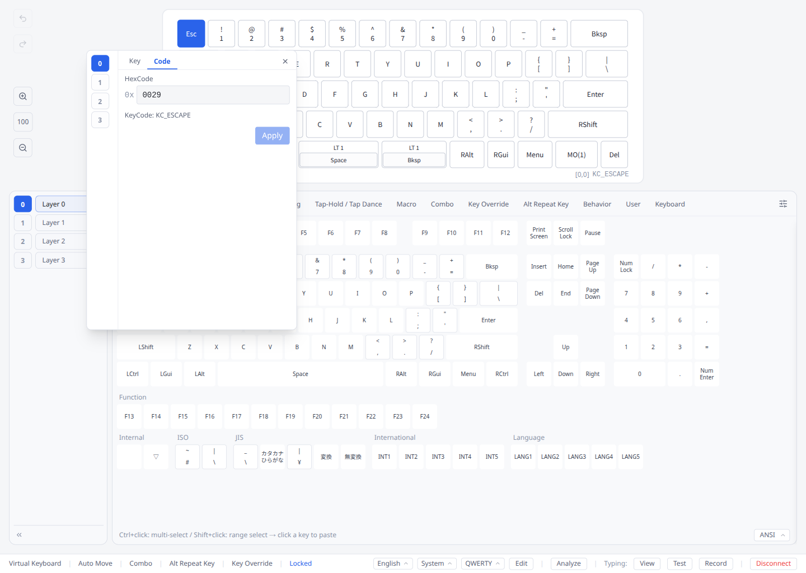

- Enter a keycode value directly in hexadecimal (e.g., `0x0029` for Escape)
- The resolved keycode name is displayed below the hex input
- Click **Apply** to assign the entered keycode

**Wrapper Modes**

The mode buttons at the top of the popover let you build composite keycodes:

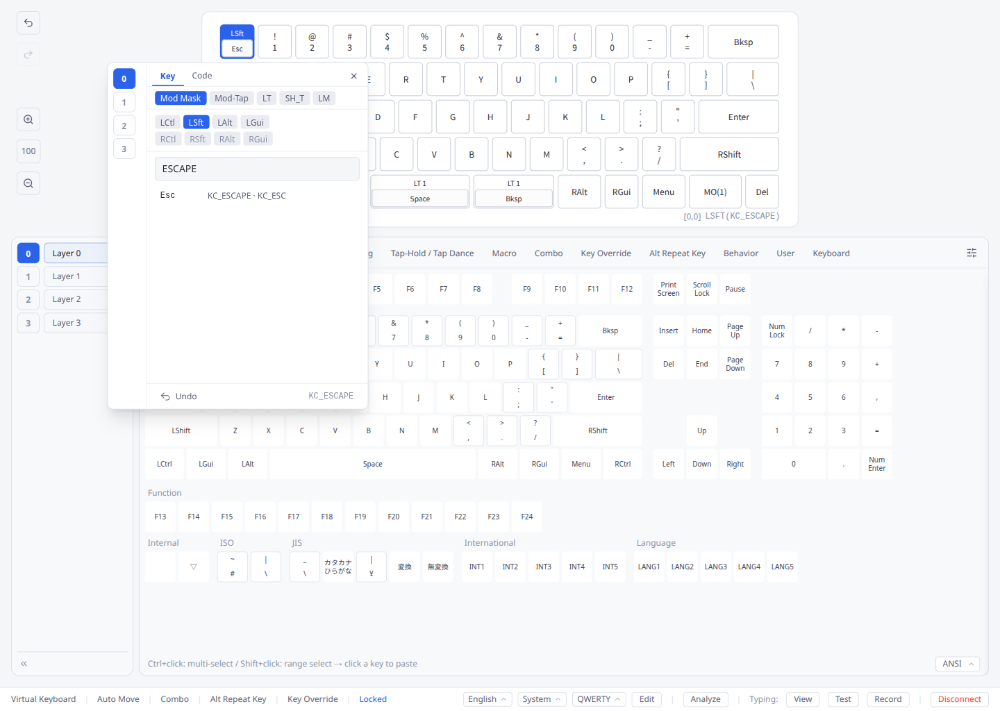

- **Mod Mask**: Combine a modifier with a key (e.g., `LSFT(KC_ESCAPE)`)
- **Mod-Tap**: Modifier on hold, key on tap (e.g., `LSFT_T(KC_ESCAPE)`)

Both modes show the modifier checkbox strip to select Left/Right Ctrl, Shift, Alt, or GUI. Left and Right modifiers cannot be mixed — selecting one side disables the other.

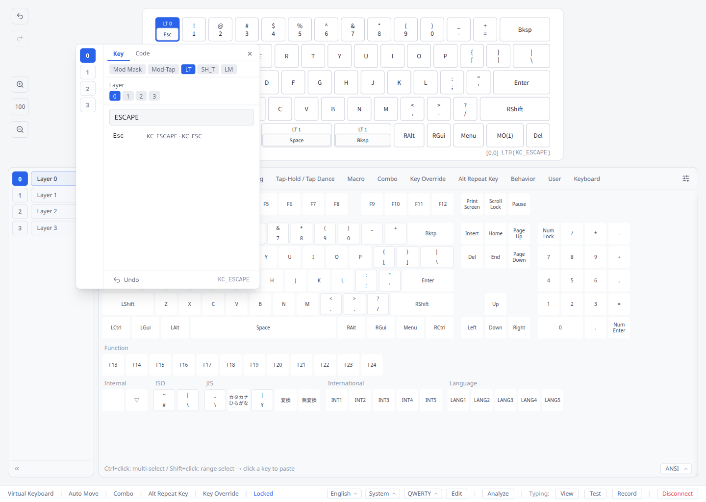

- **LT**: Layer-Tap — activate a layer on hold, send a key on tap (e.g., `LT0(KC_ESCAPE)`). A layer selector appears to choose the target layer.
- **SH_T**: Swap Hands Tap — swap hands on hold, send a key on tap (e.g., `SH_T(KC_ESCAPE)`)
- **LM**: Layer-Mod — activate a layer with modifiers (e.g., `LM(0, MOD_LSFT)`). Shows both the layer selector and the modifier checkbox strip.

Click an active mode button to toggle it off and revert to a basic keycode.

**Undo / Redo**: The popover footer shows context-sensitive **Undo** and **Redo** buttons. Undo displays the previous keycode and reverts to it; Redo displays the next keycode and re-applies it. These buttons only appear when the most recent undo/redo history entry matches the key currently open in the popover (i.e., the last single change). For multi-step history navigation, use the toolbar buttons or keyboard shortcuts (see §4.2).

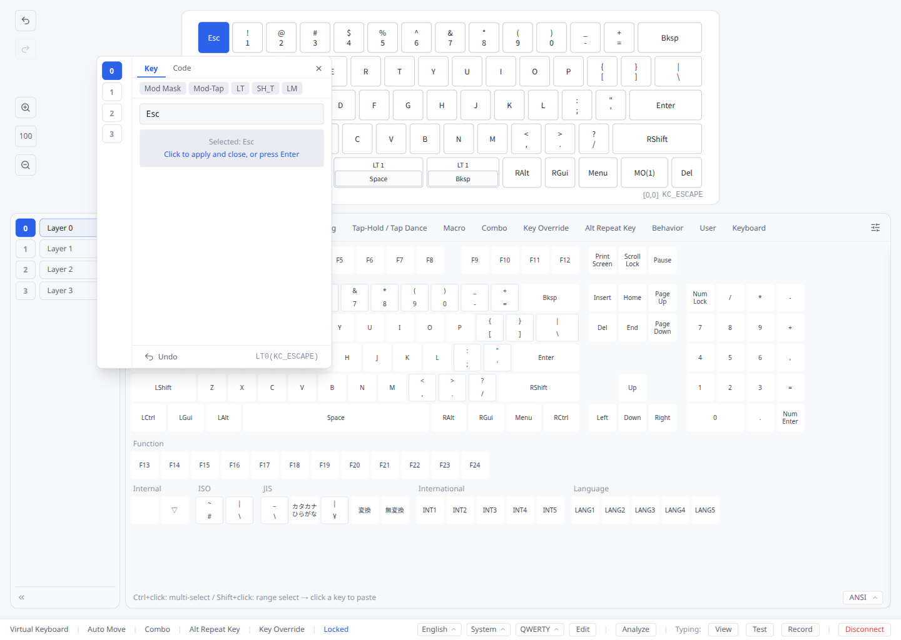
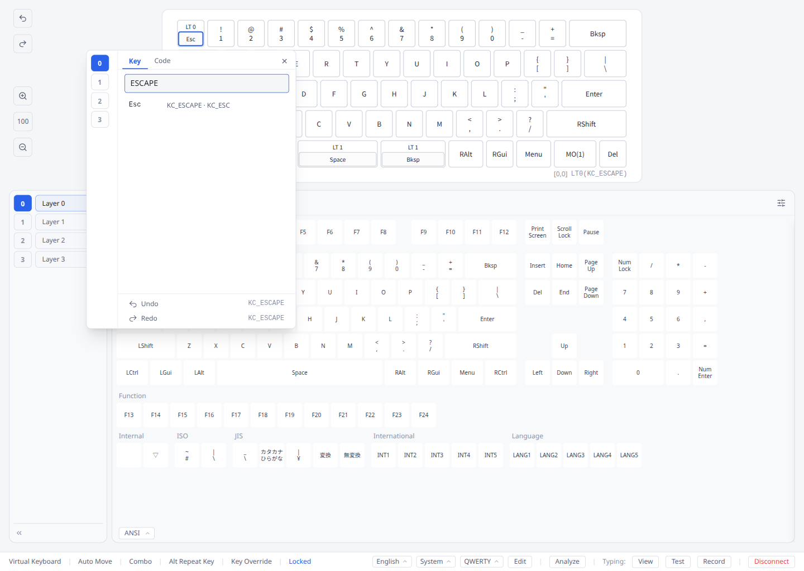

**Confirmation**: Press **Enter** to confirm the current selection and close the popover. Press **Escape** or click outside the popover to close it without changes.

### 2.5 Layout Options

Some keyboards support multiple physical layouts (e.g., split backspace, ISO enter, different bottom row configurations). When a keyboard has layout options, a Layout Options button (grid icon) appears at the right end of the keycode palette tab bar.

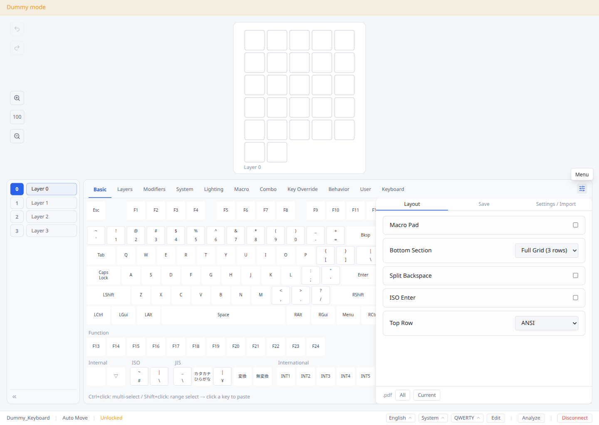

- Click the grid icon to open the Layout Options panel
- **Checkbox options**: Toggle a layout variant on or off (e.g., "Macro Pad", "Split Backspace", "ISO Enter")
- **Dropdown options**: Select from multiple layout variants (e.g., "Bottom Section" with Full Grid / Macro Pad / Arrow Keys choices)
- Changes are applied immediately — the keyboard layout display updates in real time to reflect the selected options

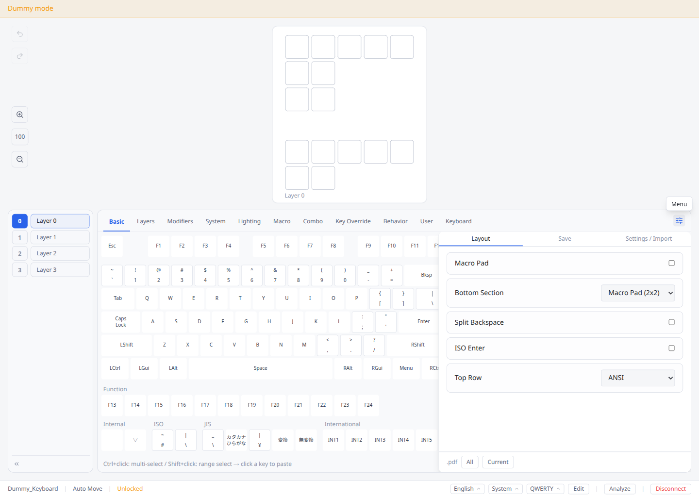

- Selecting a different option updates the visible keys on the keyboard layout
- Layout options are saved to the keyboard and persist across sessions
- Click outside the panel or press Escape to close it

> **Note**: The Layout Options button only appears for keyboards that define multiple layout variants. Most keyboards with a single fixed layout do not show this button. Screenshots in this section were taken using a dummy JSON definition loaded via "Load from JSON file".

### 2.6 View Matrix

When **Auto Move** is enabled (§3.14), assigning a keycode automatically advances the selection to the next key. Keys are visited in order of their matrix position (sorted by row, then by column) — by default the physical matrix defined by the keyboard, which gives a natural left-to-right, top-to-bottom walk even on keyboards whose definition lists keys in a scrambled order. The View Matrix lets you customize this order per keyboard by assigning each key a custom view position.

To edit the View Matrix, open the Keycodes Overlay Panel (§3.14) and click **Edit** in the **View Matrix** row. While the mode is active:

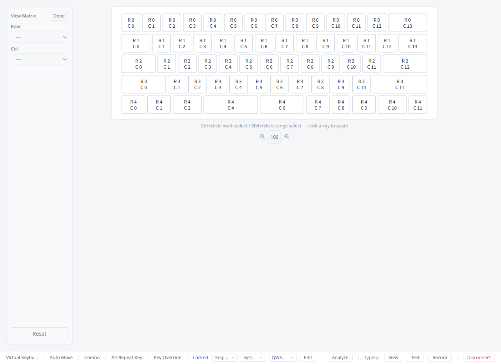

- The keymap display goes blank — instead of keycodes, each key shows its effective view position as two lines: `R` (row) and `C` (column)
- All keymap operations are disabled: layer switching, key assignment, the key popover, and the Key Tester (turned off automatically on entry). The keycode picker area (tabs, tiles, and menu) is hidden entirely, leaving a two-pane view: the **View Matrix** panel on the left and the keymap on the right (zoom and scrolling keep working)
- The layer panel is replaced by the **View Matrix** panel: the **Done** toggle, **Row** / **Col** selects for the currently selected key(s), and — at the bottom — the **Reset** button. Click Reset and confirm (**Reset?**) to delete all custom positions and return to the physical matrix order
- Click a key to select it — it's highlighted on the keymap, and the **Row** / **Col** selects immediately show its effective position. Both selects offer the same range, `0` up to one less than the larger of the keyboard's matrix row/column counts — view positions are a logical ordering, not a readout of each axis's physical size, so direct-pin keyboards (whose physical matrix collapses to a single row or column) still get a full 2D range on both axes. Changing either select saves instantly; there is no separate Save step. Choosing the value equal to the key's own physical position removes its custom position instead
- Ctrl-click (or Cmd-click on macOS) adds or removes a key from the selection; Shift-click selects a contiguous range. All selected keys stay highlighted. With 2 or more keys selected, the **Row** / **Col** selects show a blank placeholder — picking a value bulk-applies that row (or column) to every selected key in one step, each key keeping its own value on the other axis. A reminder of these Ctrl-click / Shift-click shortcuts is shown below the keymap, just above the relocated zoom controls
- If two or more keys resolve to the same effective view position, those keys are flagged with a shared highlight color on the keymap until the collision is resolved. Editing isn't blocked, but the Auto Move order between those keys becomes ambiguous
- The layer label normally shown below the keymap is hidden while the mode is active — the View Matrix has no layer concept
- Click **Done** in the **View Matrix** panel to exit the mode (it also exits automatically when switching or disconnecting the keyboard)

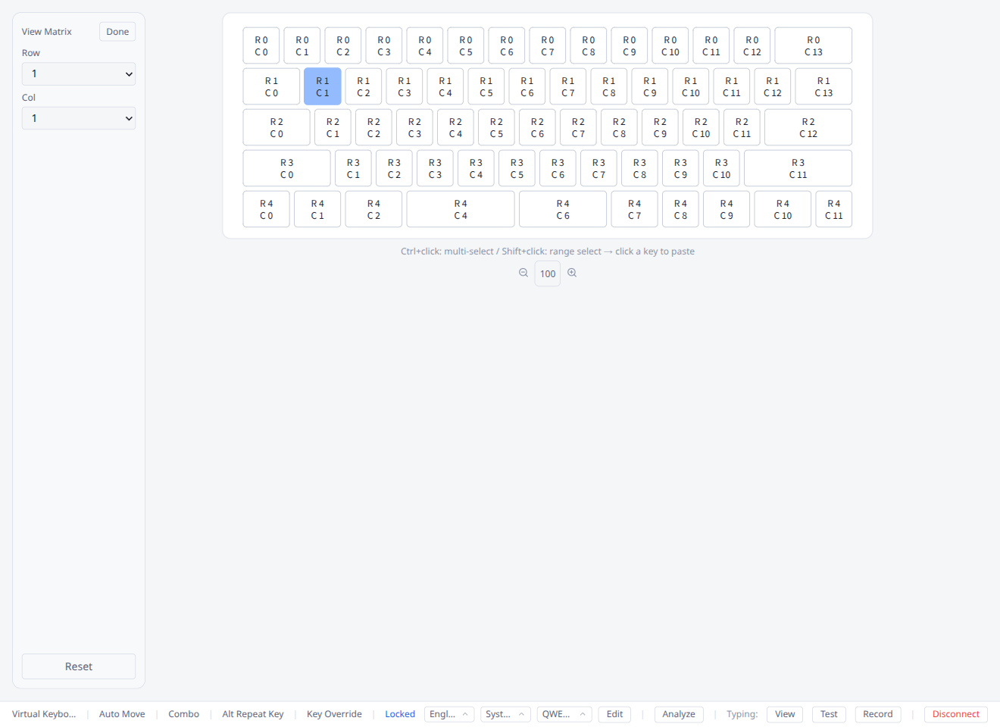

- Clicking a key highlights it and populates the **Row** / **Col** selects with its effective position

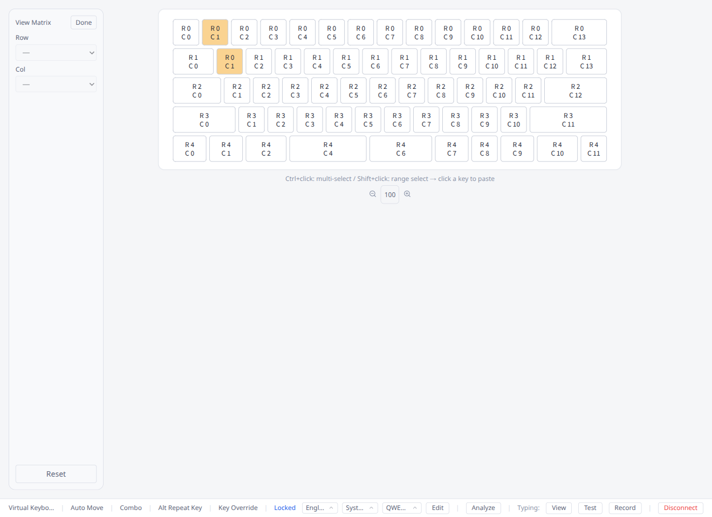

- Here two keys resolve to the same view position (`R 0` / `C 1`), so both are flagged with the shared highlight color

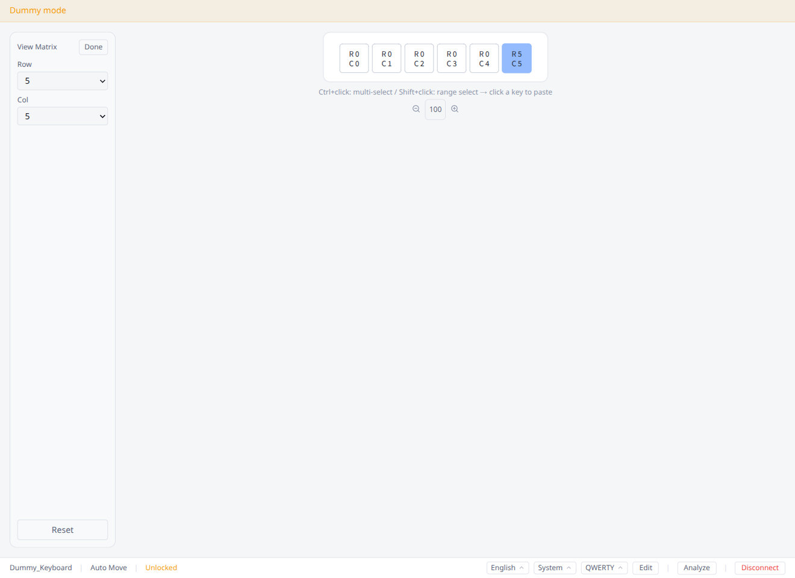

- On a direct-pin keyboard the physical matrix is a single row or column (here 1×6), yet both axes still span the larger matrix dimension — the **Row** and **Col** selects each offer `0`–`5`

Only keys you change are stored — every other key keeps its physical matrix position in the ordering. Encoders and decorative keys are not part of the Auto Move order and cannot be edited in this mode. The View Matrix is saved per keyboard and included in cloud sync (§6.1).

---

## 3. Keycode Palette

Select keycodes from different categories using the tabbed palette at the bottom of the screen.

### 3.1 Basic

Standard character keys, function keys, modifier keys, and navigation keys. The Basic tab supports four view types, selectable from the view selector at the bottom of the Basic tab:

**ANSI Keyboard View** (default)

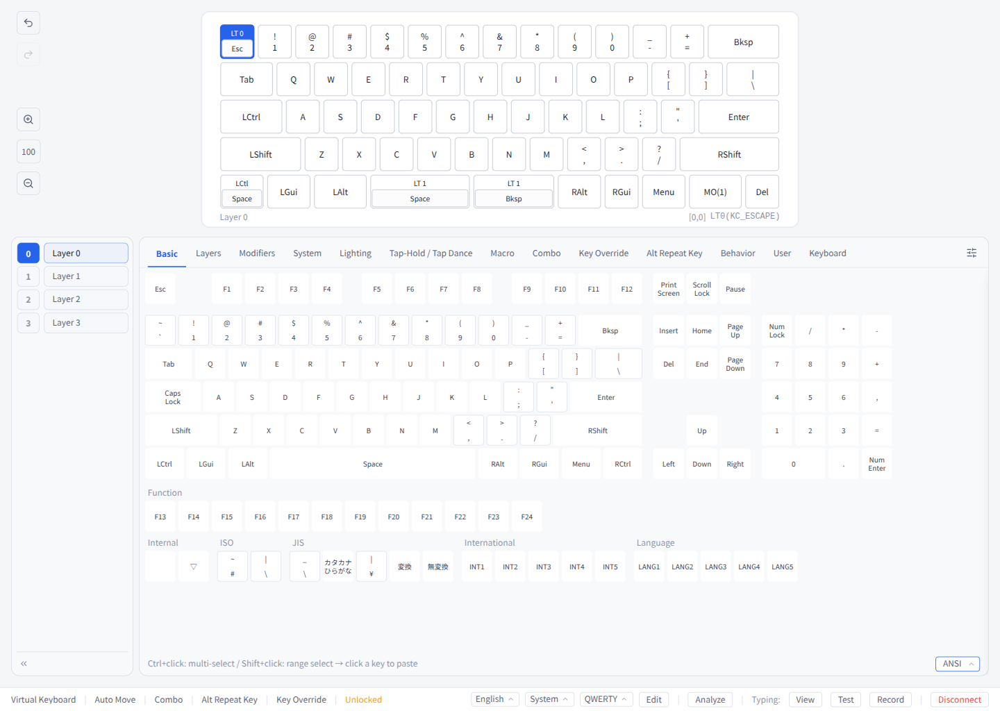

Displays keycodes as an ANSI keyboard layout. Click a key on the visual keyboard to assign it.

**ISO Keyboard View**

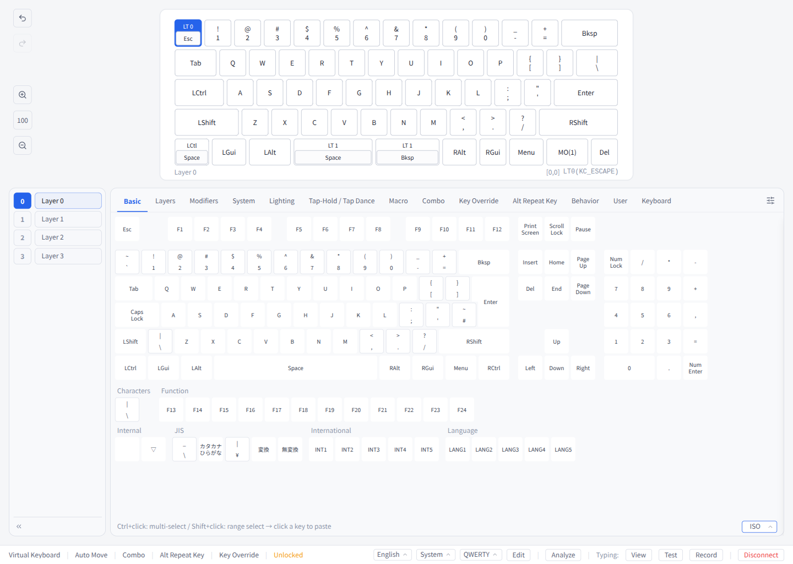

Displays keycodes as an ISO keyboard layout with the ISO-specific keys.

**JIS Keyboard View**

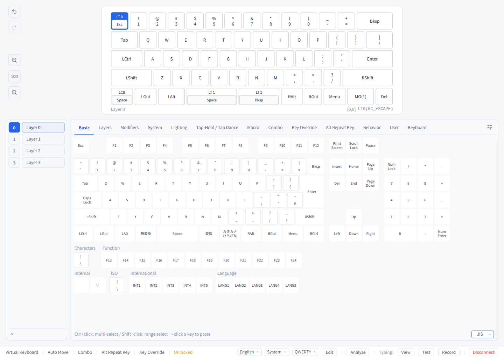

Displays keycodes as a JIS keyboard layout with JIS-specific keys (Yen, Ro, Henkan, Muhenkan, Katakana/Hiragana).

**List View**

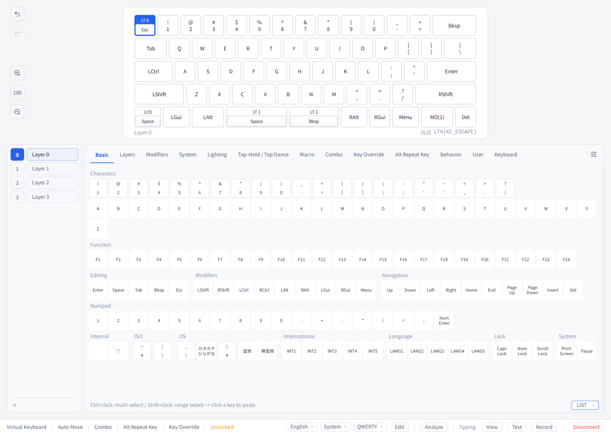

Displays keycodes in the traditional scrollable list format.

All views include:
- Character keys (A-Z, 0-9, symbols)
- Function keys (F1-F24)
- Editing keys (Enter, Tab, Backspace, Delete)
- Navigation keys (arrows, Home, End, PageUp/Down)
- Numpad keys
- International keys (KC_INT1–KC_INT5)
- Language keys (KC_LANG1–KC_LANG5)

### 3.2 Layers

Keycodes for layer operations.

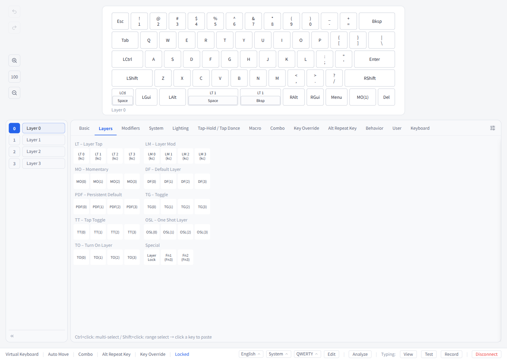

- **MO(n)**: Momentarily activate layer n while held
- **DF(n)**: Set default layer to n
- **TG(n)**: Toggle layer n
- **LT(n, kc)**: Layer on hold, keycode on tap
- **OSL(n)**: Activate layer n for the next keypress only
- **TO(n)**: Switch to layer n

### 3.3 Modifiers

Keycodes for modifier key combinations and tap behavior settings.

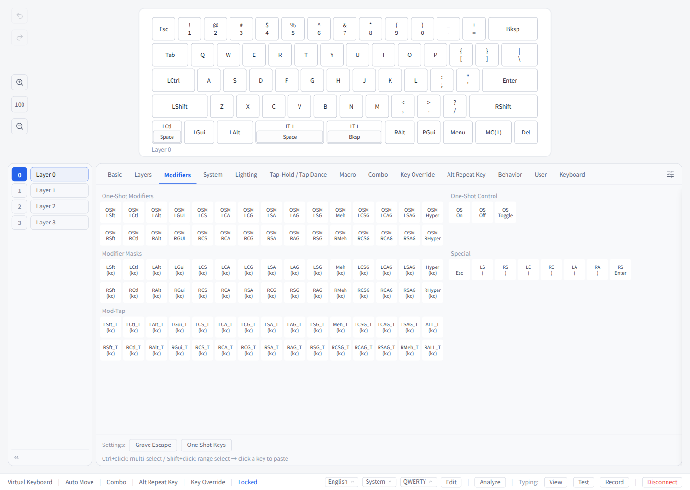

- **One-Shot Modifiers (OSM)**: Activate modifier for the next keypress only
- **One-Shot Control**: Turn the one-shot feature itself on / off / toggle (distinct from OSM, which triggers a one-shot modifier)
- **Mod-Tap**: Modifier on hold, regular key on tap
- **Modifier Masks**: Modifier key combinations

### 3.4 System

Keycodes for mouse control, media playback, system utilities, and audio/haptic feedback.

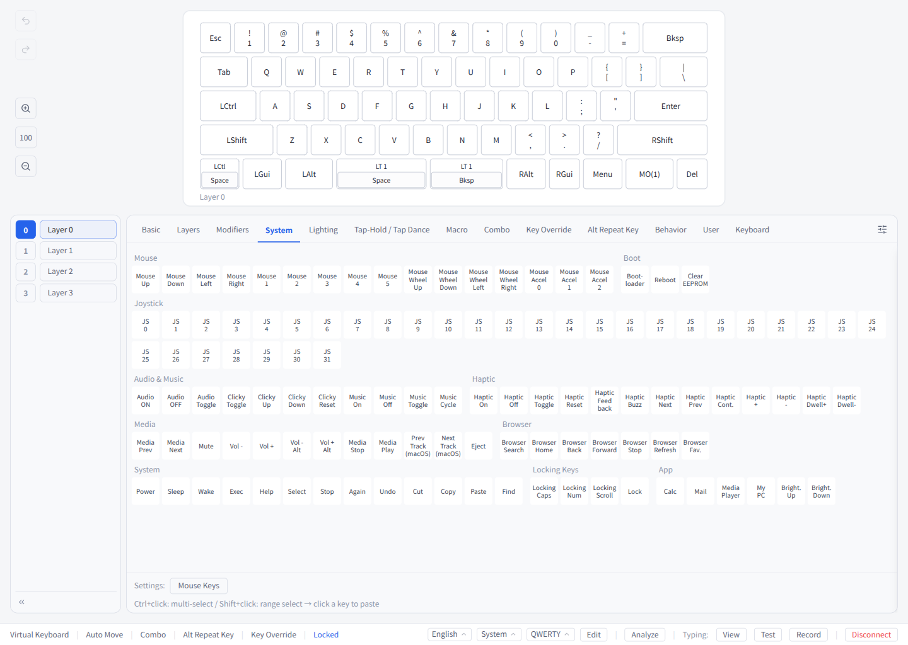

Groups render as five rows, pairing related groups side by side:

- **Mouse** (buttons, movement, scrolling) / **Boot** (enter bootloader mode, QK_BOOT)
- **Joystick**: axis and button keycodes
- **Audio**: audio toggle and control keycodes / **Haptic**: haptic feedback toggle and control keycodes
- **Media Playback**: play/stop/volume/track controls / **Browser**: browser navigation keys
- **System Control**: system power, sleep, wake / **Locking Keys**: Locking Caps Lock, Num Lock, Scroll Lock / **App**: application launcher keys

> **Note**: The MIDI tab is only displayed for MIDI-capable keyboards. When available, it appears between System and Lighting.

### 3.5 Lighting

Keycodes for backlight and RGB lighting controls.

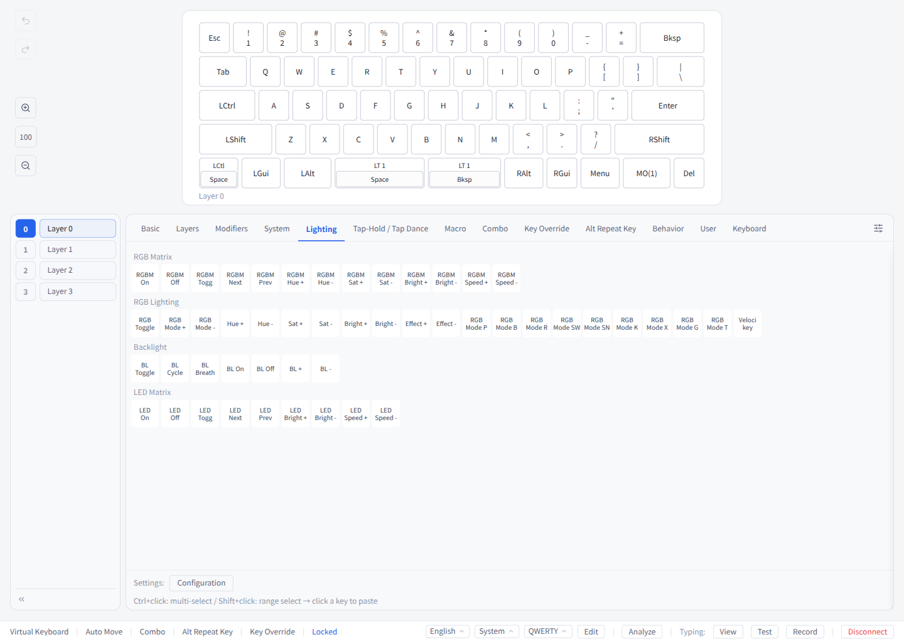

- RGB Matrix controls
- RGB Lighting controls
- Backlight controls
- LED Matrix controls

### 3.6 Tap-Hold / Tap Dance

Keycodes that assign different actions to tap and hold.

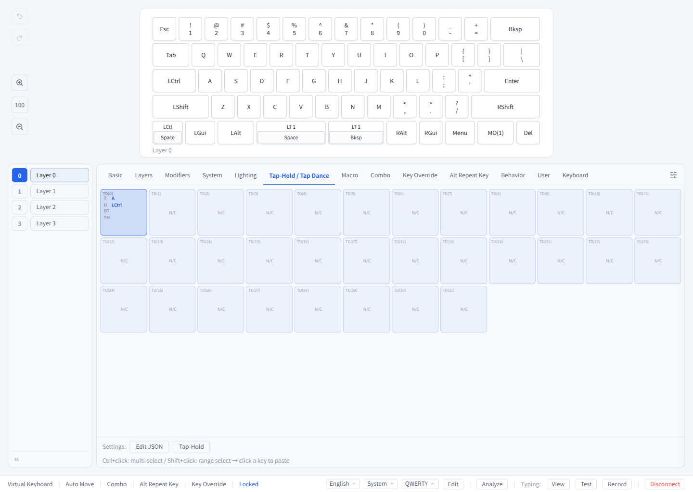

The Tap Dance section displays a **tile grid preview** showing all entries at a glance:

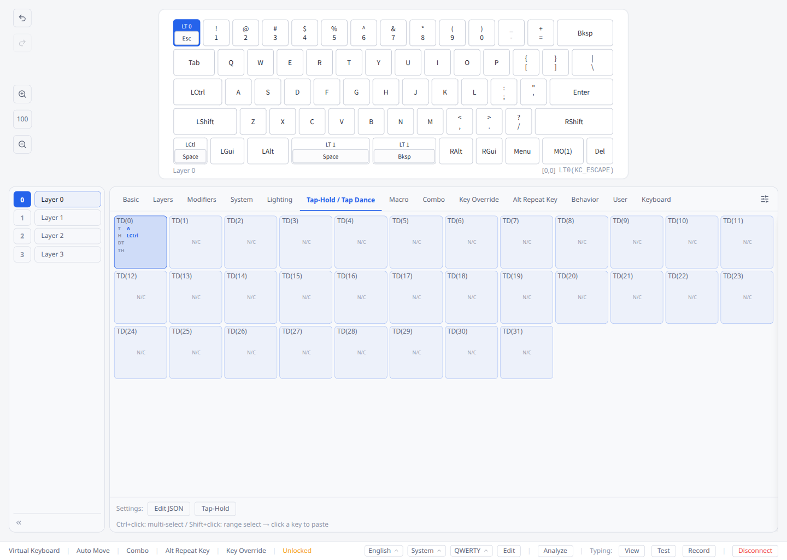

- Each tile shows the entry number and a summary of configured actions
- Configured entries display their tap/hold actions; unconfigured tiles show the number only
- Click a tile to open the Tap Dance edit modal directly to that entry
- Configure tap, hold, double-tap, and other actions for each entry
- **Edit JSON** button at the bottom opens a JSON editor for bulk editing all entries (see §5.6)

### 3.7 Macro

Macro keycodes.

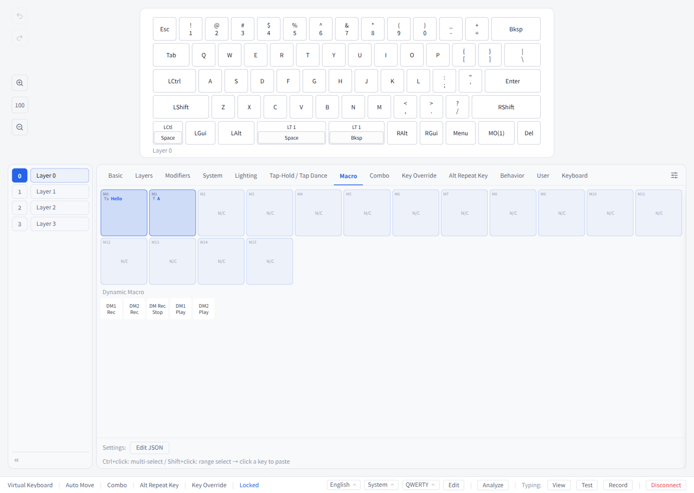

The Macro section displays a **tile grid preview** showing all entries at a glance:

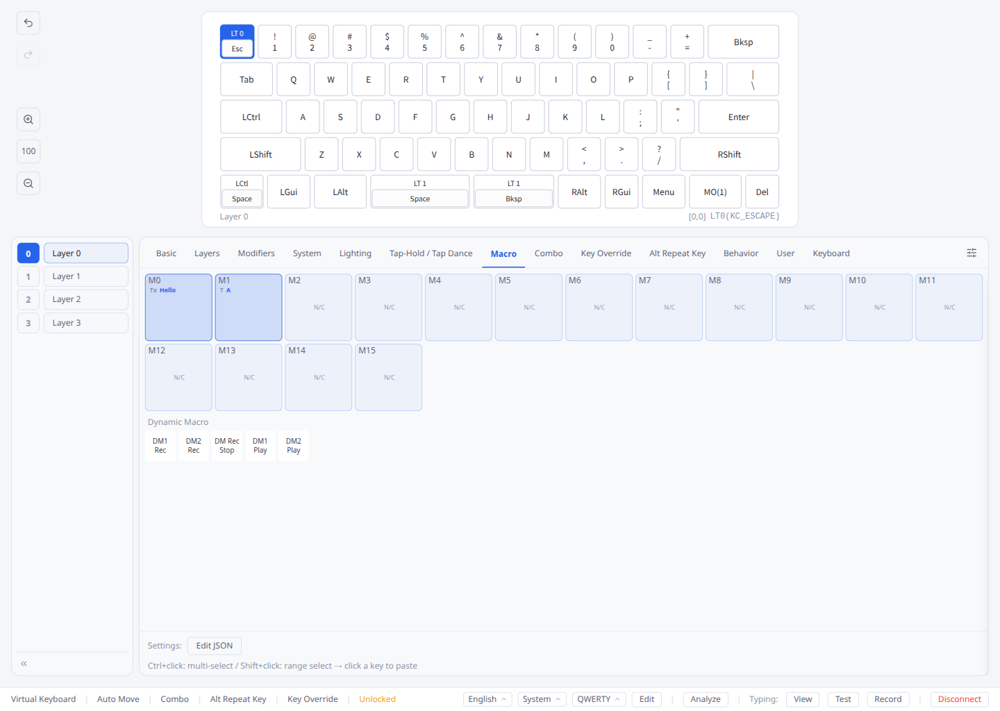

- Each tile shows the macro number and a preview of the recorded sequence
- Configured entries display a summary of key actions; unconfigured tiles show the number only
- Click a tile to open the Macro edit modal directly to that entry
- Record sequences of key inputs as macros
- **Edit JSON** button at the bottom opens a JSON editor for bulk editing all entries (see §5.6)

#### Macro Edit Modal — List Mode and Edit Mode

Opening a macro action brings up the Macro Modal with two display modes that share the same row:

- **List mode** (default): The action's keycodes are shown as clickable tiles followed by a dashed **add slot**. Single-click a keycode tile to switch that index into edit mode. Single-click the dashed add slot to select it; double-click the dashed slot to open the keycode popover with an empty query (mirrors the keymap editor). The pencil "edit" icon from earlier versions is gone — clicking is the only affordance
- **Edit mode**: The keycode picker stays visible below the row. Each keycode tile shows a hover **X** button to delete that index, and the Tap row exposes a **Close** button to leave edit mode. Picker and popover selections are **staged** — they update the row visually but are not committed until you press the bottom **Save** button or **Enter**. The footer also shows a **Revert** ConfirmButton when you are editing an action that already existed (it is hidden when you just added the action via Add Action, since there is nothing prior to revert to). Save and Revert are disabled until a pick actually changes something. Pressing **Escape**, the per-row **Close** button, **Revert**, or clicking outside the picker / action list / footer / key popover rolls back the entire in-flight edit — including newly-appended Add-keycode slots or an entirely newly-added action — and leaves edit mode. Deleting a slot during edit shifts the selection so the session continues rather than exiting.

Empty keycode actions are tolerated while editing; they are normalized out silently when the macro is saved or exported to a favorite.

#### Recording Lock

While the built-in recorder is capturing keystrokes, the Macro Modal enters a strict disabled state to prevent accidental edits:

- The Add Action select, Text Editor toggle, Clear, Revert, and bottom **Save** buttons are all disabled
- Every existing MacroActionItem and its KeycodeField is disabled (native `disabled` attribute — Tab / hover / click are all suppressed)
- The inline favorites panel is made invisible with its width preserved, so the layout does not jump
- The modal's top-right Close button and backdrop click are inert — the modal cannot be dismissed until recording stops
- The list-mode footer's Clear / Revert / Save buttons remain visible but disabled during recording. In per-action edit mode the list-level Clear / Revert are hidden, but the edit-mode Save (and Revert, for existing edits) are kept visible and disabled so you can see the affordance

### 3.8 Combo

Combo keycodes for simultaneous key-press combinations.

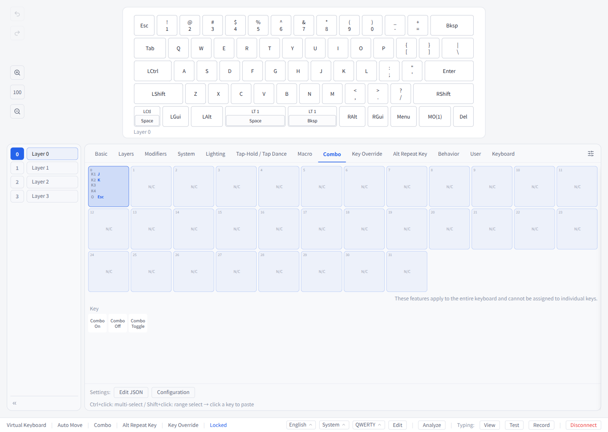

The Combo tab displays a **tile grid preview** showing all entries. A note reads: "These features apply to the entire keyboard, not just the current layer."

- Each tile shows the combo number and a summary (e.g., "A + B → C")
- Click a tile to open the Combo edit modal directly to that entry (§5.2)
- Combo keycodes (CMB_000–CMB_031) can be assigned to keys for triggering combos
- **Settings: Configuration** button at the bottom opens a settings modal for combo-related timeout configuration (e.g., Combo time out period)
- **Edit JSON** button at the bottom opens a JSON editor for bulk editing all entries (see §5.6)

### 3.9 Key Override

Key Override keycodes for replacing key outputs when specific modifiers are held.

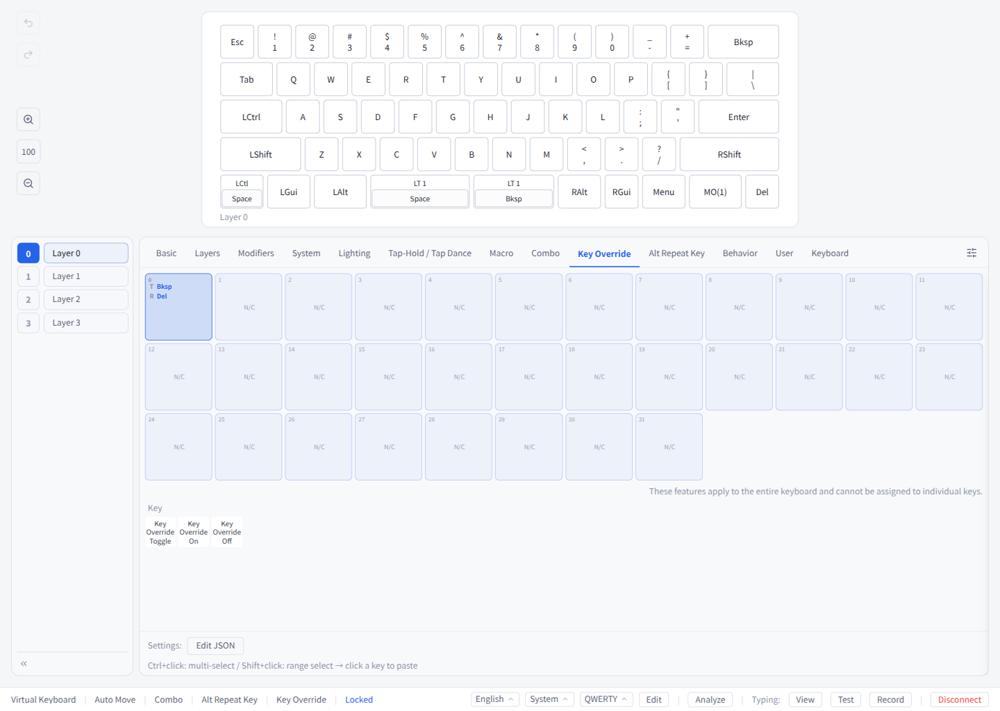

The Key Override tab displays a **tile grid preview** showing all entries and a settings area.

- Each tile shows the override number and a summary
- Click a tile to open the Key Override edit modal directly to that entry (§5.3)
- **Edit JSON** button at the bottom opens a JSON editor for bulk editing all entries (see §5.6)

### 3.10 Alt Repeat Key

Alt Repeat Key keycodes for context-aware alternate repeat key bindings.


The Alt Repeat Key tab displays a **tile grid preview** showing all entries and a settings area.

- Each tile shows the entry number and a summary
- Click a tile to open the Alt Repeat Key edit modal directly to that entry (§5.4)
- **Edit JSON** button at the bottom opens a JSON editor for bulk editing all entries (see §5.6)

### 3.11 Behavior

Keycodes for advanced QMK behavior features.

- **Magic**: Magic keycodes for swapping and toggling keyboard behaviors
- **Mode**: NKRO toggle, mode switching keycodes
- **Auto Shift**: Auto Shift toggle and configuration keycodes
- **Autocorrect**: Autocorrect on / off / toggle
- **Leader**: Begin a leader sequence (`QK_LEAD`)
- **Swap Hands**: Swap Hands keycodes and Swap Hands Tap variants
- **Caps Word**: Caps Word toggle
- **Dynamic Tapping Term**: Print / increase / decrease the tapping term at runtime

### 3.12 User

User-defined keycodes.

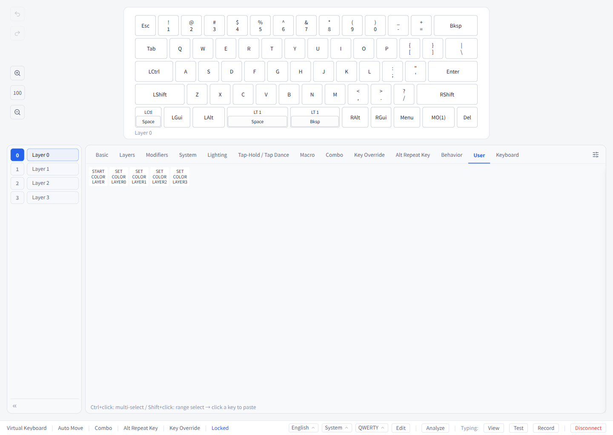

- Custom keycodes defined in firmware (e.g., `CUSTOM_1`, `CUSTOM_2`)
- When exporting `keymap.c`, custom keycodes use their configured names instead of generic `USER00`/`USER01` identifiers, and an `enum custom_keycodes` block is generated automatically

### 3.13 Keyboard (Device Picker)

The Keyboard tab lets you copy keycodes from other connected keyboards or from saved files.

> **Use case:** While editing a keyboard, you wonder how another keyboard's keymap is set up — but that keyboard isn't connected right now. If you've previously saved its data (via the Save panel), you can load it from the **File** source in this tab to browse its keymap and copy keycodes directly into your current layout.

**Device List**

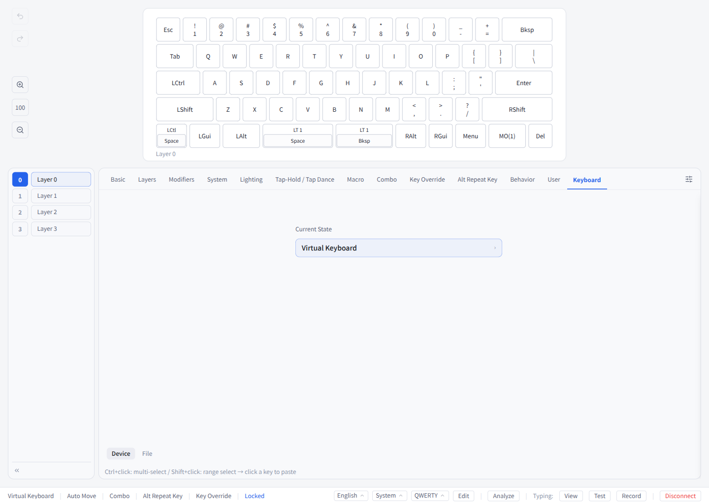

When you open the Keyboard tab, a list of all connected Vial-compatible keyboards is displayed. This list updates in real time as you plug in or unplug devices.

- Click a device to load its keymap — the currently connected keyboard shows its live keymap instantly; other devices are probed via a temporary USB connection

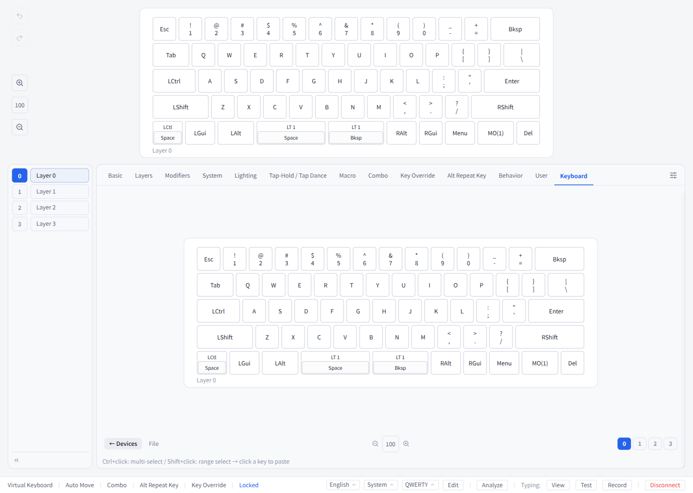

- Once loaded, click any key on the displayed keyboard to assign that keycode to the selected key on the main keymap
- Use Ctrl+click for multi-select, Shift+click for range select
- Layer buttons at the bottom right let you browse different layers
- Zoom controls (+ / numeric input / −) adjust the picker keyboard size (30%–200%). When viewing another keyboard, its saved zoom level is loaded automatically
- Press Escape to clear the picker selection

**File Source**

Click the **File** button at the bottom to switch to the file source. This shows saved keyboard snapshots and allows loading `.pipette` files — the same keycode picking workflow applies.

> **Note**: Only V2 format (`.pipette`) files are supported in the key picker. If a legacy V1 format file is selected, a warning is displayed prompting you to connect the keyboard and open the keymap to migrate the data.

> **Tip — Build from keyboards you don't own:** The reference keyboard doesn't have to be one you physically own. Save a shared `.pipette` file under a name (§1.1), pick it as the **File** source here, then Ctrl+click / Shift+click to multi-select keys on the reference keyboard and click a key on your own keymap to paste them in. This lets you copy assignments from other people's layouts — or any keyboard you've collected — straight into yours, with no hardware connected.

**Composite Keycodes**

When clicking a composite key (e.g., `LT1(KC_SPC)`) in the picker, the full keycode is assigned as-is. Inner/outer parts are not split — the complete keycode is copied to the target key.

> **Note**: The Keyboard tab is hidden when editing the inner part of a mask key (e.g., choosing the `KC_SPC` inside `LT1(KC_SPC)`), since composite keycodes cannot be assigned to the inner byte.

### 3.14 Keycodes Overlay Panel

The Keycodes Overlay Panel provides quick access to editor tools and save functions. Toggle it with the panel button at the right end of the keycode tab bar.

**Settings / Import Tab**

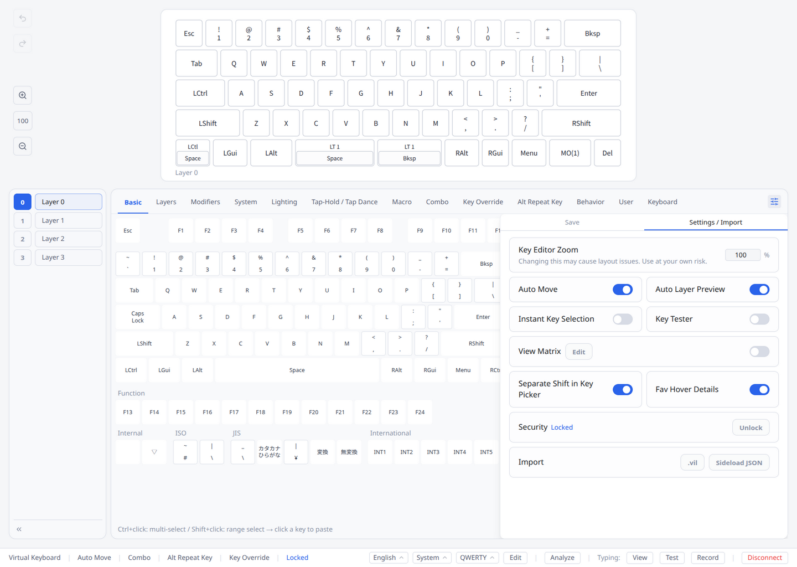

- **Key Editor Zoom**: Set the UI zoom level (50–200%) applied while in key editor mode. Defaults to the global UI zoom (§6.5) when not configured. Saved and synced per keyboard
- **Auto Move**: Toggle automatic advancement to the next key after assigning a keycode
- **View Matrix**: Enter or leave View Matrix mode (**Edit** / **Done**) to customize the Auto Move key order (see §2.6)
- **Instant Key Selection**: Toggle instant key selection mode (see §2.2 for behavior details)
- **Separate Shift in Key Picker**: Toggle split display for combined keycodes (e.g., show Mod-Tap as two halves)
- **Key Tester**: Toggle Matrix Tester mode (supported keyboards only)
- **Security**: Shows lock status (Locked/Unlocked) with a Lock button. The Lock button is unavailable (disabled) while Typing Record (§4.3) is on, since locking would immediately reopen the Unlock dialog
- **Import**: Restore from `.vil` files or sideload custom JSON definitions
- **Reset Keyboard Data**: Reset keyboard to factory defaults

**Save Tab**


- **Export Current State**: Download keymap as `.vil`, `keymap.c`, PDF keymap cheat sheet, or PDF layout export (key outlines with summary pages for Tap Dance, Macro, Combo, Key Override, and Alt Repeat Key entries)
- **Save Current State**: Save a snapshot of the current keyboard state with a label
- **Synced Data**: List of saved snapshots with Load, Rename, Delete, and Export actions
- This is the same Save panel as the standalone editor settings (§6)

**Layout Tab** (when available)

Some keyboards support layout options (see §2.5). When available, a Layout tab appears as the first tab in the overlay panel, providing access to the same layout options.

---

## 4. Toolbar

The toolbar on the left side of the keymap editor provides the following features.


### 4.1 Zoom

Adjusts the keyboard layout display scale. Range: 30%–200% (default 100%).

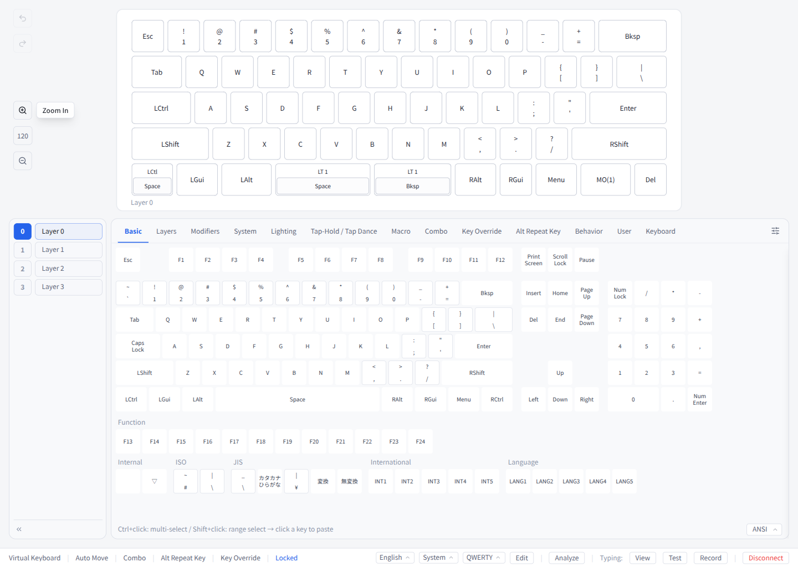

- (+) button to zoom in
- (-) button to zoom out
- Can also be adjusted in editor settings
- Zoom level is saved per keyboard and restored automatically on reconnect

### 4.2 Undo / Redo (Keymap History)

The keymap editor automatically records a history of keycode changes. You can navigate through this history to undo or redo changes.

| Method | Scope | How to use |
|--------|-------|------------|
| **Keyboard shortcuts** | Full history (up to Max Keymap History, default 100) | Ctrl/Cmd+Z (Undo), Ctrl+Y / Ctrl/Cmd+Shift+Z (Redo) |
| **Toolbar buttons** | Full history | Undo / Redo buttons in the left toolbar |
| **Popover buttons** | Last single change only (must match the open key) | Undo / Redo buttons in the popover footer (see §2.4) |

- History is cleared when switching keyboards, disconnecting, restoring a snapshot / loading a saved layout / importing a `.vil` file, or rewriting the keymap from a Key Label (see **Applying a Key Label to the Keymap** in §6.2) — each of these replaces some or all of the keymap, so there is nothing left in the old history that still applies. A keymap Rewrite is the one case where nothing is pushed back onto the (now-empty) stack afterward — see **Limitations** there
- The maximum history size can be configured in Settings → Defaults → **Max Keymap History** (see §6.1)
- All keymap mutation paths are tracked: single key edits, popover selections, mod-mask changes, paste, and copy-layer operations

### 4.3 Typing Test

A typing practice feature. Test your typing with the current keymap while viewing the keyboard layout below. The layout highlights key presses in real time, so you can verify that your physical keymap matches the on-screen display.

Click the **Typing Test** button in the status bar to enter typing test mode.

#### Settings Panel

The left side of the typing-test screen is a collapsible **Settings** panel. The chevron button at its bottom collapses it to a thin rail and expands it again; the state is saved per keyboard. The panel groups the test controls into three sections:

- **Settings** — the **Data Source** row (see below); **Layer** (the base layer used by the on-screen keymap, shown when the keyboard has more than one layer); and **Lines** / **Font** (line count and font size of the reading window — these two apply in every mode). With a MonkeyType language active, the **Pattern** / **Units** / **Option** rows described under **MonkeyType** also appear here; with a Tatoeba pack active, Tatoeba's own **Pattern** / **Units** rows appear instead (see **Tatoeba** below)
- **Data** — **History** opens the saved-results modal (see **History** below). **Compare** picks the comparison baseline — **Previous**, **Best**, **Average**, a pinned **Result**, or **Off**; while a baseline is set, colored ▲ / ▼ deltas appear next to WPM / KPM / Accuracy in the stats row, and the **Compare** button itself takes on an accent border and text whenever the baseline isn't Off. The baseline choice is remembered per test condition (mode + settings + language, or per imported text). **Weak Spot Training Mode** opens a settings modal, shown in every mode, for biasing word sampling toward your own detected weak spots — the modal's Enable toggle and tunable parameters only take effect in the words/time patterns; a status line below the button shows what's currently detected (see **Weak Spot Training Mode** below). **Save Unnamed** (default on) auto-saves finished results even without a name; switched off, only named results are kept
- **View** — three switches: **Operation** (the controls row below the reading window), **Measurement** (the live stats row), and **Keymap** (the keyboard pane). Each hides its area when switched off; a finished test always shows the controls and the results regardless

#### History

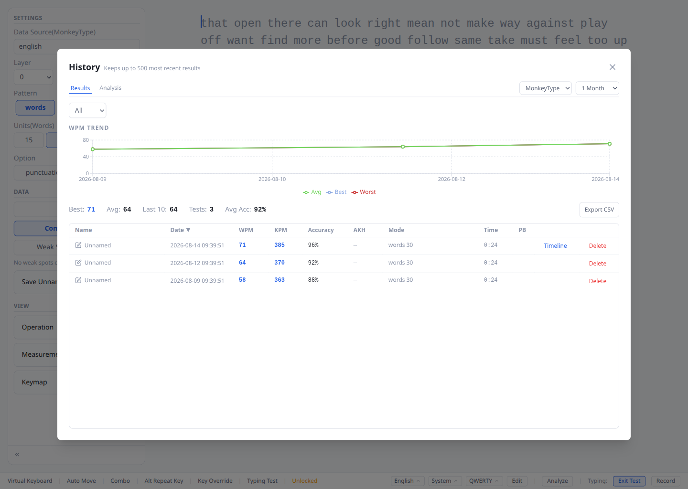

The History modal opens on a single header row: **Results** / **Analysis** tabs on the left, a small note next to the title stating the retention cap (see below), and a right-end group of selects — a source select (**MonkeyType** / **Tatoeba** / **Aozora** / **File Import**) that scopes every section in the modal to one source, then (only while **Analysis** is active) the Accuracy Trend's own condition select, then a **period filter** (always the rightmost select, in both tabs): **1 Week** / **1 Month** (default) / **3 Months** / **1 Year** / **All Time**. The period filter resets to 1 Month every time the modal reopens, and it scopes everything below the header row — the WPM Trend chart, the stats row, the Results table, **Export CSV**, and the entire Analysis tab. Runs from different sources aren't comparable to each other, so every stat, chart, and export in the modal stays scoped to whichever source is currently picked.

Regardless of period filter or source, History itself keeps only the 500 most recent results overall — once that cap is reached, saving a new result silently drops the oldest one. This limit is independent of any filter above: it's not that older results are hidden from view, they're gone from storage entirely.

**Results** tab — the run list:

- A sub-filter row sits above the table for two of the four sources: a mode dropdown (All / Words / Time / Quote) for **MonkeyType**, a text dropdown for **Aozora** / **File Import**. **Tatoeba** has neither — its own Accuracy Trend condition selector (on the Analysis tab) already covers per-condition grouping
- A titled **WPM Trend** chart aggregates the filtered runs **per calendar day**, plotting three lines — **Best** / **Worst** / **Avg** — with the exact value on hover; on a day with only one run, all three lines coincide at that point. It appears once there are 2 or more days with data
- A stats row (Best / Avg / Last 10 / Tests / Avg Acc) follows, with **Export CSV** at its right end — the export always matches whatever the sub-filter, source select, and period filter currently show
- The table lists up to 20 rows under whichever sort is active — click any column header to change it, defaulting to most recent first. Column widths are measured from the active language pack's own strings at runtime, so labels stay on one line regardless of locale. Besides Name / Date / Mode / PB, the table carries WPM, KPM, Accuracy, and an abbreviated **AKH** column (Avg Key Hold — the run's mean key press-to-release duration; hover the header for the full name). A run with a saved keystroke log shows a **Timeline** text link in its own column; clicking it opens the **Keystroke Timeline** (see below). A row shows nothing in that column instead — never a disabled link — when its run has no saved log at all: recorded before Recording Consent was ever accepted (see **Typing Record** below — the same app-wide consent flag also gates the raw log for an ordinary Typing Test run, not only for ambient recording), recorded before this feature existed, or paused/interrupted without finishing. Each row can also be renamed (same naming modal as the finished screen) or deleted

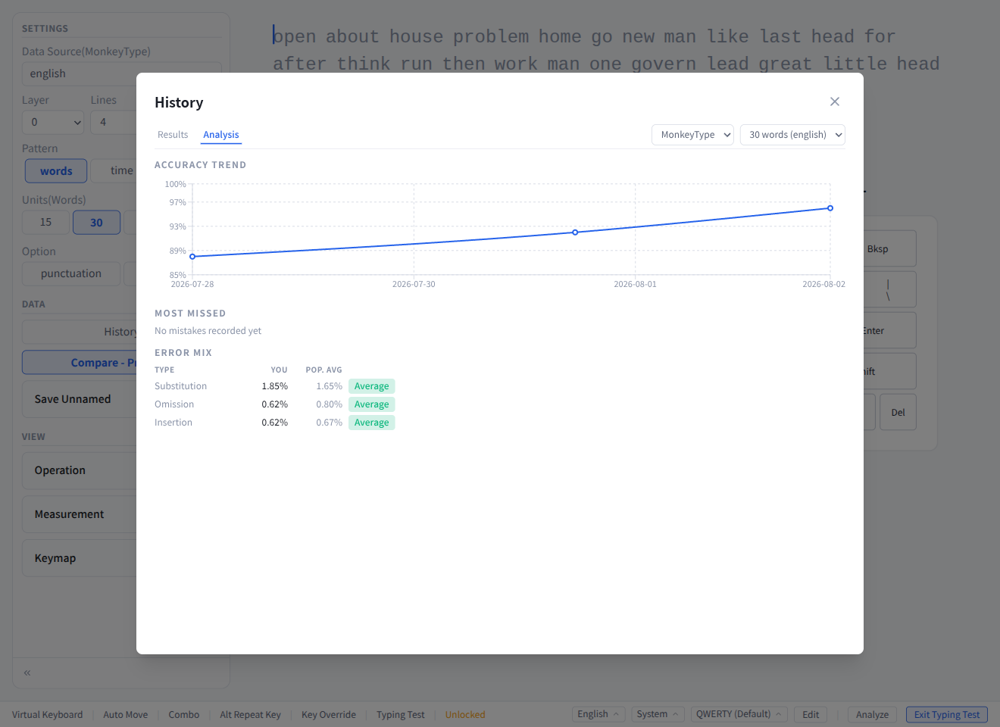

**Analysis** tab — three aggregate sections, all scoped to whichever source and period is picked in the header (not to the Results tab's own sub-filter):

- **Accuracy Trend** plots accuracy over time for a single test condition, picked from the header's condition select (e.g. "50 words (english) +punct" or "30s (english)"; the label format varies by mode). It always lists every condition the active source has, defaults to the most recent run's condition, and the chart appears once the selected condition has 2 or more saved runs
- **Most missed** lists every missed character (or, in Romaji mode, the missed kana's romaji, e.g. "shi") as a bar-graph row — key, the character(s) actually typed instead, a stacked bar, and the count — aggregated across every result in the active source rather than one condition, sorted by count and scrolling internally rather than capped at a fixed number. Each bar splits red (moved on to the next character without correcting the mistake) / gray (corrected with Backspace) whenever per-keystroke detail is available for the runs behind that key; hovering a bar shows the exact typed-instead characters and the corrected/moved-on counts. A legacy run with no per-keystroke detail renders its bar fully gray with a tooltip noting the detail isn't available, rather than guessing. Hidden when the source has no results at all; shows a brief empty message when there are results but none of them recorded a mistake
- **Error mix** is a TYPE / YOU / POP. AVG table of substitution / omission / insertion rates (each a share of the target characters classified), char-weighted across every result in the active source. **YOU** is the aggregated rate and **POP. AVG** the population mean for context; a colored verdict pill (Far below average / Below average / Average / Above average / Far above average) reads the standard-deviation distance between the two, and hovering a row's label shows a tooltip explaining what that error class means and how to improve it. Hidden when the source has no results at all; shows a brief empty message when there are results but none of them qualify (e.g. every result predates error-class tracking, or the source is Romaji-only, whose runs never carry this figure)

#### Keystroke Timeline

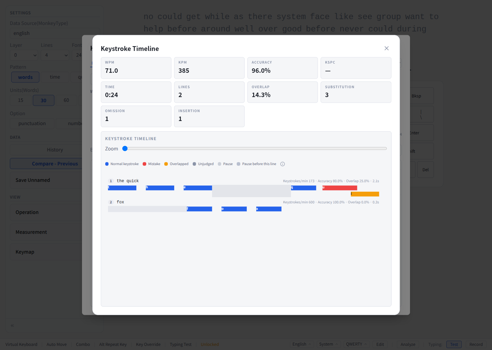

The same timeline panel appears in two places: opened from a **Timeline** link in the History Results table (see **History** above), in its own modal; and inline, as the main view of the completion screen itself, for a run that just finished with a saved keystroke log (see **During a Test** below). Both show identical content — only the surrounding chrome differs (a modal frame with a close button vs. embedded directly in the typing-test pane).

A run saved with its typing-test line grouping renders one horizontal bar strip **per line**: a shared time axis for every word on that line, a subtle divider at each word boundary, and a per-line stat fragment in the row's own header — keystrokes/min, accuracy, and overlap rate where they can be computed, plus the line's own duration in seconds, always shown. A Romaji-input run also shows a second monospace row with the typed romaji beneath each line's kana. A run saved before line grouping existed (a legacy log) falls back to the original **per-word** view instead — one strip per word, with no per-line figures.

Bar color reads the keystroke's outcome — normal, mistake, overlapped (pressed before the previous key was released), or unjudged (no correctness data, e.g. mid-IME-composition) — and a legend spells out each color plus the pause markers. The line view treats a gap of **250ms or longer** as a pause (shown compressed on the axis) and a pause crossing into a new line as a lead-in marker before that line; the per-word view uses a coarser **1000ms** cut and "before this word" wording instead, since one word's own axis is much shorter than a line's. Either way, every duration shown — in the row/line headers and in the hover tooltip over any bar or marker — is still the real, uncompressed value, never the compressed on-screen one.

In the line view only, each keystroke bar also shows its own key label once the bar is wide enough to fit one, so zooming in on a fast-typed cluster reveals every key rather than just spacing the bars out — the per-word view has no such label overlay. A **Zoom** slider (fit → 10×) drives this.

Above the rows, a stat grid shows eleven figures in a fixed order: **WPM**, **KPM**, **Accuracy**, **KSPC**, **Substitution**, **Omission**, **Insertion**, **Overlap**, **AKH** (Avg Key Hold — the run's mean key press-to-release duration, in ms; hover for the tooltip explaining it), **Time**, and **Words** (or **Lines**, for a line-based run — the same distinction the reading window itself uses). A card reads as empty (`—`) rather than being omitted when its figure can't be computed for that run (e.g. KPM/KSPC/the error-class trio on a run predating that tracking).

Below the stat grid, a **Missed** box lists this run's mistakes as the same bar-graph rows described under History's **Most missed** above (key / typed-instead chars / red-gray bar / count), omitted entirely when the run had no mistakes.

#### Data Source

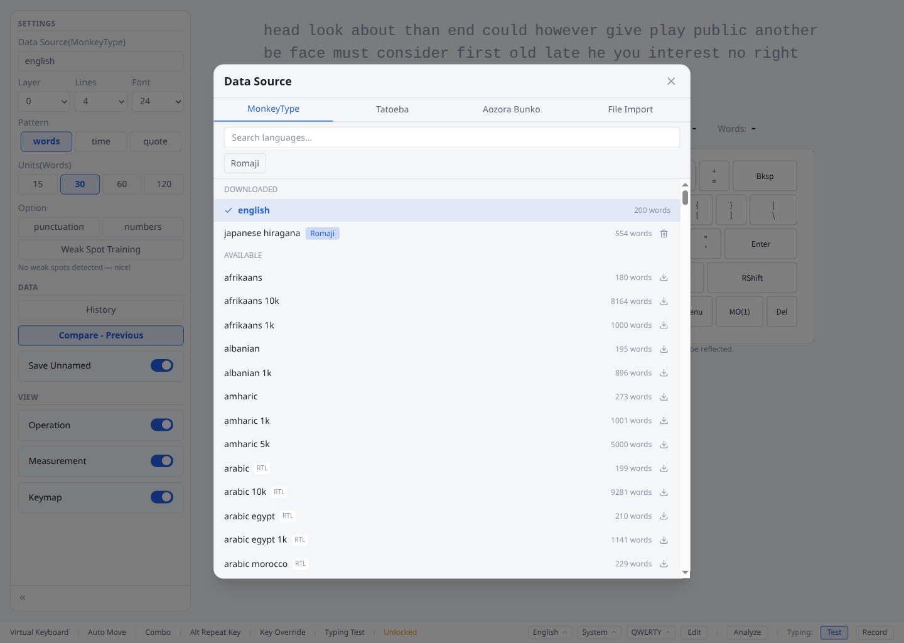

The **Data Source** row in the left Settings panel shows the active mode type and source (a MonkeyType language, a Tatoeba pack, or an imported text) — click the row to open the Data Source modal. Four tabs select what you type against:

- **MonkeyType** — random words, timed word bursts, or real-world quotes generated from a downloaded language pack
- **Tatoeba** — real sentences sampled from a downloaded Tatoeba language pack
- **Aozora Bunko** — public-domain Japanese literary works imported from the Aozora Bunko catalog
- **File Import** — a plain-text `.txt` file you import yourself

The modal opens on the tab matching the currently active mode. An Aozora Bunko import technically plays back as a File Import text, so opening the modal while one is active jumps straight to the **Aozora Bunko** tab instead of **File Import** — matching where the text is actually managed. Picking a row switches mode immediately and closes the modal; closing without picking (Escape, the X button, or clicking outside) leaves the current mode unchanged.

The **MonkeyType** and **Tatoeba** tabs share the same language-pack list:

- A search box filters the list by name
- Below the search box, a **Romaji** filter toggle narrows the list to Japanese-input-capable entries only (see **Japanese Input** under **MonkeyType** below). The **File Import** tab has the same toggle below its import button; the **Aozora Bunko** tab keeps its kana-row filter instead (see **Aozora Bunko** below)
- Packs are split into **Downloaded** and **Available** sections
- Each row shows the pack name and its word count; right-to-left languages also show an **RTL** badge, and kana packs (hiragana / katakana) that support Japanese input show a **Romaji** badge (see **Japanese Input** below)
- Click the download icon on an Available row to download it. Rows you downloaded yourself show a trash icon to delete them; packs bundled with the app (such as MonkeyType's english) are also listed under Downloaded but cannot be deleted
- If a newer dataset manifest is available, a banner reading "An update is available for the word lists." appears above the list with an **Update** button. This check runs automatically each time the tab is opened (a successful check is cached for the app session, so it won't repeatedly hit the network; a failed check — e.g. while offline — is not cached, and reopening the tab retries). Nothing downloads until you click **Update**
- Applying an update replaces the pack manifest and also removes that provider's previously downloaded packs, since they belong to the old dataset version — download them again from the refreshed list as needed

#### MonkeyType

With a MonkeyType language selected, the Settings panel gains three rows: **Pattern** picks the test pattern (**words** / **time** / **quote**), **Units** picks the word count, duration, or quote length for it, and **Option** toggles Punctuation / Numbers (words and time patterns only). The three patterns:

**Words Mode**

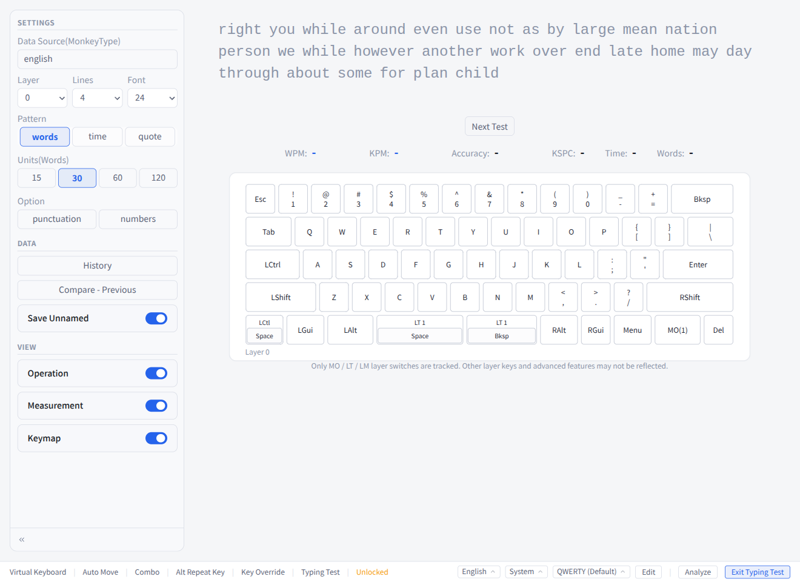

- Type a fixed number of random words (15 / 30 / 60 / 120)
- The test ends when all words are completed

**Time Mode**

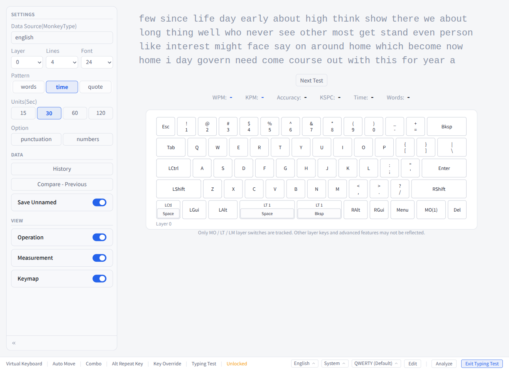

- Type as many words as possible within a time limit (15 / 30 / 60 / 120 seconds)
- A countdown timer shows remaining time

**Quote Mode**

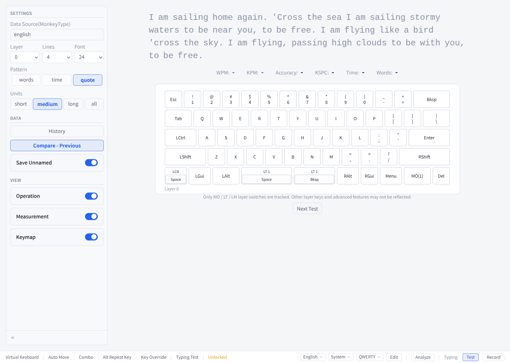

- Type a real-world quote (short / medium / long / all)
- The quote source is shown after completion

**Options**

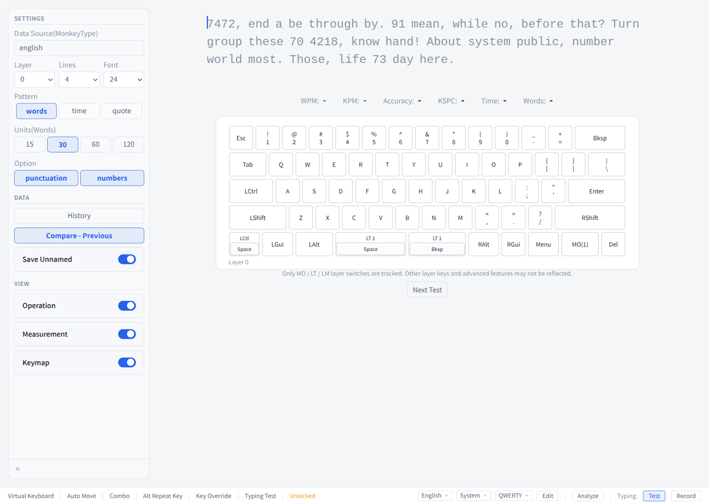

In the words and time patterns, the Settings panel's **Option** row adds toggles:

- **Punctuation**: Adds punctuation marks (commas, periods, etc.) to the word list
- **Numbers**: Adds numbers to the word list

The Option row is hidden in the quote pattern (which uses the original text as-is) and in the Tatoeba / Aozora Bunko / File Import modes.

**Weak Spot Training Mode**

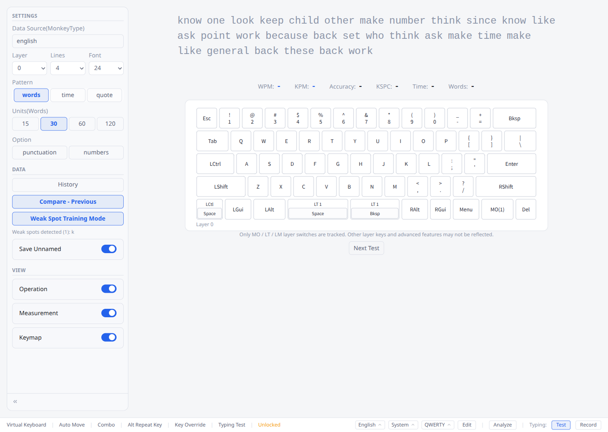

A full-width **Weak Spot Training Mode** button sits in the Settings panel's **Data** section, below **Compare**, in every pattern — the button itself renders regardless of mode; only the setting it controls is words/time-only. It's a dialog trigger (not a toggle itself) — clicking it opens the **Weak Spot Training Mode** modal, where the feature is actually turned on/off and tuned. The button takes on the active (accent) styling whenever the setting is currently on, so its state is visible without opening the modal. Directly below the button, a status line reflects what's currently known (hidden entirely while History hasn't finished loading — nothing is claimed either way until it's ready):

- **"No weak spots detected — nice!"** — History is loaded and no token crossed any of the detection thresholds (shown in the modal)
- **"Weak spots detected (N): k, r, sha"** — at least one weak token was found; the modal's Enable toggle becomes clickable

Opened from any other pattern, the modal shows the same shell but replaces the description/toggle/parameters with a short note explaining the feature only applies to words/time.

Turning the setting on (inside the modal) biases word sampling toward tokens your own History shows you're weak at, scoped to the current language and effective input method (Direct / Romaji / Kana) — it doesn't change what words exist, only how often each one is picked.

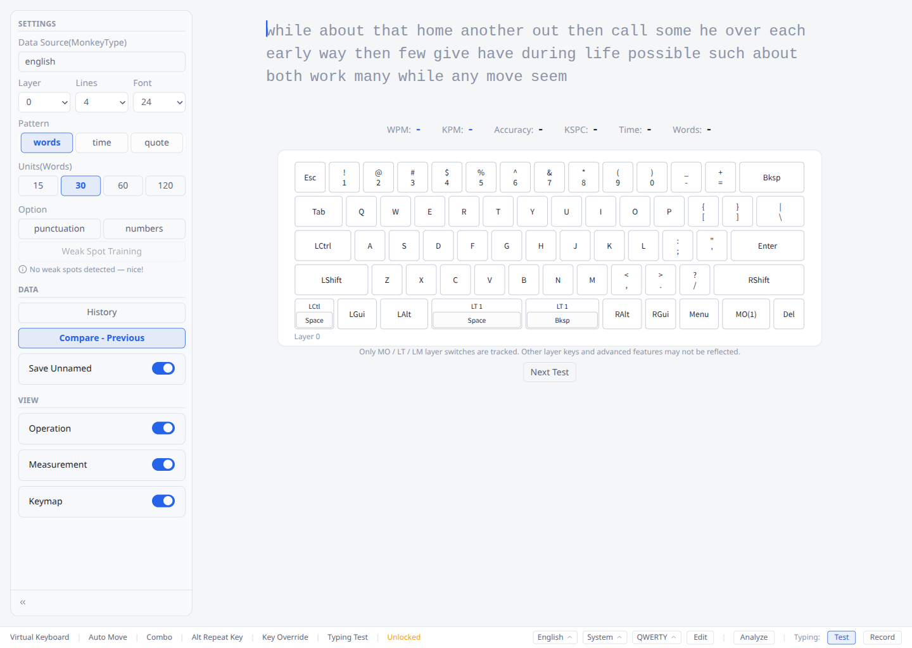

The modal opens with the detection-signal explanation, then the **Enable** toggle below it, then the tunable parameters. The toggle can always be turned OFF, but turning it ON requires at least one weak spot to have actually been detected for the current language and input method — there's nothing to turn on ahead of time, and a parameter change that later drops detection back to nothing never leaves the toggle stuck on with no way to turn it off.

A token counts as weak by any of three signals, each measured against your own typing rather than a fixed benchmark, and explained in the modal itself with your CURRENTLY configured threshold values filled in:

- **Misses** — it's been recorded as a mistake enough times in History (default: 2+)
- **Noticeably slower** — with a saved keystroke log available, your typical pace on it runs meaningfully behind your own overall median (default: 1.5× or slower, needs 15+ timed samples)
- **Hesitation** — with a saved keystroke log available, it produces a long pause more often than the rest of your typing (default: over 2× your pace, on 20%+ of its timed samples)

The two timing-based signals need a saved per-run keystroke log, which only exists for runs recorded after Recording Consent was turned on (see **Typing analytics recording** below — the same app-wide consent flag also gates the raw log for an ordinary Typing Test run, not only for REC). Without any saved logs, detection still works from the miss signal alone.

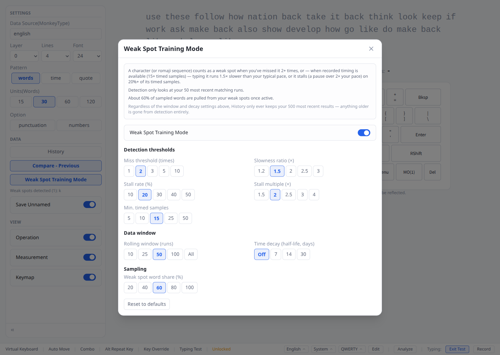

Below the Enable toggle, the modal exposes every detection/sampling parameter as its own button row (two per line within each section), along with a **Reset to defaults** button:

The button labels below are exactly what the modal renders — plain numbers, with no `×` / `%` / unit suffix on the button itself (the unit is named in the parameter row's own label instead):

| Section | Parameter | Default | Choices |
|---|---|---|---|
| Detection thresholds | Miss threshold (times) | 2 | 1 / 2 / 3 / 5 / 10 |
| Detection thresholds | Slowness ratio (×) | 1.5 | 1.2 / 1.5 / 2 / 2.5 / 3 |
| Detection thresholds | Stall rate (%) | 20 | 10 / 20 / 30 / 40 / 50 |
| Detection thresholds | Stall multiple (×) | 2 | 1.5 / 2 / 2.5 / 3 / 4 |
| Detection thresholds | Min. timed samples | 15 | 5 / 10 / 15 / 25 / 50 |
| Data window | Rolling window (runs) | 50 | 10 / 25 / 50 / 100 / All |
| Data window | Time decay (half-life, days) | Off | Off / 7 / 14 / 30 |
| Sampling | Weak spot word share (%) | 60 | 20 / 40 / 60 / 80 / 100 |

**Rolling window** limits detection to only your N most recent matching runs (by both the miss and timing signals together) instead of your entire matching History — the default of 50 keeps a weak spot you've since overcome from lingering forever just because it still shows up somewhere far back in your history. **Time decay** additionally down-weights older misses within that window on a half-life curve (a miss recorded today always counts at full weight; one recorded one half-life ago counts at roughly half) — off by default, so every miss in the window counts equally unless you turn it on. **Weak spot word share** controls how large a fraction of sampled words are pulled from the biased pool once the setting is active, rather than uniformly — the default 60/40 split keeps a run representative of ordinary typing even while biased.

None of the above changes what History itself retains: regardless of Rolling window or Time decay, History only ever keeps your 500 most recent results (see **History** above), so detection can never look further back than that — a run older than the 500-result cap is gone from consideration entirely, not just outside the configured window.

Whether a parameter change reaches your CURRENT run depends on whether Weak Spot Training Mode is on. While it's off, a parameter change only takes effect on your next run (same as any other Settings-panel change) — it can't be sampling from a pool it isn't using yet, so the run in progress is unaffected. While it's on, a parameter change immediately restarts the current run under the new parameters, the same way switching Pattern or Units would. Changing parameters is always allowed, whether or not detection currently reads as active.

Because it changes what you actually type, a run made with Weak Spot Training Mode active is tracked as its own test condition, separate from your ordinary runs of the same mode/settings — its Personal Best, Compare baseline, History filter, and Accuracy Trend entry are all their own. The condition label carries a `+weak spot` suffix (e.g. "50 words (english) +weak spot"), the same convention as the `+punct` / `+nums` / `+romaji` / `+kana` suffixes described elsewhere on this page. This grouping is by the on/off flag alone, not by the parameters used — a run biased at a 20% word share and one biased at 100% still share the same condition even though their word selection was meaningfully different; each saved result quietly keeps a record of the exact parameters it ran under, for reference, without splitting the grouping further.

**Japanese Input**

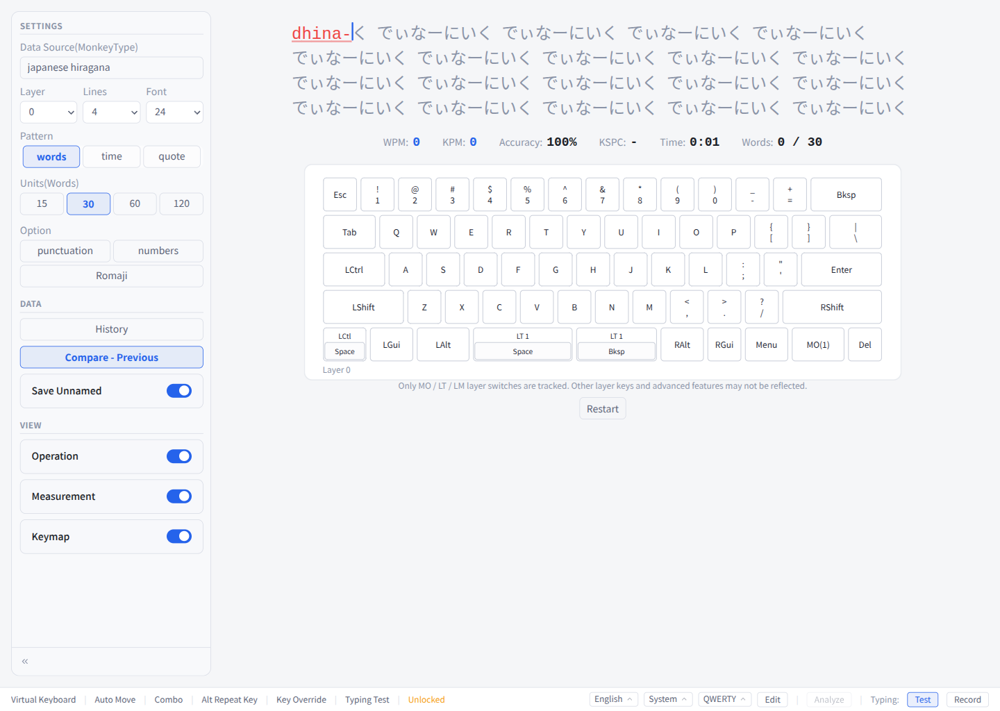

Japanese input is not limited to the MonkeyType tab: with a romaji-capable source loaded — a **hiragana** or **katakana** MonkeyType language pack (words/time patterns), a kana **Tatoeba** pack, or a kana-only **File Import** / **Aozora Bunko** text — the Option row gains a full-width **Japanese Input** button. Capable language packs and imported texts are marked with a **Romaji** badge wherever they're listed (see the shared language-pack list above, and the File Import / Aozora Bunko sections below), so you can spot them before selecting one. For an imported text, capability is computed locally from the text's own content the moment it's listed — it is never stored or synced, so it can't drift from the content it describes. Clicking the button opens the **Japanese Input Settings** modal.

Japanese punctuation is typeable alongside kana in every method: 。、？！ map to `.` `,` `?` `!`, and a kana text containing them is still counted as romaji-capable.

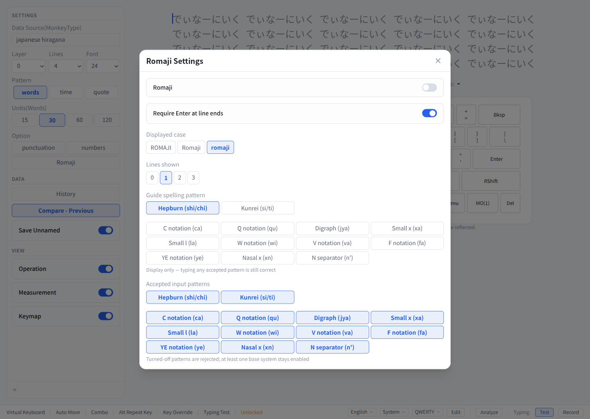

The modal opens on a 3-way **Input method** selector, in this order: **Romaji** (default), **Kana**, **Direct**. Selecting one applies it immediately — there is no separate master on/off switch; Direct is the functional equivalent of turning judging off entirely. Every setting below the selector shows only for the method(s) it applies to. The guide row's font size always tracks the shared **Settings > Font** size — there is no separate control for it.

- **Romaji** — sequential romaji-keystroke matching: each keystroke is checked against the current kana as you type, and any of its currently-accepted spellings is accepted interchangeably (for example でぃ accepts `dhi`, `deli`, or `dexi`, whichever you type). The current word's kana are colored per confirmed segment, and a romaji guide row below the reading window mirrors the reading window's own line layout, re-anchoring on every keystroke.
- **Kana** — types the physical JIS かな-layout key positions directly (`KeyboardEvent.code` + Shift state), matched against a fixed かな layout table rather than any spelling. A simpler one-current-line kana stroke guide replaces the romaji guide row; a character whose physical key needs Shift held for that stroke (the small-kana/dakuten row) is colored to flag it. Shift tolerance is per-key, not timing-based: a key with no shifted かな of its own ignores the actual Shift state entirely, so holding Shift across an unrelated stroke doesn't cost you anything — only keys that genuinely carry a shifted かな require Shift to match.
- **Direct** — no judging engine at all: literal/verbatim matching against the displayed kana, the same as a non-Japanese text. Requires an OS IME or a kana-producing physical keyboard layout to actually type kana. None of the settings below apply to Direct.

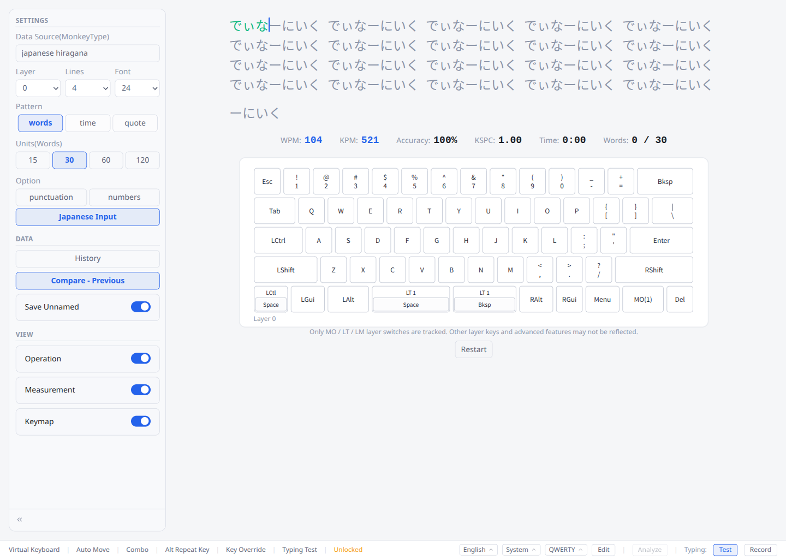

Both Romaji and Kana show:

- **Require Enter at line ends** (default **on**): when on, a line-end word (the **⏎** marker in Tatoeba / Aozora Bunko / File Import runs) holds once complete until you press **Enter**, same as non-Japanese mode. Turn it off to auto-advance a line-end word immediately on completion, like any other word — Space still does nothing in either method, since neither ever uses Space to submit.
- **Lines shown**: how many guide lines are displayed, line-synchronized with the reading window's own word lines — the line the current word sits on, plus that many more lines below it. `0` hides the guide row entirely, `1` (default) shows only the current line, `2` adds the next line, and `3` adds the next two lines. Within the current line, words already typed render in a dimmer tone than the current word's own guide; words not yet reached — later on the current line, or on a following guide line — render fainter still.

Romaji only shows three more settings, since かな has one fixed spelling and Direct has no guide at all:

- **Displayed case**: how the guide row's romaji is rendered — **ROMAJI** (upper case), **Romaji** (capitalized), or **romaji** (lower case, default). Display only; it never changes which keystrokes are accepted.
- **Guide spelling pattern**: split into two rows, mirroring Accepted input patterns below.
  - **Base**: a single-select choice between **Hepburn** (shi/chi) and **Kunrei** (si/ti) — exactly one is always active, and it picks which base system's spelling the guide line shows for kana with multiple accepted spellings. **Hepburn is the default.**
  - **Options**: **C** (ca), **Q** (qu), **Digraph** (jya), **Small x** (xa), **Small l** (la), **W** (wi), **V** (va), **F** (fa), **YE** (ye), **Nasal x** (xn), and **N separator** (n') — independent alternate-spelling preferences layered on top of the selected Base, off by default. Multiple can be selected at once — e.g. selecting both Small x and the Kunrei base applies each preference to whichever kana it matches, in the same guide. Each button's label shows one example spelling; hover it for the full spelling list it covers.
  **Display only** — whichever accepted spelling you actually type is still correct, regardless of what the guide shows.
- **Accepted input patterns**: split into two rows.
  - **Base**: **Hepburn** (shi/chi) and **Kunrei** (si/ti), either of which can spell every kana on its own. Both are enabled by default. Clicks are selection-first: clicking an enabled base while both are on keeps **only** that base (one click switches to Kunrei alone), clicking a disabled base brings it back so both are accepted, and **at least one base always stays enabled** (clicking the sole enabled base does nothing).
  - **Options**: the same eleven families as the guide row above — **C**, **Q**, **Digraph**, **Small x**, **Small l**, **W**, **V**, **F**, **YE**, **Nasal x**, and **N separator** — all enabled by default. Turning any of them off rejects that family's spellings as input; unlike the base row, every option can be turned off at once, since the enabled base(s) already cover every kana on their own. Disabling a whole loanword family (W/V/F/YE) still leaves its kana typable via the decomposed spelling — e.g. with F off, ふぁ still completes as `fu` + `xa`.

Notes that apply to Romaji and Kana alike:

- **Turn off your OS IME before typing.** Both engines judge direct keystrokes, and an active IME composition intercepts them before they ever reach the matcher. If a composition event is detected while either is active, a hint appears below the guide line reminding you to turn the IME off
- A rejected keystroke does not advance the guide, and it stays counted against Accuracy — Backspace cannot undo it, so keep typing the current kana until it's accepted
- Words advance automatically as soon as their kana are complete; Space is not needed — line-end behavior instead follows the **Require Enter at line ends** setting above
- Because WPM tracks keystroke rate rather than confirmed word length in these methods, Romaji runs get their own personal best and history grouping (a `+romaji` suffix, e.g. "30 words (japanese_hiragana) +romaji") and Kana runs get their own (`+kana`), each tracked separately from plain/Direct runs of the same material
- This grouping does not track which Accepted input patterns were enabled (Romaji only) — runs typed with different style restrictions still share the same personal best, Compare baseline, history filter, and Accuracy trend entries as long as everything else (mode, word count/duration, language, punctuation/numbers) matches

#### Tatoeba

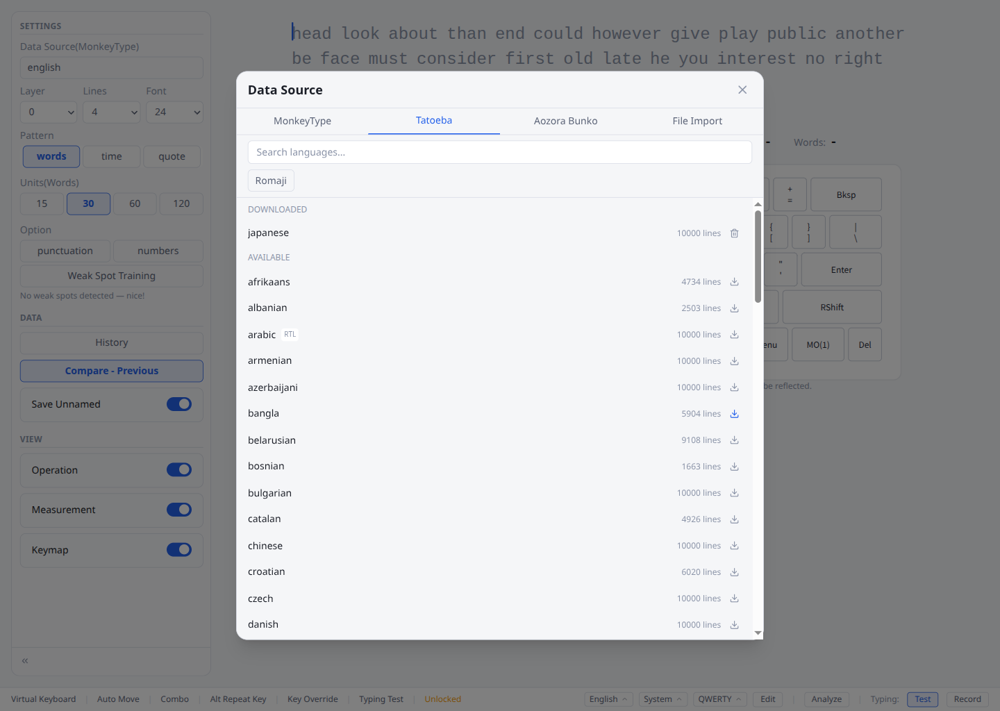

Pick a downloaded language pack from the **Tatoeba** tab (download it first if needed — see **Data Source** above) to type real sentences sampled from the [Tatoeba Project](https://tatoeba.org). Like MonkeyType, Tatoeba gets its own **Pattern** and **Units** rows in the Settings panel: **Pattern** picks **Lines** or **Time**. **Lines** samples a fixed batch of sentences per run — **Units** picks 5 / 10 / 20 / 40 sentences. **Time** runs for a set duration instead — **Units** picks 15 / 30 / 60 / 120 seconds — resampling another batch of sentences as you go so the run never runs out of material before time is up.

Personal bests, History, and the Accuracy Trend group Tatoeba runs by language + pattern + unit, so a 5-line run and a 30-second run of the same pack are tracked separately. The History condition label reflects this — e.g. **"Tatoeba 5 Lines (english)"** for a Lines run, **"Tatoeba 30s (english)"** for a Time run.

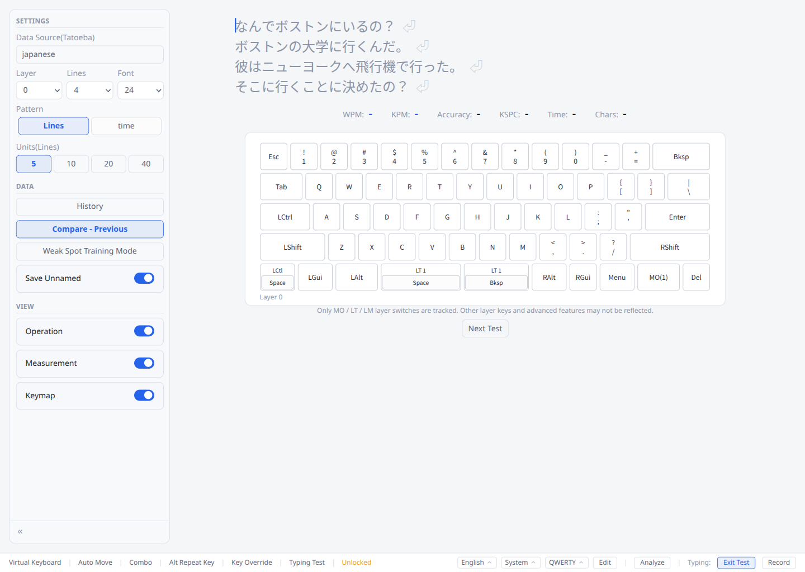

- Each sampled sentence renders on its own line
- A **⏎** marker appears at the end of every line except the last; press **Enter** (not Space) there to advance to the next sentence. Elsewhere, Space still advances between words as usual
- Attribution and license details for the Tatoeba packs are shown on the About / legal screen
- The **japanese_hiragana** and **japanese_katakana** Tatoeba packs are kana-pure and marked with a **Romaji** badge in the pack list — see **Japanese Input** under MonkeyType above for how it works

#### Aozora Bunko

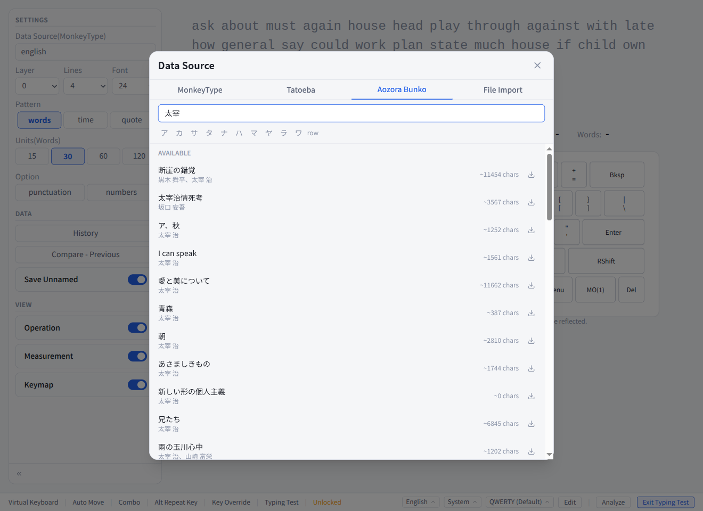

Browse and import public-domain Japanese literary works from the [Aozora Bunko](https://www.aozora.gr.jp/) catalog (roughly 10,500 works, sourced via the aozorabunko GitHub mirror).

- The search box filters by title or author
- Below it, a two-tier gojūon (five-vowel kana) row filter narrows results by the first kana of the author's reading (ア / カ / サ / …); click a row to also reveal its column kana for a finer filter (e.g. the カ row → キ column). Click an active button again to clear it
- Results are split into **Downloaded** and **Available** sections; the **Available** section renders 50 works at a time, revealing the next 50 automatically as you scroll (the catalog list is loaded once when the tab opens — scrolling does not hit the network)
- Each row shows the title, author, and an estimated character count (`~N chars` — an estimate, not an exact figure)
- Clicking the download icon on an Available row downloads the work's archive from the GitHub mirror, decodes it, and automatically strips Aozora-specific markup (ruby annotations, editorial notes, header/footer boilerplate) before saving it as a typing text — no manual cleanup needed. The newly imported work is selected immediately. A failed import shows an inline error under that row
- A downloaded work is stored through the same normalization and 5,000-word cap as File Import texts (see below). Words are counted by whitespace, so in Japanese prose — which contains no spaces — each paragraph counts as one word, and the cap effectively allows around 5,000 paragraphs
- A downloaded work plays back exactly like an imported File Import text, including the per-line Enter-to-advance behavior, but it is only listed and deleted from this **Aozora Bunko** tab — it does not appear in the **File Import** tab
- Click the trash icon on a Downloaded row to remove it; it returns to Available and can be re-imported later
- The dataset-update banner described under **Data Source** also applies here — updating refreshes the catalog listing itself, not any already-imported works
- Once imported, a work whose content turns out to be pure kana (rare — most Aozora Bunko literature mixes kanji and kana) shows a **Romaji** badge in the Downloaded section, same as a kana File Import text — see **Japanese Input** under MonkeyType above

#### File Import

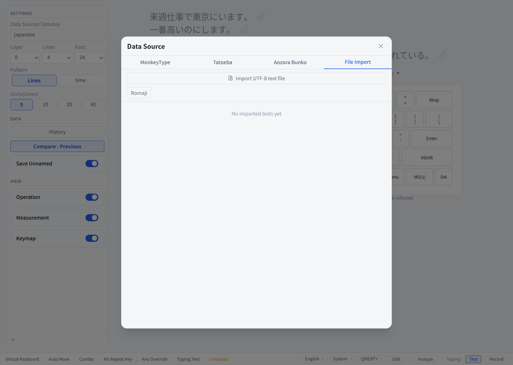

Import your own plain-text `.txt` file (UTF-8 only) to type against it — useful for practicing code snippets, prose, or any custom text.

- Click **Import UTF-8 text file** and choose a `.txt` file. Files must be UTF-8 encoded, no larger than 5 MB, and contain at least one typeable word — files that fail these checks are rejected with an inline error message
- Text is capped at 5,000 words; anything beyond the cap is silently truncated on import
- Non-empty line boundaries in the source file are preserved: a **⏎** marker appears at the end of every line except the last, and Enter (not Space) advances past it. Import normalizes the text — empty lines are dropped and runs of spaces or tabs within a line collapse to a single space. Leading indentation on each line is shown for reference but is not itself typed
- Importing a file whose name matches an existing entry prompts for confirmation before overwriting it
- Each row shows the text's name and length — **words** for space-separated text (e.g. English), or **lines** for text with no spaces to count words by (e.g. Japanese prose); click a row to select it, or click the trash icon to delete it
- This list only shows texts you imported directly here — Aozora Bunko imports are managed from the **Aozora Bunko** tab instead
- A text whose content is pure kana shows a **Romaji** badge and unlocks Japanese input for it — see **Japanese Input** under MonkeyType above. This is checked locally from the text's own content each time it's listed, not stored or synced

#### During a Test

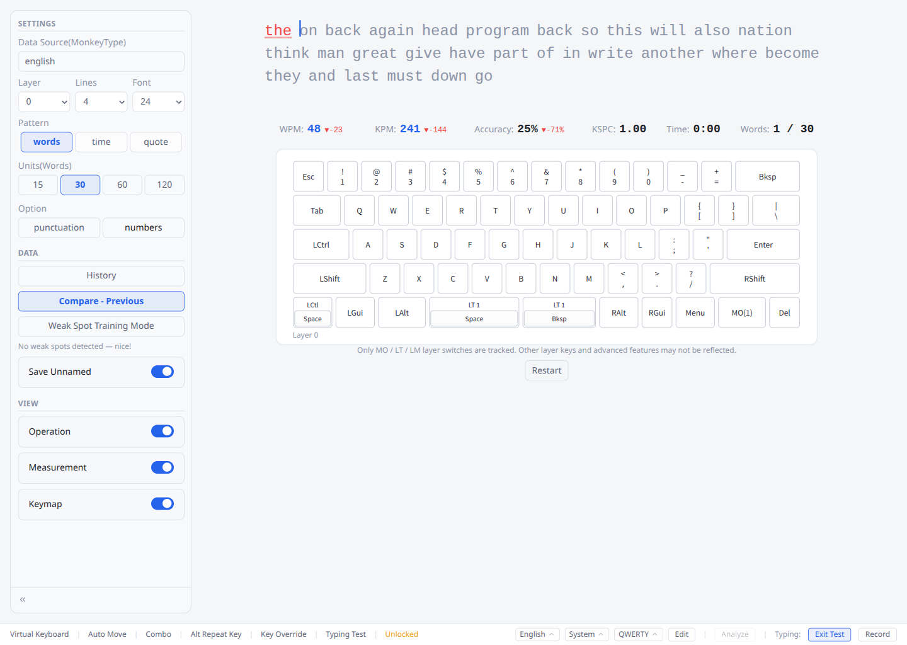

While typing, the following stats are displayed in real time:

- **WPM**: Words Per Minute (current typing speed)
- **KPM**: Keystrokes Per Minute (correct characters per minute)
- **Accuracy**: Percentage of correctly typed characters
- **KSPC**: Keystrokes per confirmed character (Backspace counts as a keystroke). Reads `-` before anything is confirmed yet, or once an IME composition fires mid-run (that run's keystrokes can no longer be counted reliably)
- **Time**: Elapsed time (or remaining time in the time pattern)
- **Words**: Current word / total words. In File Import and Tatoeba modes this becomes **Chars** — character progress through the text instead of a word count

While a comparison baseline is set (Settings panel → Data → **Compare**), a colored ▲ / ▼ delta next to the WPM, KPM, and Accuracy values shows the difference against the baseline.

Correctly typed words turn green. Incorrect characters are highlighted in red with an underline. The cursor advances as you type, and words scroll automatically.

The controls row below the reading window changes with the test state:

- **Before a run starts**: **Next Test** generates a fresh test. When a paused File Import run is saved, a **Resume** button appears beside it
- **While running or paused**: **Restart** starts the test over. In File Import mode a **Pause** (running) or **Resume** (paused) button joins it — pausing saves the run, and resuming asks whether to continue from the saved position or start over
- **When finished**: a result-name field opens the naming modal, with quick-insert chips for the keyboard name, the test material, a timestamp, and the run's WPM / KPM / Accuracy; **Next Test** starts the next run

**Completion screen**

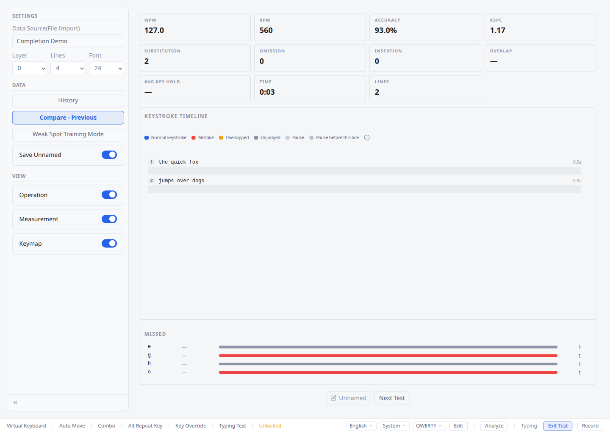

Once a run finishes, if a keystroke log was saved for it (recording consent accepted — see **Typing Record** below), the reading window, the keyboard pane, and the Japanese-input guide row all hide, and the **Keystroke Timeline** panel (see below) becomes the main view instead: its stat grid, timeline rows, and (when the run had mistakes) **Missed** box, with the naming/Next Test controls now at the very bottom of the screen rather than directly under a compact stats row. The rows area is the only part that scrolls — the stat grid, legend, and controls stay in place. If no log was saved for the run (recording consent was never accepted, the run was in Typing View, or nothing was saveable), the completion screen falls back to a compact stats row instead, with a hint that enabling typing recording would show the timeline here next time. That fallback row still shows a **Missed** chip line — each missed character (or, in Romaji mode, each missed kana's romaji, e.g. "shi") with its count, counted when a wrong character is deleted with Backspace or left wrong when the word is submitted — and, below it, a **Substitution / Omission / Insertion** line with the run's error-class breakdown, computed by comparing each finished word's target text against what was actually typed. That line is omitted for a Romaji-input run (its committed text is always one of the accepted spellings for the target, so there's no difference left to classify) and for a run with no finished words at all.

Additional notes:

- Press Escape to exit typing test mode
- The status bar's Disconnect button is hidden while Typing Test is active. To disconnect, first return to the editor with Escape or the Typing Test button
- The keyboard layout below the test area shows key presses in real time via the Vial matrix tester protocol

#### Typing View (View-Only Mode)

Typing View displays only the keyboard layout in a compact, resizable window — ideal for overlaying on top of other applications while practicing.

Click the **View** button in the status bar's **Typing:** group (visible when Typing Test is not active) to enter view-only mode.

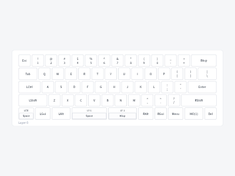

- The window shows only the keyboard layout with real-time key press highlighting
- The toolbar, keycode palette, typing test UI, and status bar are hidden
- The window maintains its aspect ratio when resized

**Menu Pane**

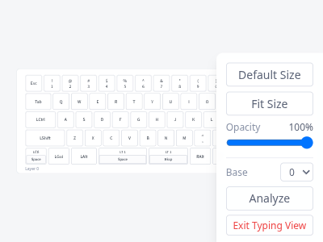

Click anywhere on the keyboard area to toggle the menu pane (bottom-right popup). It's a single flat panel — no tabs — since recording controls now live in the footer's **Record** button (§4.3) instead of here:

- **Default Size**: Reset the window to its default calculated size
- **Fit Size**: Adjust the window height to match the current width while preserving the aspect ratio
- **Top**: Keep the window above other windows (always-on-top; not available on Wayland)
- **Base**: Select which layer to display (when the keyboard has multiple layers)
- **Analyze**: Jumps directly to the Analyze page for this keyboard so you can review the stream you just recorded. Going back returns you to Typing View
- **Exit Typing View**: Return to the full editor

> **Note**: The keyboard layout's live layer indicator follows momentary layer keys (`MO`, `LT`, `LM`) only, while they are held. Persistent layer switches (`TO`, `TG`, `DF`) are not tracked — the VIA/Vial protocol offers no way to read the keyboard's live layer state back, so a persistent switch triggered outside the app would silently desync from what's shown. Use **Base** above to tell the view which base layer the keyboard is actually on.

Press Escape or click the keyboard area again to close the pane. A hint text appears at the bottom when hovering over the window. The window size and always-on-top preference are saved per keyboard.

> **Note**: Auto-lock is suspended while in Typing View mode. If the keyboard is disconnected while in view-only mode, the window automatically restores to its normal size.

#### Typing Record

Click **Record** in the status bar's **Typing:** group (alongside **View** and **Test** — visible whenever the keyboard has matrix tester support, in both the plain editor and Typing Test) to open the **Recording Settings** modal. It records per-key and per-minute statistics that feed the Analyze page (§1.4). Recording stays off by default. Since Record lives in the shared footer, it records on whichever screen you're on — the plain editor, Typing View, or Typing Test — as long as the keyboard is unlocked; Key Tester is the one screen it always skips.

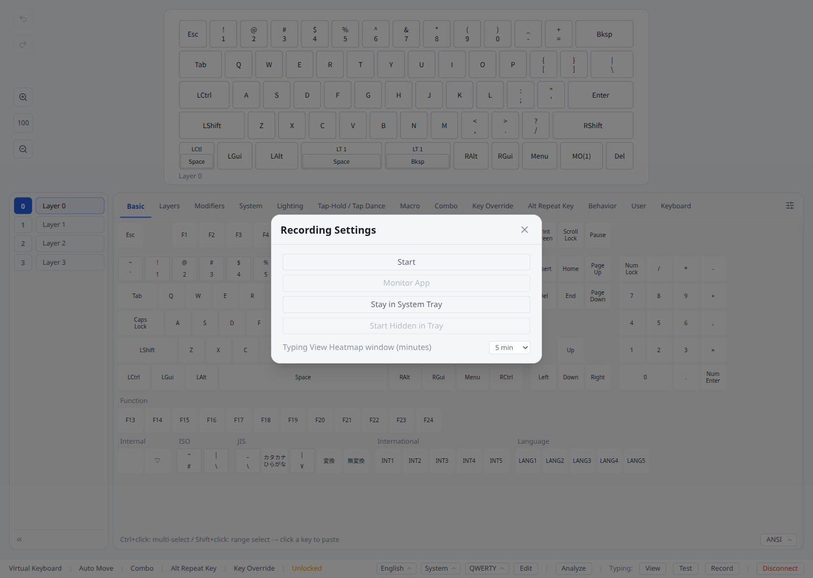

**Start / Stop**

Press the toggle once to start recording — the button shows **Start** while idle and **Stop** while recording. A **Recording** indicator then appears in the status bar's left-hand indicator group. While the compact Typing View window is open (which hides the main status bar entirely), its own bottom-of-window hint text doubles as the recording indicator there instead.

Recording requires the keyboard to be unlocked. Turning Record on while the keyboard is locked opens the Unlock dialog immediately, and so does starting or reconnecting Pipette with Record already on and the keyboard still locked — this applies on every screen, including the plain editor, which otherwise never prompts for an unlock on its own. In a tray-resident hidden start (§6.6), the window appears just long enough to show that dialog and hides again once you unlock.

> **Note**: Auto-lock does not fire while Record is on, so an unattended recording session on the plain editor is never interrupted by a lock/unlock loop.

The very first time you press Start, a consent dialog appears:

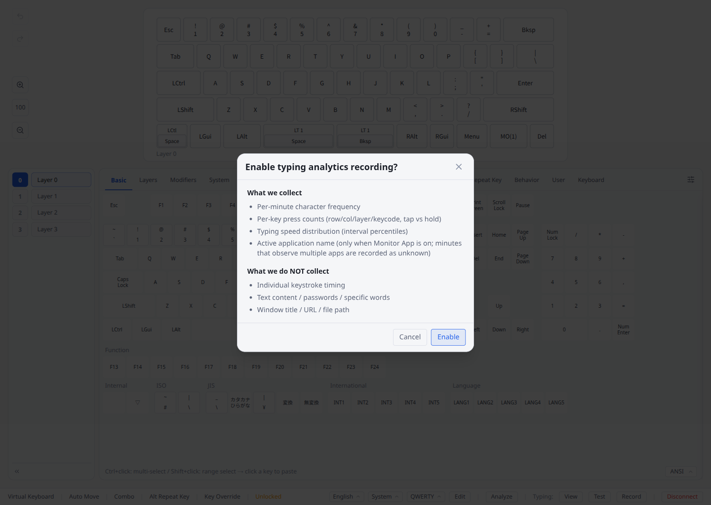

| Section | Items |
|---------|-------|
| **What we collect** | Per-minute character frequency · Per-key press counts (row / col / layer / keycode, tap vs hold) · Typing speed distribution (interval percentiles) · Active application name (only when Monitor App is on; minutes that observe multiple apps are recorded as unknown) |
| **What we do NOT collect** | Individual keystroke timing · Text content / passwords / specific words · Window title / URL / file path |

Click **Enable** to opt in — your consent is persisted in app settings (not synced) and the dialog never appears again. Click **Cancel** to back out without starting; you can press Start later to see the dialog again.

This same consent flag also gates the per-run raw keystroke log behind History's **Keystroke Timeline** (§4.3) and the typing-test completion screen's own inline timeline, for an ordinary Typing Test run in the editor — not only this modal's own ambient recording. Until you've accepted it at least once, no Typing Test run saves a keystroke log at all, so no History row shows a **Timeline** link and the completion screen always falls back to its compact stats row, regardless of whether Record itself is on.

**Monitor App**

When the Monitor App toggle is on (and recording is in the Stop / recording state), Pipette resolves the foreground application name once per data flush so each minute can be tagged with the app that owned the keystrokes. Minutes that observed only one app carry that app's name; minutes that observed multiple apps are tagged as `Unknown / Mixed`. The tags drive the **App** filter and the **By App** tab in Analyze.

- The button is greyed out while recording is in the **Start** (not recording) state — turning it on without recording active has no effect, so the UI funnels you through Start first
- The on/off state is global (AppConfig), not per-keyboard, and is **not** synced to other machines
- **Linux / Wayland**: requires the FocusedWindow GNOME Shell extension (see README). Without it, every minute is recorded as `null`
- **macOS**: requires the Accessibility permission (see README). Without it, every minute is recorded as `null`
- Turning Monitor App off keeps existing tags in the database; only newly recorded minutes go untagged

**Tray toggles**

Directly below Monitor App, the modal also has **Stay in System Tray** and **Start Hidden in Tray** toggles — the same settings as Settings → Tools (§6.6), with the same linked-disable behavior (Start Hidden in Tray is disabled while Stay in System Tray is off, and turning Stay in System Tray off also turns Start Hidden in Tray off). They're surfaced here too since a recording session is often the reason to reach for the tray.

**Heatmap window**

A select at the bottom of the modal picks how many minutes of Typing View's live per-key heatmap overlay to show at once.

**Analyze**

While in Typing View, its own Menu Pane keeps a separate **Analyze** entry (§4.3) that jumps directly to the Analyze page for this keyboard — the footer's own Analyze/Record buttons are hidden while Typing View is open, so this stays the only way back to Analyze from there. Going back returns you to Typing View. Elsewhere, use the status bar's own **Analyze** button (§9).

#### View Mode Memory and Auto-Restore

The last view mode (Editor / Typing Test / Typing View) is remembered per keyboard and automatically restored the next time you connect that keyboard:

- **Editor**: The editor view is shown as usual. If Typing Record (§4.3) is on and the keyboard is locked, the Unlock dialog still appears first — Record's own unlock requirement applies even on this screen
- **Typing Test**: Typing Test mode is re-entered automatically. If the keyboard is locked, the Unlock dialog appears first and the test starts after unlocking
- **Typing View**: The compact view-only window is re-entered automatically. If the keyboard is locked, the Unlock dialog appears first

View mode is stored per keyboard alongside preferences like keyboard layout, zoom scale, and window size. When Pipette Hub sync is enabled, view mode is synced to other devices as well (see §7).

---

## 5. Detail Setting Editors

Open detail setting modals from their dedicated keycode tabs. Lighting opens via a **Settings: Configuration** button at the bottom of its tab; Combo, Key Override, and Alt Repeat Key detail editors open by clicking an entry on their respective tabs.

### 5.1 Lighting Settings

Open from the **Settings: Configuration** button on the Lighting tab. Configure RGB lighting colors and effects.

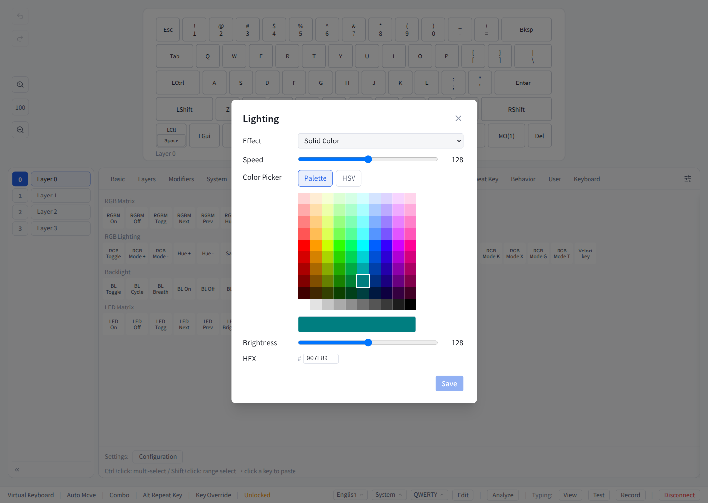

- Select colors with the HSV color picker
- Choose colors from preset palette
- Adjust effects and speed
- Click Save to apply

### 5.2 Combo

Configure simultaneous key press combinations to trigger different keys. The Combo tab displays an inline tile grid; clicking an entry opens the detail editor modal directly.

**Tile Grid (Combo tab)**

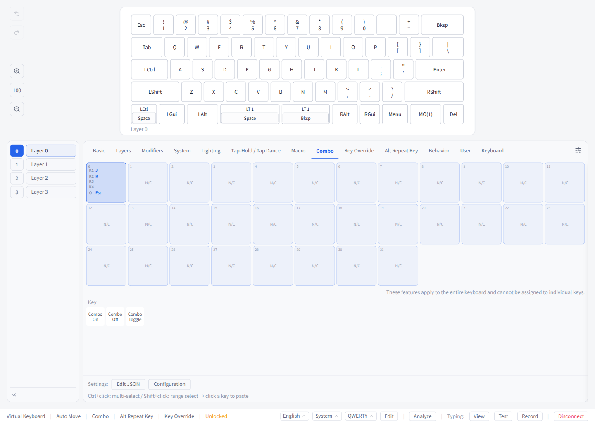

The Combo tab shows entries as a numbered list (0--31). Configured entries display a summary (e.g., "A + B → C"). Click an entry to open the detail editor. Combo keycodes (Combo On, Combo Off, Combo Toggle) are shown below the list. A **Settings: Configuration** button at the bottom opens a settings modal for QMK Combo timeout configuration (e.g., Combo time out period).

**Detail Editor**

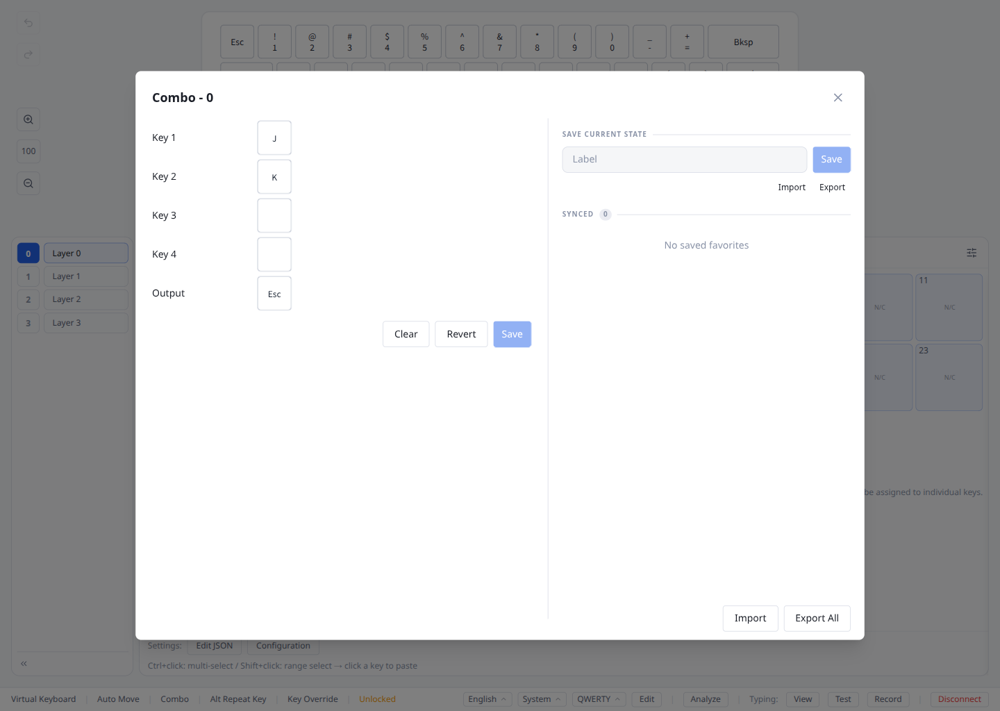

- Left panel: Combo editor with Key 1--4 and Output fields.
- Right panel: Inline favorites panel (Save Current State / Synced Data / Import / Export All)
- **Clear** resets all fields; **Revert** restores the last saved state. Both use two-step confirmation.
- **Save** writes changes to the keyboard

### 5.3 Key Override

Replace specific key inputs with different keys. The Key Override tab displays an inline tile grid; clicking an entry opens the detail editor modal directly.

**Tile Grid (Key Override tab)**


Shows entries as a numbered list. Configured entries display a summary. Click an entry to open the detail editor.

**Detail Editor**

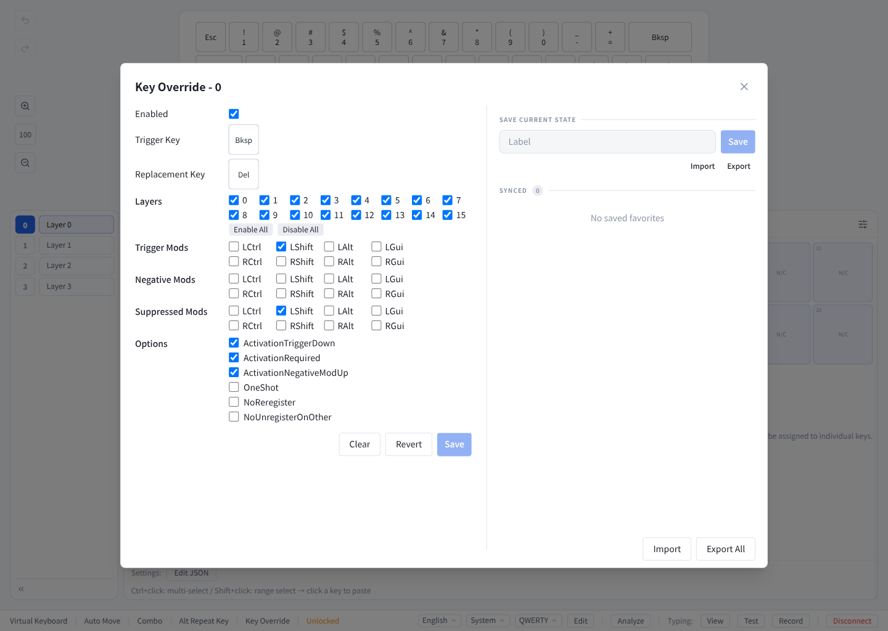

- Left panel: Trigger Key, Replacement Key, enabled toggle, layer and modifier options
- Right panel: Inline favorites panel (Save Current State / Synced Data / Import / Export All)
- **Clear** resets all fields; **Revert** restores the last saved state. Both use two-step confirmation.
- **Save** writes changes to the keyboard

### 5.4 Alt Repeat Key

Configure alternative actions for the Repeat Key. The Alt Repeat Key tab displays an inline tile grid; clicking an entry opens the detail editor modal directly.

**Tile Grid (Alt Repeat Key tab)**

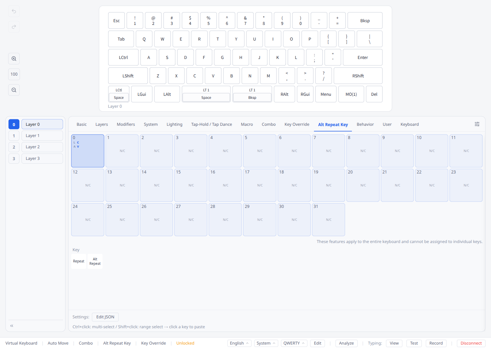

Shows entries as a numbered list. Configured entries display a summary. Click an entry to open the detail editor.

**Detail Editor**

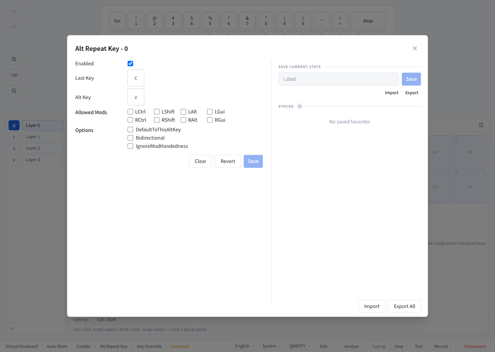

- Left panel: Last Key, Alt Key, enabled toggle, Allowed Mods, Options (DefaultToThisAltKey, Bidirectional, IgnoreModHandedness)
- Right panel: Inline favorites panel (Save Current State / Synced Data / Import / Export All)
- **Clear** resets all fields; **Revert** restores the last saved state. Both use two-step confirmation.
- **Save** writes changes to the keyboard

### 5.5 Favorites

Each editor modal (Tap Dance, Macro, Combo, Key Override, Alt Repeat Key) includes an inline **Favorites panel** on the right side of the editor.

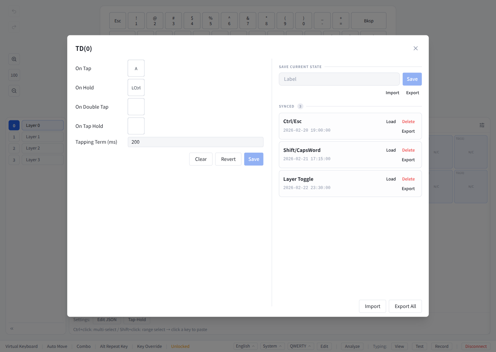

The inline favorites panel provides:

- **Save Current State**: Enter a label and click Save to store the current entry configuration
  - **Import** / **Export** buttons: Import a `.pipette-fav` file to apply to the current entry, or export the current entry settings as a `.pipette-fav` file without saving to the store. Inline "Imported" / "Exported" feedback is shown after each action.
- **Synced Data**: Previously saved entries are listed with Load, Rename, Delete, and Export actions
- **Import** / **Export All**: Footer buttons for bulk import/export of favorites

Within the Synced Data list:

- **Load**: Apply a saved configuration to the current entry
- **Rename**: Change the label of a saved entry (also synced to Hub if the entry is uploaded)
- **Delete**: Remove a saved entry
- **Export**: Download an individual saved entry as a file

When Pipette Hub is connected, each saved entry also shows Hub actions:

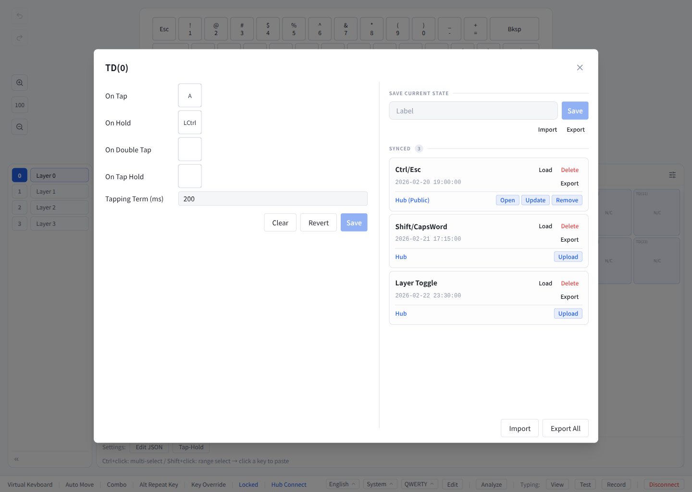

- **Upload to Hub**: Upload the favorite entry to Pipette Hub as a feature post — opens the Public / Private confirmation dialog (§7.2)
- **Update on Hub**: Re-upload the latest configuration; the dialog can also switch the post between Public and Private
- **Remove from Hub**: Delete the entry from Pipette Hub (two-step confirmation)
- **Open in Browser**: Open the individual Hub post page in your browser

### 5.6 JSON Editor

Each feature tab (Tap Dance, Macro, Combo, Key Override, Alt Repeat Key) provides an **Edit JSON** button at the bottom of the tab. This opens a JSON editor modal for bulk editing all entries as raw JSON text.

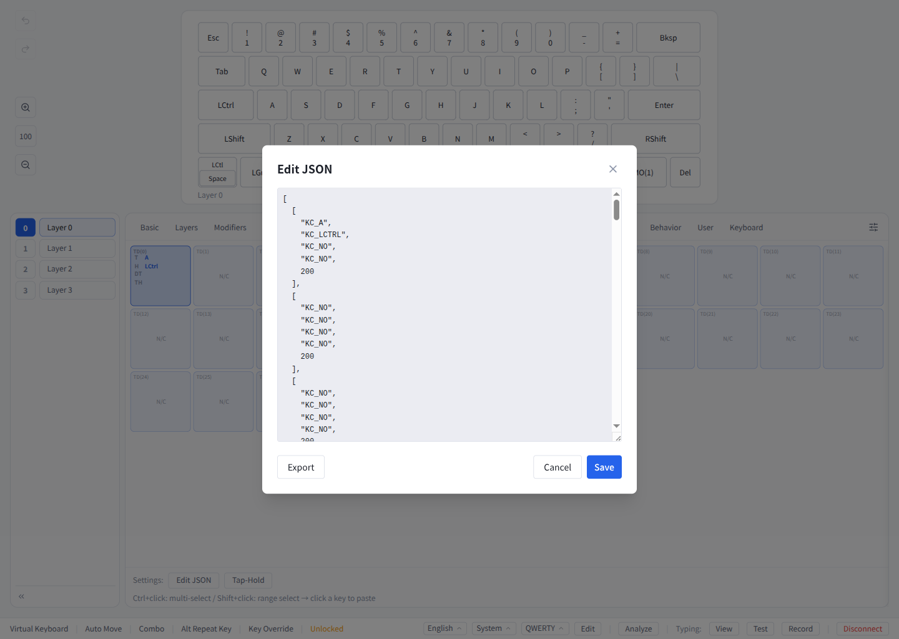

- **Text area**: Edit all entries as a JSON array. Changes are validated in real time — parse errors are shown below the editor
- **Export** (left): Save the current JSON as a `.pipette-fav` file for backup or sharing
- **Cancel** (right): Close without saving
- **Save** (right): Apply the parsed JSON and write changes to the keyboard

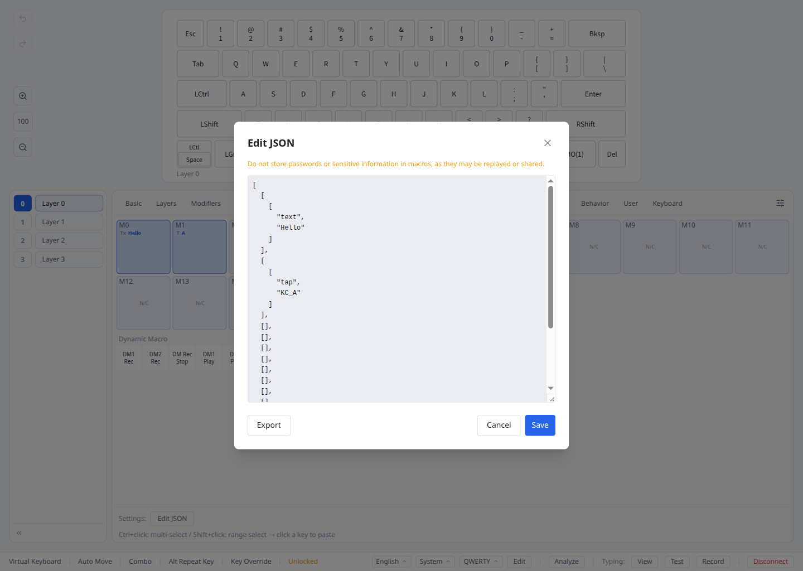

For Macros, a warning is displayed indicating that keyboard unlock is required to save changes.

> **Note**: The JSON editor modifies all entries at once. Use with caution — invalid JSON will be rejected, but valid JSON with incorrect values may cause unexpected behavior.

> **Note**: Favorites are not tied to a specific keyboard — saved entries can be loaded on any compatible keyboard. When Cloud Sync is enabled, favorites are also synced across devices (see §6.1). Favorites can also be managed from the Data modal on the device selection screen (see §1.3).

---

## 6. Editor Settings Panel

Open the editor settings panel from the save button (floppy disk icon) in the keycode tab bar, or use the Save tab in the Keycodes Overlay Panel (§3.14).

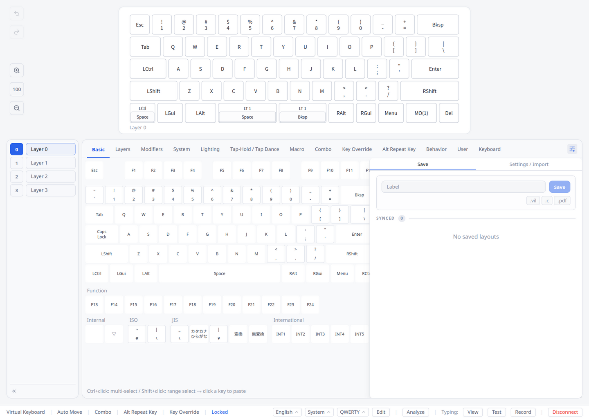

The editor settings panel now provides a single **Save** panel with the following features:

- **Export Current State**: Download keymap as `.vil`, `keymap.c`, PDF keymap cheat sheet, or PDF layout export (key outlines with summary pages for Tap Dance, Macro, Combo, Key Override, and Alt Repeat Key entries). An "Exported" inline feedback message appears after a successful export.
- **Save Current State**: Save a snapshot of the current keyboard state with a label. Enter a name in the Label field and click Save. If the Label field is left empty, the Save button is disabled. Saved snapshots appear in the Synced Data list below and can be loaded or deleted later
- **Synced Data**: List of saved snapshots. Click to load, rename, or delete entries
- **Reset Keyboard Data**: Reset keyboard to factory defaults (use with caution)

> **Note**: Tool settings (auto advance, key tester, security) are in the Keycodes Overlay Panel (§3.14). Keyboard layout is available in the status bar quick settings (§9); Basic tab view type is selectable at the bottom of the Basic tab. Zoom is available in the toolbar (§4.1). Layer settings are managed directly via the layer panel on the left side of the editor.

### 6.1 Cloud Sync (Google Drive appDataFolder)

Pipette can sync your saved snapshots, favorites, and per-keyboard settings across multiple devices via Google Drive.

Sync is configured in the **Settings** modal (gear icon on the device selection screen), under the **Data** tab:

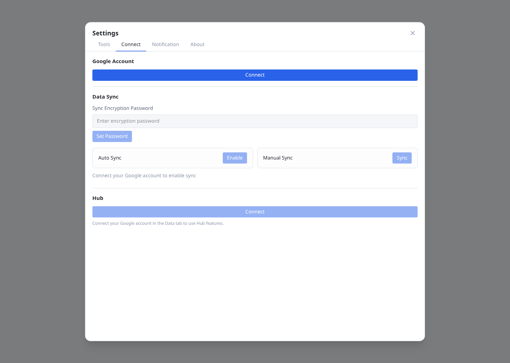

The Data tab contains the following sections: Google Account, Data Sync, and Pipette Hub. Additional troubleshooting and data management options are available in the Data panel (§1.3).

#### Google Account

- Click **Connect** to sign in with your Google account
- Click **Disconnect** to sign out. If Pipette Hub is also connected, a warning confirms that Hub will be disconnected as well

#### Sync Encryption Password

- Set a password to encrypt all synced data (required). A strength indicator helps you choose a strong password
- If a password already exists on the server (set from another device), a hint is shown asking you to enter the same password
- **Change Password**: Click **Change Password** to re-encrypt all synced files with a new password. No data is deleted — existing files are decrypted and re-encrypted in place

**Change Password error conditions**

When a password change cannot proceed, Pipette shows a localized message instead of the raw error. The common cases are listed below; other underlying errors (network, Drive) may appear as their own messages.

Credential failures (the 5 reasons come from the same typed `SyncCredentialFailureReason` set used for readiness — only 3 of them surface in **Sync Status** below):

| Reason | Message | Trigger |
|--------|---------|---------|
| `unauthenticated` | "Please sign in to Google before changing the password." | Not signed in with Google |
| `noPasswordFile` | "No saved password to change. Set a password first." | No local sync password has ever been set |
| `decryptFailed` | "Couldn't read the existing password (OS keychain rejected it)." | The OS keychain entry is unreadable (keychain reset, profile move, etc.) |
| `keystoreUnavailable` | "OS keychain is not available; password cannot be changed here." | `safeStorage.isEncryptionAvailable()` returns false (typical on headless Linux without a keyring) |
| `remoteCheckFailed` | "Couldn't reach Google Drive to verify the current password." | Network or Drive outage — retry later |

Operational errors (shown as the message directly, no reason code):

| Message | Trigger |
|---------|---------|
| "Cannot change password while sync is in progress." | A sync is already running — wait for it to finish |
| "New password must be different from the current password." | The new password matches the existing one |
| "Some files cannot be decrypted. Please scan and delete undecryptable files first." | Drive has files the current password cannot decrypt — delete them first via the Data panel's **Sync › Cloud Data** (§1.3) |
| "Sync password does not match. Please check your encryption password." | The current password fails to decrypt the remote password check — reconfirm the password you are providing |

#### Sync Controls

- **Auto Sync**: Toggle automatic sync on or off. When enabled, changes sync automatically with a 10-second debounce and periodic 3-minute polling
- **Sync**: Manually sync favorites and connected keyboard data. Only favorites and the currently connected keyboard are synced (not all keyboards)

#### Sync Status

- Displays current sync progress with the sync unit name and an item counter (current / total)
- Shows error or partial-sync details if any units failed

**Readiness reasons**

If sync cannot run because the client is not ready, a specific readiness reason is shown in place of the generic "Not synced yet" label. Only three reasons surface here; detailed keystore failures (`decryptFailed`, `keystoreUnavailable`) come through the password set/change flow instead.

| Reason | Message |
|--------|---------|
| `unauthenticated` | "Sign in to Google to sync." |
| `noPasswordFile` | "Set a sync password to start syncing." |
| `remoteCheckFailed` | "Couldn't reach Google Drive — sync is paused." |

#### Sync Unavailable Alert

- Displayed when the sync backend cannot be reached. Click **Retry** to attempt reconnection

#### Data Storage

Synced data is stored in [Google Drive appDataFolder](https://developers.google.com/workspace/drive/api/guides/appdata) — a hidden, app-specific folder that only Pipette can access. Your personal Drive files are never touched.

See the [Data Guide](Data.md) for details on what is synced and how your data is protected.

#### Data Management

Troubleshooting and data management functions are available in the **Data** panel (see §1.3):

- **Local > Application**: Import/export local data, or reset application settings
- **Sync**: List remote-only keyboards by real name and download any one on demand, plus reset global (non-keyboard) targets and delete undecryptable files under **Sync › Cloud Data** (see §1.3)

#### Settings — Defaults

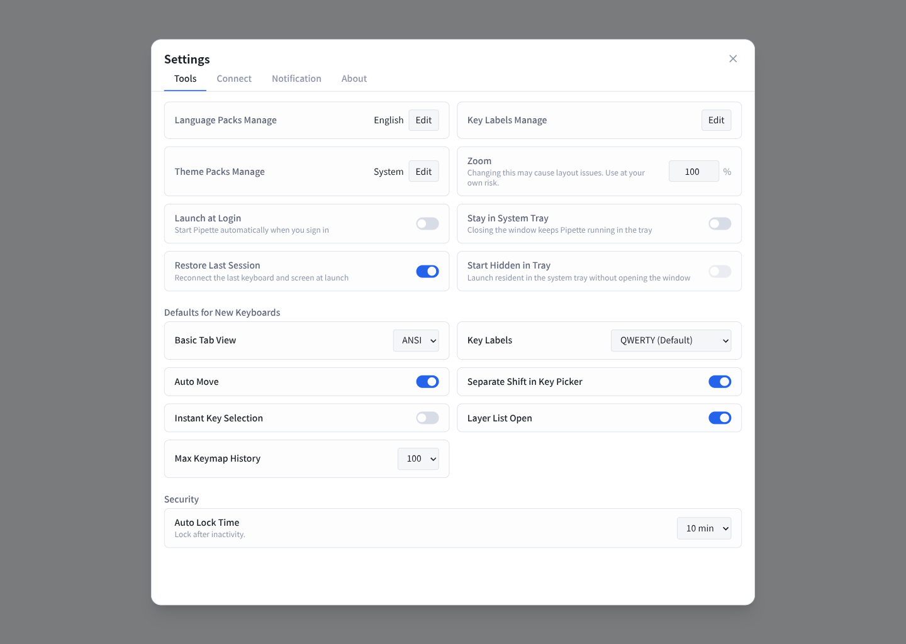

The Tools tab in the Settings modal includes a **Defaults** section for setting initial preferences for new keyboard connections:

- **Keyboard Layout**: Default key labels for new keyboards. The dropdown lists every entry currently installed in the **Key Labels** store (see §6.2). **QWERTY (Default)** ships built-in; install more from Pipette Hub or import a `.json` via **Key Labels Manage**. The drop-down preserves the manual order set in the modal — drag a row up or down there and the dropdown follows
- **Auto Move**: Default auto-advance behavior
- **Instant Key Selection**: Default instant key selection behavior (see §2.2)
- **Layer Panel Open**: Whether the layer panel starts expanded or collapsed
- **Basic View Type**: Default view type for the Basic tab (ANSI/ISO/JIS/List)
- **Separate Shift in Key Picker**: Default setting for separating Shift in the key picker
- **Max Keymap History**: Maximum number of keymap changes to keep in the current keyboard's edit history (default: 100). History is cleared on disconnect or keyboard switch. See §4.2 for details.

### 6.2 Key Labels Manage

The Tools tab also exposes a **Key Labels Manage** row (next to the Language Packs row). Click **Edit** to open the Key Labels modal, which manages every label set the app uses to render keycaps in the editor, the Analyze view, and the Layout Comparison.

QWERTY is built-in; every other label set (Dvorak, Colemak, French, Brazilian, …) is downloaded from Pipette Hub or imported from a local `.json` file. Installed entries sync across devices via Cloud Sync, so the same drag order and selection appear on every machine signed into the same account.

**Delete removes the Hub post too, for entries you uploaded.** If the entry you delete is linked to a Hub post you own, Delete also takes that post down from Hub — the local copy and the shared upload disappear together, in one action. If the Hub side fails (for example, no network), the local entry is **not** deleted either — an error is shown under the row and the entry stays put so you can try Delete again. A **downloaded** entry (someone else's upload) deletes locally only, even though it still shows Author/Sync — there's no Hub post of yours to remove, so Delete never makes a Hub call for it. Use **Remove** (in the Hub actions row) instead if you only want to detach your own local copy from Hub while keeping both the local entry and the Hub post — Remove never touches the local copy.

**Installed tab**

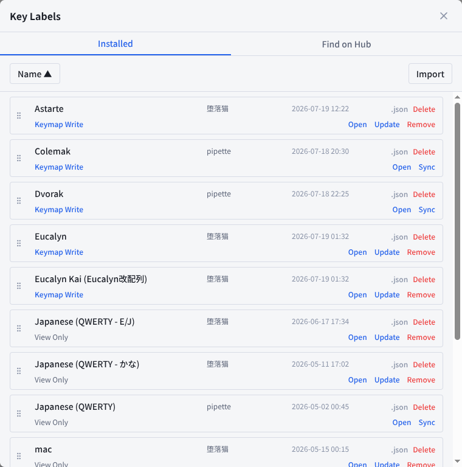

Lists every label set already on this device. Each row shows the label name, the uploader name (when the entry came from Hub), the Hub-side last-update time (`YYYY-MM-DD HH:mm`, mirrors what the Hub website displays), an `.json` export shortcut, and a Delete button. Drag the grip handle on the left to reorder rows — the order is propagated to the Settings dropdown and to every Key Labels picker in the editor. A **Name** button at the left of the toolbar (opposite Import) sorts the list alphabetically instead — click once for ascending, click again for descending; each click applies the new order immediately, the same way a manual drag would, so drag, dropdowns, and sync all stay consistent.

The Name button has three states: ascending (▲) and descending (▼) each show a triangle for as long as that sort still matches the list's order, and a plain "Name" with no triangle once the order no longer matches either sort — which happens the moment you drag a row by hand. There is no button click that returns to a triangled state; only another click (re-applying asc/desc from scratch) or reopening the modal does.

The **Import** button accepts **one or more** `.json` files at once (the system file picker's native multi-select). While an import is running, every list action — Delete, Sync/Update/Remove, rename, drag reorder, Name sort, and Import itself — locks, and the toolbar shows an **Importing…** indicator in place of the Name-button feedback. For a **single** file (or a Hub download): while a triangle is showing, the new entry is inserted at its correct alphabetical position instead of added to the bottom of the list; re-importing over an existing label (same name) is treated as an update and keeps that label's current position. Either way, a brief "Imported {name}" / "Updated {name}" message appears next to the Name button for a few seconds, and the affected row scrolls into view. For a **batch of two or more** files, the toolbar shows a summary instead once the batch finishes — "Imported N files (success N, failure N)" — with no per-name feedback and no row auto-scrolled or auto-selected.

A second line under each row starts with a **Keymap Write** / **View Only** type label, then the Hub actions:

- **Keymap Write** / **View Only**: whether this label set also qualifies to bulk-rewrite the keymap (see **Applying a Key Label to the Keymap** below) — the same eligibility check the footer's Keyboard Layout select tags each option with. QWERTY always shows **View Only**, since its map is never `keymapApplicable`
- **Open**: open the entry's Hub page in the system browser (only when the row is linked to a Hub post)
- **Upload**: publish a new Hub post from this local entry (only for entries that have not been uploaded yet)
- **Update**: push the current local content to the existing Hub post (owner only)
- **Sync**: pull the latest Hub content into this local entry without losing the local rename or drag position (shown for downloaded entries you do not own). A **pulsing green dot** appears next to the Sync button when the Hub-side post is newer than your local cache — opening the modal triggers a bulk freshness check (throttled to once per 5 min) so you can spot updates without manually clicking each row
- **Remove**: take the post down from Hub. Confirms inline before running

If the Hub freshness check finds a row whose post has been deleted upstream, the Updated column reads **`(removed)`** in red instead of a timestamp; clicking Sync on such a row will fail because the Hub no longer serves it.

QWERTY shows its **View Only** type label but no Hub actions, and cannot be deleted — though it can still be reordered like any other row.

**Find on Hub tab**

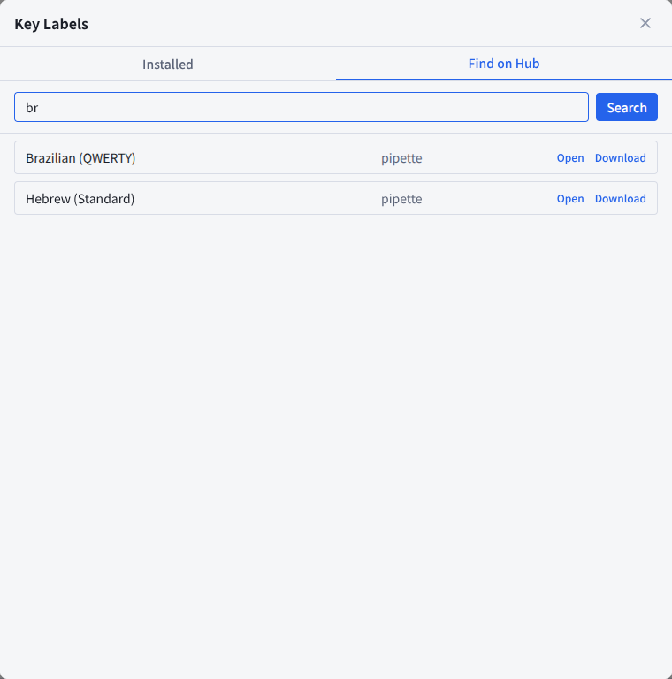

Searches Pipette Hub for label sets. Type 2 or more characters to start an automatic search (debounced); the **Search** button and **Enter** still work as manual triggers. Results are listed alphabetically by name. Results show the label name, the uploader, and either a **Download** action or an **Installed** marker when the same name is already present locally. Re-importing a file with a name that already exists overwrites the local entry in place (`.json` content replaced, the Hub link is preserved).

**Authoring a Key Label**

A Key Label `.json` file is a small JSON object with three fields:

```json
{
  "name": "Brazilian (QWERTY)",
  "map": {
    "KC_2": "2\n@",
    "KC_3": "3\n#",
    "KC_LBRC": "´\n`",
    "KC_QUOT": "ç",
    "KC_GRAVE": "KC_LALT"
  },
  "compositeLabels": {
    "LSFT(KC_2)": "@",
    "LALT(KC_L)": "KC_LALT"
  }
}
```

In the example above, `"KC_GRAVE": "KC_LALT"` makes the editor render whichever cap is currently bound to `KC_GRAVE` with the canonical "LAlt" legend — the value is a keycode id, so `keycodeLabel()` resolves it on the fly.

| Field | Required | Purpose |
|------|:--:|---------|
| `name` | Yes | Display name shown in the modal, in the Settings → Defaults dropdown, and in the Keycodes Overlay Panel |
| `map` | Yes | `QMK keycode id → label string`. Used as the keycap legend in the Keymap Editor whenever this label set is active |
| `compositeLabels` | No | Same shape as `map`, but for composite keycodes (e.g. `LSFT(KC_2)`, `LT(0,KC_A)`, `MT(MOD_LCTL,KC_ESC)`). Used to override the inner / outer text of the composite key. Omit the field if you don't need any composite override |
| `keymapApplicable` | No | Optional boolean. Opt-in marker meaning this label set is a pure QWERTY-keycode permutation (e.g. Colemak, Dvorak) and can also be used to bulk-rewrite the actual keymap, not just the display legends — see **Applying a Key Label to the Keymap** below. Omit or set `false` for label sets that aren't a clean 1:1 character swap (multi-line shift/altgr legends, keycode-passthrough values, non-Latin layouts, …) |

You don't need a `compositeLabels` entry just to have a composite key's inner (tap/base) symbol reflect your pack: a plain `map` entry for the inner basic keycode already applies there too — `"KC_8": "(\n8"` shows `(` over `8` both for a plain `KC_8` key **and** for the tap/base half of `LSFT(KC_8)`, `LT1(KC_8)`, etc. `compositeLabels` is only needed when the composite as a whole should show something different from that automatic inner substitution (e.g. a custom combined legend, or overriding just the outer/modifier half).

A value can also be a plain QMK keycode id — the editor passes it through `keycodeLabel()` so something like `"LALT(KC_L)": "KC_LALT"` resolves to the canonical "LAlt" label without you having to spell the legend out by hand. The same shortcut works in `map`, so `"KC_8": "KC_LALT"` would render the cap as "LAlt".

The label string controls how the legend is rendered. Lines are separated by `\n` and the layout is chosen by part count:

| Parts | Layout | Example |
|------|--------|---------|
| 1 | Centred (existing behaviour) | `"8"` |
| 2 | Stacked top / bottom | `"(\n8"` → `(` over `8` |
| 3 | Three horizontal slices (top / middle / bottom) | `"a\nb\nc"` |
| 4 | 2 × 2 quadrants — top-left, top-right, bottom-left, bottom-right | `"1\n2\n3\n4"` →`1\|2 / 3\|4` |
| 5+ | Excess parts beyond 4 are dropped |  |

An empty string between separators leaves the corresponding slot blank, so `"1\n2\n\n4"` renders as:

```
1 | 2
-----
  | 4
```

Composite keycodes (LT, MT, modifier+key, …) render the inner key inside an inset rectangle that occupies the lower half of the cap, so only the first two `\n` parts of the outer label are honoured. Parts 3 and 4 are silently dropped to avoid colliding with the inner rect.

`name` is also the uniqueness key inside the local store: importing a `.json` whose name already exists overwrites the matching entry in place (the Hub post link, if any, is preserved). To start a brand-new entry, change the `name` before importing.

**Applying a Key Label to the Keymap**

Switching the **Keyboard Layout** dropdown in the footer never opens a dialog by itself — it always just changes the display. For a label set marked `keymapApplicable` whose map is a clean, closed QWERTY permutation (Colemak, Dvorak, Eucalyn, …), picking it also reveals two vertical index tabs attached to the right edge of the Keymap Editor:

- **The pack's own name** (top) — a read-only *simulation* of that pack's legends, with the changed keys tinted the **simulated** colour (`key-label-simulated`). Nothing here is clickable: no key selection, no popover, no multi-select, no picker paste — this tab exists purely to preview what a Rewrite would produce
- **QWERTY (Default)** (bottom) — the real keymap, unaffected by the selected pack, fully editable exactly as before

The simulation tab is selected by default whenever the tabs appear. Switching keyboards resets the selection back to the simulation tab; switching only layers or picking a different pack does not.

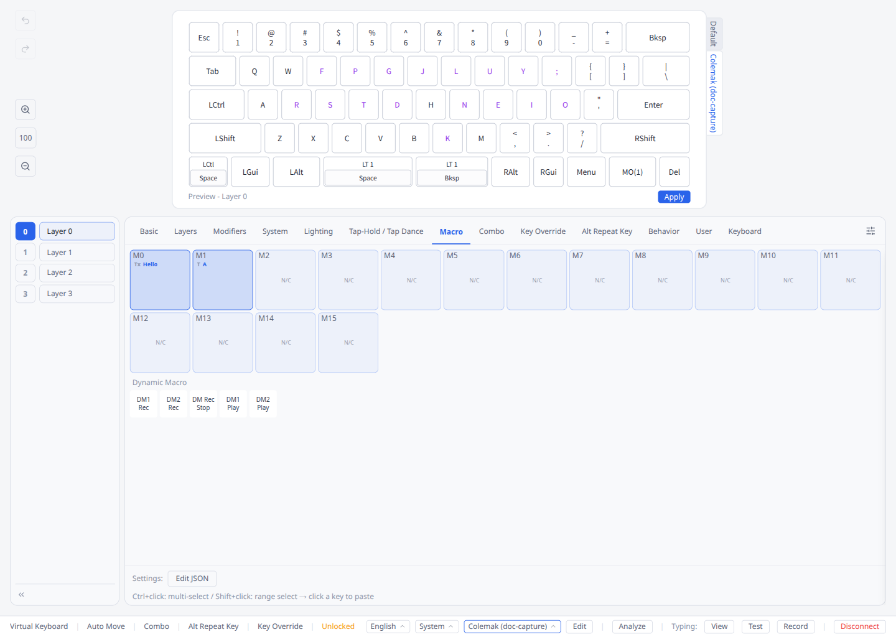

**The layer-indicator row reads "Preview - Layer N" while the simulation tab is active** (e.g. "Preview - Layer 0"), so it stays visually distinct from the plain "Layer N" label the Default tab and every other keymap view use. **Apply lives at the right end of that same row** — an **Apply** button that opens the Rewrite confirmation dialog:

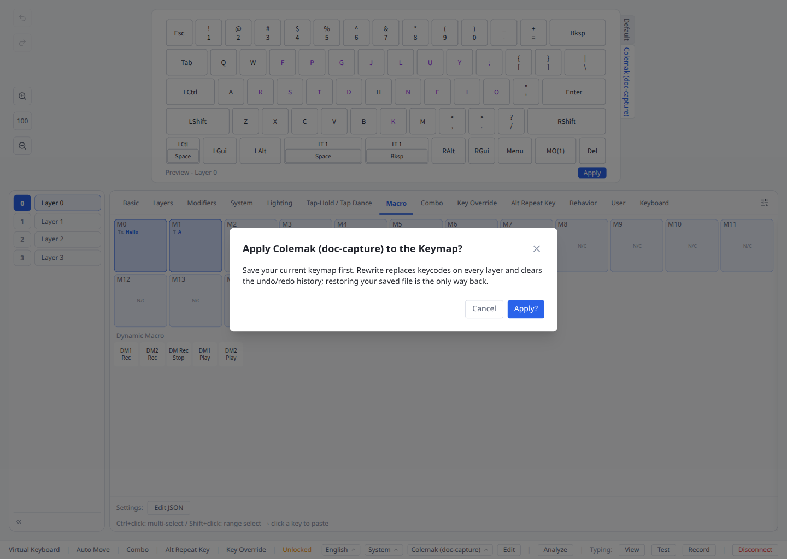

- **Apply?** — a destructive one-shot: bulk-rewrites every layer's keycodes (and encoders, where applicable) to match the label set, then clears the undo/redo history outright. It is not recorded as an Undo step — there is nothing to revert afterward, on the same undo/redo stack or any other
- **Cancel** — closes the dialog without changing anything; the simulation/QWERTY (Default) tabs stay exactly as they were

The dialog also shows a save recommendation: back up the current keymap first, before confirming. Rewrite replaces keycodes on every layer and clears the undo/redo history in the same stroke, so a previously saved backup is the only way back to the pre-Rewrite keymap (see **Limitations** below).

After a successful Rewrite, the keys that were actually changed briefly flash the same blue used for key selection before fading back, so you can see at a glance what changed.

**A successful Rewrite (or one that finds nothing left to change) resets the Keyboard Layout dropdown back to QWERTY (Default), and the tabs disappear.** The keycap legends switch to the raw, untranslated keycode each key now actually sends, with no remap colouring — the same clean, undecorated state a snapshot / `.vil` restore leaves. Picking that same arrangement again afterward brings the tabs right back, since the dropdown no longer has any record of what was last rewritten.

**The picker only follows the active label set for JIS-type/deviation packs.** A label set that qualifies as a clean, closed QWERTY permutation (the same eligibility check that gates the simulation tabs above) only swaps *which* key sends a given character, and every one of those characters already appears somewhere in the picker — so the picker intentionally keeps its standard legends regardless of which tab is active. A label set that doesn't qualify (JIS shift-pair legends, kana, any partial/non-closed swap) has no tabs at all: picking it converts both the Keymap Editor and the key picker's legends in place, tinted the **actual** colour (`key-label-remap`) — a truthful legend, since the key really does produce what's shown. A theme pack can define its own `key-label-simulated`; if it doesn't, Pipette derives one automatically from that pack's `key-label-remap` (see §6.4 below).

**QWERTY (Default) is always display-only.** Selecting it from the dropdown never touches the keymap and never shows any tabs — it only switches which legends are shown, back to raw and uncoloured. There is no "restore rewrite" offered by picking it; once a Rewrite has landed, only a previously saved `.vil` file or snapshot can bring back the keymap it replaced (see **Limitations** below).

**Rewriting directly from a keymap that already holds a different rewritten arrangement applies the newly picked table as-is, without composing against what came before.** Because a Rewrite always applies the target's own QWERTY-baseline table directly against whatever keycodes the keymap currently holds, rewriting a second time onto a keymap that isn't actually still QWERTY underneath (for example because an earlier Rewrite, or hand edits, already changed it) can produce the wrong result — and there is no Undo left to fall back on once it lands, since a Rewrite already clears the undo/redo history in the same step. **Reload a saved QWERTY backup before rewriting to a different arrangement**, so the target table is always applied against the QWERTY baseline it was designed for; this is exactly what the confirm dialog's save recommendation is for.

The desktop app always re-validates the map itself before offering the tabs/Apply, even when `keymapApplicable` is set in the file — a label set with shift-pair legends, non-Latin characters, keycode-passthrough values (like the `"KC_GRAVE": "KC_LALT"` example above), or a map that isn't **closed** (every replacement character's key must itself remap somewhere, even if only back to itself — a map that sends key A's character to key B but never says what key B should now send would duplicate one character and lose another) fails validation, and picking it behaves exactly like a JIS-type deviation pack (or a plain unflagged label set): a truthful in-place conversion, no tabs, no Apply.

**Selecting a different pack — or picking QWERTY (Default) — while the confirm dialog is open closes the dialog instead of letting it act on a keymap you've already moved away from.** The dialog always concerns the pack that was active when Apply was pressed; changing the selection underneath it discards the pending request.

**Limitations**

- **Rewrite cannot be undone.** The moment any key is actually rewritten, Pipette clears the undo/redo history instead of adding a revertible step — there is no Undo entry for a Rewrite, clean or partial, and manual edits made afterward simply start a fresh history from scratch. The only way back to the pre-Rewrite keymap is a previously saved `.vil` file or snapshot; this is exactly why the confirm dialog recommends saving one first.
- Manual per-key edits made before a Rewrite are skipped by its safety check: it only touches a position whose keycode is still part of the arrangement's own QWERTY-baseline permutation, so a key you've already edited by hand to something outside that set is left alone.
- If a Rewrite fails partway through (e.g. a device write error), the keymap is left in a mixed state — some positions rewritten, some not — and the Keyboard Layout dropdown's selection (and the tabs) are left exactly as they were (it does not reset to QWERTY (Default), since the keymap now matches neither arrangement). The undo/redo history is still cleared if any key was actually written before the failure, so recovery is again a previously saved backup, not Undo.

On Pipette Hub, the flag round-trips as `keymap_applicable` in the upload / download body alongside `map` and `composite_labels`.

### 6.3 Language Packs Manage

The Tools tab shows a **Language Packs** row displaying the currently active UI language. Click **Edit** to open the Language Packs modal.

English is built-in; every other language is imported from a local `.json` file or downloaded from Pipette Hub. Installed packs sync across devices via Cloud Sync. Hub-linked packs are automatically checked for updates at app startup and refreshed silently when newer versions are available.

**Installed tab**

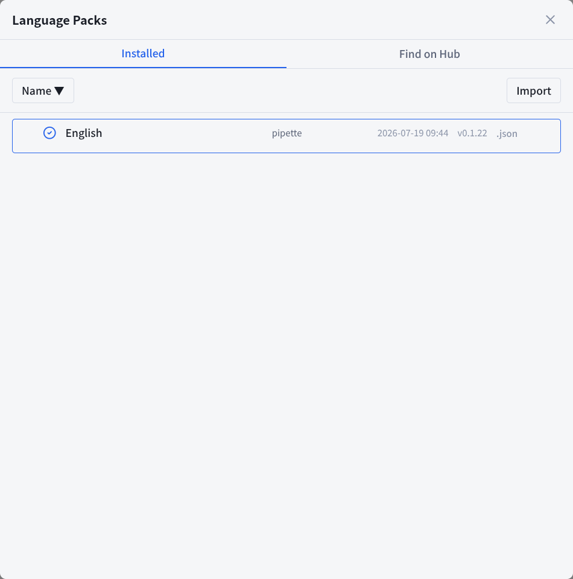

Lists every language pack on this device. Each row has a **check circle** on the left — click it to switch the active UI language immediately. The active row is highlighted with an accent border. A drag grip sits at the left edge of every row, including built-in English — it can be dragged and reordered like any imported pack (its translations still ship with the app; only its position in the list lives in the pack store).

Each row shows:

- **Name** (click to rename inline)
- **Author** — the uploader's name when the pack came from Hub, blank for local-only packs. Built-in English always shows "pipette"
- **Updated timestamp** (`YYYY-MM-DD HH:mm`) — the Hub-side last-update time, mirroring what the Hub website displays; blank until the pack has been uploaded. Built-in English shows its own build date instead, since it isn't a Hub-linked pack
- **Version** chip when the pack covers every key of the current English baseline, or a **not set keys** button that opens a modal listing the missing translation keys
- **Export** / **Delete** actions on the first line
- **Open** / **Upload** / **Update** / **Sync** / **Remove** Hub actions on the second line (same pattern as Key Labels §6.2, including owner-only gating on Delete's Hub-post cascade as well as on Update/Remove)

A **pulsing green dot** next to the Sync button indicates that the Hub-side post is newer than the local copy (freshness check runs once per 5 minutes when the modal is open).

Drag the grip handle to reorder the list, including built-in English — the order syncs across devices and is reflected anywhere the pack list is used. A **Name** button at the left of the toolbar (opposite Import) sorts every row alphabetically instead, English included — click once for ascending, click again for descending.

The Name button's three states (ascending/descending triangle, or a plain "Name" once you drag a row by hand) and what happens on a **single**-file import or Hub download — the new pack is inserted at its correct alphabetical position while a triangle is showing, an overwrite of an existing pack keeps its position, and a brief "Imported {name}" / "Updated {name}" message appears next to the Name button with the row scrolled into view — work exactly as described for Key Labels (§6.2); downloading from Hub follows the same placement rule.

The **Import** button in the toolbar opens a file dialog that accepts **one or more** `.json` language packs at once. Re-importing a pack with the same `name` overwrites the existing entry. While the import runs, the list locks and the toolbar shows an **Importing…** indicator; a batch of two or more files shows a summary once it finishes — "Imported N files (success N, failure N)" — instead of the per-name feedback, and no row is auto-scrolled into view (see Key Labels §6.2 for the full behavior).

A **Pull from Google Drive** button sits next to Import (installed tab only). It runs a one-off download of every language and theme pack from Google Drive, so a pack another device already synced but this device hasn't seen yet shows up immediately, without waiting for the periodic background sync — it fails with an error if Cloud Sync isn't configured. The button shows a **Pulling…** state while it runs and disables during an in-flight import. The app also runs this same pull automatically, once, the first time a keyboard connects after Cloud Sync credentials are ready — after that first successful pull it doesn't run again automatically (a failure is retried on the next connection). Either path only affects language/theme packs — favorites, keyboard data, and other synced content are unaffected.

**Find on Hub tab**

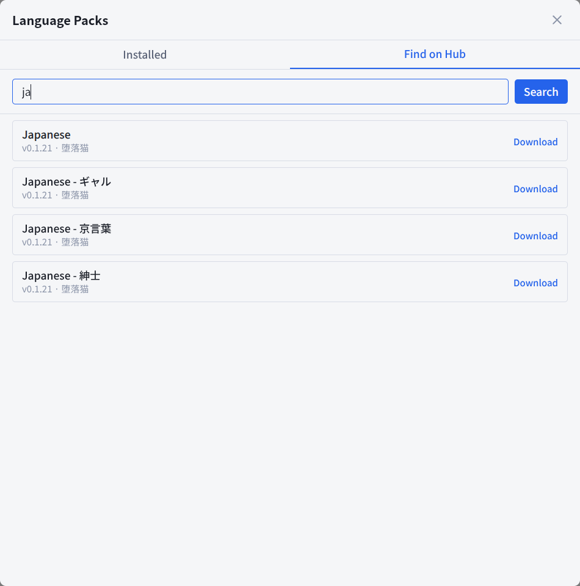

Searches Pipette Hub for language packs. Type 2 or more characters to start an automatic search (debounced). Results are listed alphabetically by name. Results show the pack name, version, uploader, and either a **Download** action or an **Installed** marker.

**Authoring a Language Pack**

A language pack `.json` mirrors the structure of the built-in English pack. Export the English pack (built-in row → Export) to get a template with every key, then translate the values:

```json
{
  "name": "Japanese",
  "version": "0.1.0",
  "common": {
    "save": "保存",
    "cancel": "キャンセル"
  },
  "editor": {
    "keymap": {
      "title": "キーマップ"
    }
  }
}
```

| Field | Required | Purpose |
|------|:--:|---------|
| `name` | Yes | Display name and uniqueness key for overwrite-on-import |
| `version` | Yes | Semver string (e.g. `0.1.0`) |
| (other keys) | Yes | Nested translation tree matching the English structure |

Keys use dot-separated namespaces (e.g. `editor.keymap.title`). A pack that covers every key of the English baseline shows the version chip; partial packs show a "not set keys" link so translators can see what remains. A standard Japanese pack, plus several Japanese "persona" variants (different speaking styles, translated from the same baseline), are shipped as example packs in the [`sample-packs/i18n/`](../sample-packs/i18n/) directory in the repository.

### 6.4 Theme Packs Manage

The Tools tab shows a **Theme Packs** row displaying the currently active theme pack (if any). Click **Edit** to open the Theme Packs modal.

Theme packs override the application's colour palette. The built-in Light / Dark / System themes remain available; a theme pack layers its colours on top. Installed packs sync across devices via Cloud Sync.

> **For theme pack authors:** See the [Theme Pack Authoring Guide](THEME-PACK-AUTHORING.html) for a complete colour token reference and design tips.

**Installed section**

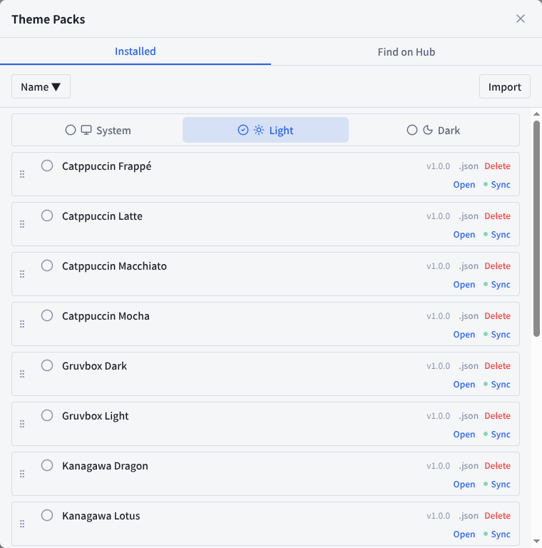

Lists every theme pack on this device. Each row has a **radio circle** on the left — click it to apply that theme pack immediately. Click the active row again to deselect it and revert to the built-in theme. The three built-in options (Light / Dark / System) appear as a separate selector bar above the list, not as rows in it, so they have no drag grip of their own.

Each row shows:

- **Name** (click to rename inline)
- **Author** — the uploader's name when the pack came from Hub, blank for local-only packs
- **Updated timestamp** (`YYYY-MM-DD HH:mm`) — the Hub-side last-update time, mirroring what the Hub website displays; blank until the pack has been uploaded
- **Version** chip
- **.json** export shortcut and **Delete** button on the first line
- **Open** / **Upload** / **Update** / **Sync** / **Remove** Hub actions on the second line (same pattern as Key Labels §6.2, including owner-only gating on Delete's Hub-post cascade as well as on Update/Remove)

A **pulsing green dot** next to the Sync button indicates that the Hub-side post is newer than the local copy (freshness check runs once per 5 minutes when the modal is open).

Drag the grip handle on the left of each row to reorder theme packs — the order syncs across devices. A **Name** button at the left of the toolbar (opposite Import) sorts the list alphabetically instead — click once for ascending, click again for descending.

The Name button's three states (ascending/descending triangle, or a plain "Name" once you drag a row by hand) and what happens on a **single**-file import or Hub download — the new pack is inserted at its correct alphabetical position while a triangle is showing, an overwrite of an existing pack keeps its position, and a brief "Imported {name}" / "Updated {name}" message appears next to the Name button with the row scrolled into view — work exactly as described for Key Labels (§6.2); downloading from Hub follows the same placement rule.

The **Import** button in the toolbar opens a file dialog that accepts **one or more** `.json` theme packs at once. Re-importing a pack with the same `name` overwrites the existing entry. While the import runs, the list locks and the toolbar shows an **Importing…** indicator; a batch of two or more files shows a summary once it finishes — "Imported N files (success N, failure N)" — instead of the per-name feedback, and no row is auto-scrolled into view (see Key Labels §6.2 for the full behavior).

A **Pull from Google Drive** button sits next to Import, with the same one-off download behavior (and the same automatic first-connection pull) described for Language Packs in §6.3 — a single pull refreshes both language and theme packs together.

**Find on Hub tab**

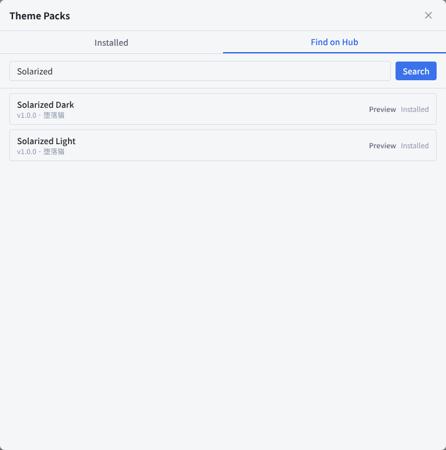

Searches Pipette Hub for theme packs. Type 2 or more characters to start an automatic search (debounced). Results are listed alphabetically by name. Each result shows the pack name, version, uploader, a **Preview** button, and either a **Download** action or an **Installed** marker.

Click **Preview** to temporarily apply the theme's colours without installing. The preview resets when you close the modal, switch to the Installed tab, or click **Preview** again to toggle it off.

**Authoring a Theme Pack**

A theme pack `.json` defines a `name`, `version`, and a `colors` object mapping every colour token to a CSS colour value:

```json
{
  "name": "Nord",
  "version": "1.0.0",
  "colorScheme": "dark",
  "colors": {
    "surface": "#2e3440",
    "surface-alt": "#3b4252",
    "surface-dim": "#272c36",
    "surface-raised": "#434c5e",
    "content": "#eceff4",
    "content-secondary": "#d8dee9",
    "content-muted": "#7b88a1",
    "content-inverse": "#2e3440",
    "edge": "#4c566a",
    "edge-subtle": "#3b4252",
    "edge-strong": "#d8dee9",
    "accent": "#88c0d0",
    "accent-hover": "#81a1c1",
    "accent-alt": "#5e81ac",
    "success": "#a3be8c",
    "warning": "#ebcb8b",
    "danger": "#bf616a",
    "pending": "#b48ead",
    "key-bg": "#3b4252",
    "key-bg-hover": "#434c5e",
    "key-bg-active": "#4c566a",
    "key-border": "#4c566a",
    "key-shadow": "rgba(0,0,0,0.3)",
    "key-label": "#eceff4",
    "key-sublabel": "#d8dee9",
    "key-label-remap": "#88c0d0",
    "key-label-simulated": "#b48ead",
    "key-bg-multi-selected": "#434c5e",
    "tab-bg-active": "#3b4252",
    "tab-text": "#7b88a1",
    "tab-text-active": "#eceff4",
    "picker-bg": "#2e3440",
    "picker-item-bg": "#3b4252",
    "picker-item-hover": "#434c5e",
    "picker-item-text": "#eceff4",
    "picker-item-border": "#4c566a"
  }
}
```

| Field | Required | Purpose |
|------|:--:|---------|
| `name` | Yes | Display name and uniqueness key for overwrite-on-import |
| `version` | Yes | Semver string (e.g. `1.0.0`) |
| `colorScheme` | Yes | `"light"` or `"dark"` — declares the intended brightness of the pack |
| `colors` | Yes | Object mapping colour tokens to CSS colour values (`#hex`, `rgb()`, or `hsl()`) |

35 colour tokens are required — export any installed pack (row → `.json`) to get a complete template. One additional token, `key-label-simulated` (the permutation-pack Display Only tint — see §6.2 above), is **optional**: if a pack omits it, Pipette automatically derives one from that pack's `key-label-remap` (a hue-rotated complement, clamped for readability against the pack's own `colorScheme`) so every pack still gets a distinct simulated tint even without authoring one by hand. Ready-to-use example theme packs (Kanagawa Wave / Dragon / Lotus and Solarized Light / Dark) are also available in the [`sample-packs/themes/`](../sample-packs/themes/) directory in the repository — every sample pack defines its own `key-label-simulated` explicitly.

### 6.5 Zoom (UI Scale)

The Tools tab shows a **Zoom** row below Theme Packs. This setting scales the entire application UI (50–200%).


- Enter a percentage value in the input field (50–200) and press **Enter** or click away to apply
- The zoom level takes effect immediately across all windows
- This is a machine-local setting — it is not synced to other devices via Cloud Sync

> **Note**: This is separate from the per-keyboard zoom in the toolbar (§4.1), which only scales the keymap editor display, and from the **Key Editor Zoom** in the Keycodes Overlay Panel (§3.14), which overrides the window zoom level while in key editor mode. The UI zoom here is the baseline applied on all other screens.

> **Warning**: Changing the zoom level may cause layout issues at extreme values. Use at your own risk.

### 6.6 Launch at Login / Stay in System Tray

The Tools tab shows four toggles below the Theme Packs and Zoom rows:

- **Launch at Login**: Start Pipette automatically when you sign in to the OS. On Windows and macOS this registers a login item; on Linux it manages an XDG autostart entry (`~/.config/autostart/pipette.desktop`). This works in installed (packaged) builds only — the toggle has no effect when running from source.
- **Stay in System Tray**: While ON, closing the window hides Pipette to the system tray and the app keeps running. Click the tray icon, or choose **Show** from its menu, to bring the window back. Hovering the tray icon shows a live tooltip: just `Pipette` when idle, `Pipette — {keyboard name}` once a keyboard is connected, and `Pipette — {keyboard name} — Cnt: X · KPM: Y` while Typing Record (§4.3) is recording. The tray menu itself is **Show**, a separator, the connected keyboard's name (when one is connected) — with **Recording** / **Cnt: N** / **KPM: N** rows added while recording — another separator, then **Quit**. Menu and tooltip labels are fixed English text for now, not translated.
- **Restore Last Session** (default ON): While ON, Pipette remembers the last keyboard you connected and automatically reconnects it the next time the app starts. Toggling this in Settings only affects the *next* launch — it never triggers a reconnect during the current session. Because the screen you were on is already remembered per keyboard, reconnecting also brings back the last screen you used with that keyboard. If the keyboard is not found within about 10 seconds of launch, Pipette gives up silently — no warning is shown, and the device selection screen stays as usual. Disconnecting a keyboard manually clears the remembered device.
- **Start Hidden in Tray**: While ON, Pipette launches resident in the system tray without opening the window. This requires **Stay in System Tray** — the toggle is disabled while Stay in System Tray is OFF, and turning Stay in System Tray OFF also turns this toggle OFF. If a session restore (see above) needs the Unlock dialog — including because Typing Record (§4.3) is on for a keyboard that reconnects locked — the window appears just for that dialog and hides again once it is resolved. Once you show the window yourself (e.g. from the tray icon), it stays open — Pipette never auto-hides a window you opened.

All four are machine-local settings — they are not synced to other devices via Cloud Sync.

---

## 7. Pipette Hub

[Pipette Hub](https://pipette-hub-worker.keymaps.workers.dev/) is a community keymap gallery where you can upload and share your keyboard configurations and favorite entries.

### 7.1 Hub Setup

Hub features require Google account authentication. Please complete Google account authentication first. Configure Hub in the **Settings** modal (gear icon on the device selection screen):

1. In the **Data** tab, click **Connect** under the Google Account section to sign in with your Google account
2. Scroll down to the **Pipette Hub** section in the same Data tab — it should show **Connected**
3. Set your **Display Name** — this name is shown on your Hub posts
4. Your uploaded keymaps appear in the **My Posts** list

### 7.2 Uploading a Keymap

To upload a keymap to Hub:

1. Connect to your keyboard and open the editor settings (gear icon in the keymap editor)
2. Switch to the **Data** tab
3. Save the current state with a label (e.g., "Default")

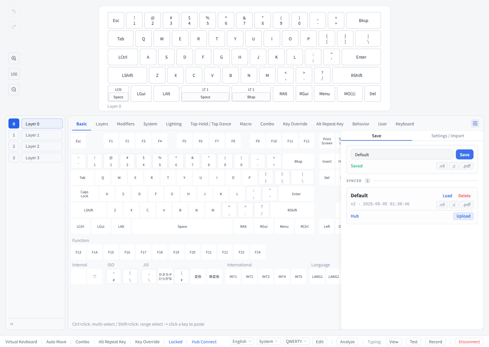

4. Click the **Upload** button on the saved snapshot entry
5. A confirmation dialog opens — choose **Public** or **Private** (see *Public vs Private* below), then click **Confirm**

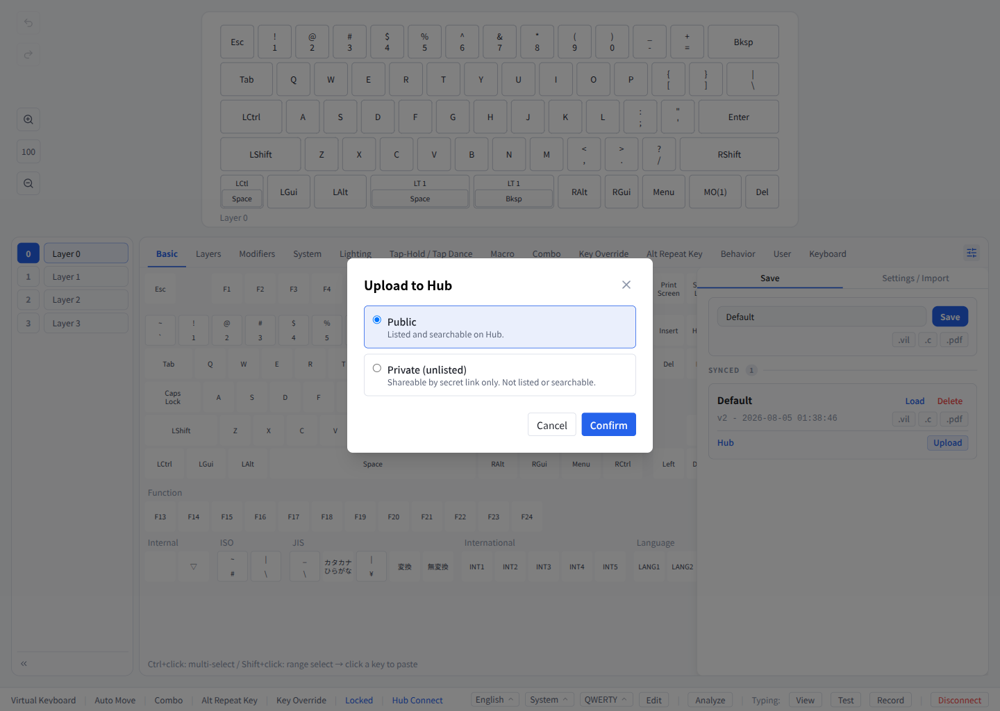

6. After uploading, the entry's Hub row is labelled **Hub (Public)** or **Hub (Private)** and shows **Open in Browser**, **Update**, and **Remove** buttons

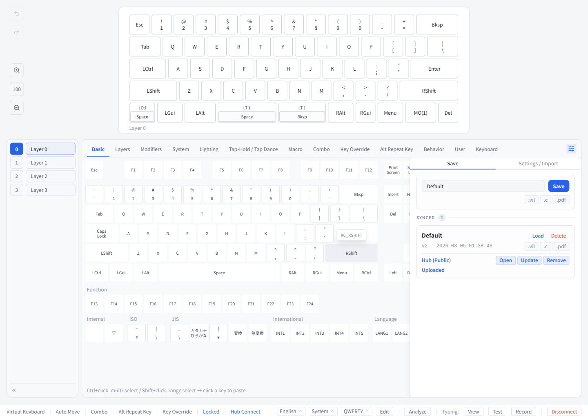

- **Open in Browser**: For a public post, opens its Hub page. For a private post, copies/opens the secret share link.
- **Update**: Opens the same confirmation dialog so you can re-upload **and** switch visibility (see below)
- **Remove**: Removes the post from Hub (the private link stops working immediately)

#### Public vs Private (Unlisted)

Every upload (and every **Update**) opens a confirmation dialog with two choices:

- **Public** — listed and searchable on Hub, just like before.
- **Private (Unlisted)** — reachable only by a secret link; never listed or searchable. When you pick Private you also choose a **link expiry** (1 / 3 / 7 / 30 / 60 / 90 / 180 days; default 7 days). Private links always expire — the maximum is 180 days. The dialog previews the exact expiry date. The private link is stored locally and synced across your devices, so **Open in Browser** can hand it out at any time.

**Switching visibility with Update.** Because a private post has no public page (and vice-versa), switching between Public and Private — or re-uploading a Private post — is performed as *delete + recreate*. This produces a **new share link and expiry**, so the dialog warns you before continuing. A plain Public → Public update keeps the same URL.

> **Note**: Hub uploads include a `.pipette` file alongside the standard export formats, allowing other users to load the full keyboard state directly.

### 7.3 Uploading Favorite Entries

Individual favorite entries (Tap Dance, Macro, Combo, Key Override, Alt Repeat Key) can also be uploaded to Hub:

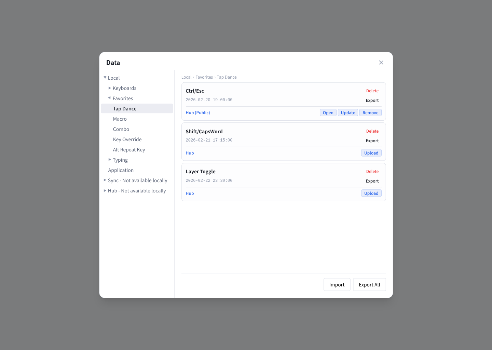

1. Open any editor modal with the inline favorites panel, or use the Data modal from the device selection screen
2. In the favorites list, each entry shows an **Upload to Hub** button when Hub is connected
3. Click **Upload to Hub** — the Public / Private confirmation dialog opens (see §7.2 *Public vs Private*)
4. After uploading, the row is labelled **Hub (Public)** or **Hub (Private)** with **Open in Browser**, **Update on Hub**, and **Remove from Hub** buttons (Update re-opens the dialog and can switch visibility)
5. Renaming a favorite that is uploaded to a public Hub post also updates the title on Hub automatically

> **Note**: A Display Name must be set before uploading. If no Display Name is configured, a warning is shown instead of the Upload button.

### 7.4 Uploading Analytics

Saved Analyze conditions can be uploaded to Hub, sharing your typing analytics charts with the community.

**Flow**

1. Open the Analyze page and set up the filters you want to share (keyboard, device, app, date range, keymap snapshot)
2. Save the condition with a label using the **Saved search conditions** panel (bookmark icon)
3. When Hub is connected, a **Hub** action row appears under each saved entry with an **Upload to Hub** button
4. Click **Upload to Hub** — the category-picker modal opens in upload mode (see §1.4 Export / Upload)
5. Select which chart categories to include, pick Layout Comparison targets and Per-app data if desired, then click **Upload**
6. The Public / Private confirmation dialog opens (see §7.2 *Public vs Private*); choose visibility (and, for Private, an expiry) and **Confirm**
7. After uploading, the entry's Hub row is labelled **Hub (Public)** or **Hub (Private)** with **Open in Browser**, **Update on Hub**, and **Remove from Hub** buttons

**Validation rules**

The Hub enforces two guards before accepting an analytics upload:

- **Minimum 100 keystrokes** in the saved range — sub-100-keystroke charts are too sparse to be useful
- **Maximum 30-day range** — longer ranges produce payloads that exceed the Hub size budget

If either rule is violated, a localized error message explains what to fix (e.g., shorten the range or record more typing).

**Upload-mode options**

- **Layout Comparison targets** — pick one or more alternative layouts to include. The Hub post will show how your typing would redistribute across each target. The toggle is disabled when no targets are selected
- **Per-app data** — choose which apps to include as per-app breakdowns. The Hub post renders per-app charts for the selected apps

**Update and Remove**

- **Update on Hub** re-uploads the latest chart data for the same saved condition (useful after more typing has been recorded)
- **Remove from Hub** deletes the analytics post from the Hub server (two-step confirmation)

**Error handling**

Upload errors are localized. Common cases: authentication failure (sign out and back in), payload too large (reduce categories or shorten range), rate limit (wait and retry).

> **Note**: A Display Name must be set before uploading. If no Display Name is configured, a warning is shown instead of the Upload button.

### 7.5 Hub Website

The [Pipette Hub website](https://pipette-hub-worker.keymaps.workers.dev/) displays uploaded keymaps in a gallery format.

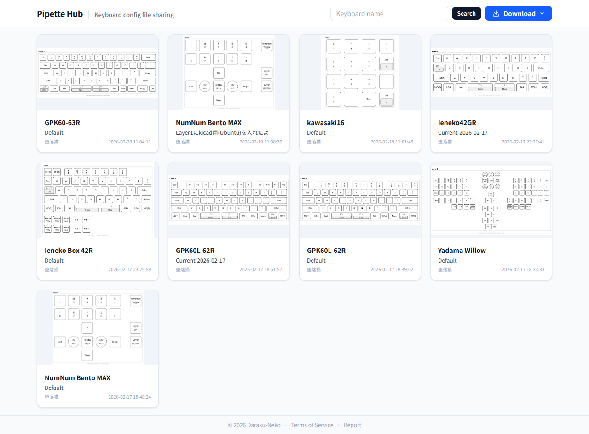

- Browse uploaded keymaps from the community
- Search by keyboard name
- Download keymaps as `.vil`, `.c`, or `.pdf` files

#### Individual Keymap Page

Clicking a keymap card opens the detail page with a full keyboard layout visualization.

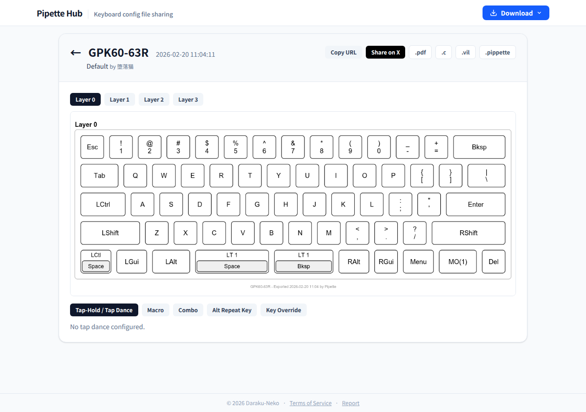

- View all layers (Layer 0–3) of the uploaded keymap
- Review Tap Dance, Macro, Combo, Alt Repeat Key, and Key Override configurations
- **Copy URL** or **Share on X** to share with others
- Download in various formats (`.pdf`, `.c`, `.vil`)

See the [Data Guide](Data.md) for details on how Hub authentication works.

---

## 8. Modal Interactions

Pipette applies a uniform set of keyboard and dismissal rules to every top-level modal (Settings, Data, Macro, QMK Settings, Tap Dance, Combo, Key Override, Alt Repeat Key, Notification, Language Packs, Theme Packs, Language Selector, Layout Store, Editor Settings, Favorite Store, and the History Toggle dialog).

### Escape to Close

Pressing **Escape** closes the modal, with the following exceptions so that Escape never interrupts text entry:

- If the focused element is an `<input>`, `<textarea>`, `<select>`, or anything inside a `contenteditable` region, Escape is ignored (the element receives it instead)
- During an IME composition (e.g., Japanese input), Escape is ignored so the composition can be cancelled without dismissing the modal

### Unlock Dialog Protection

The Unlock Dialog (prompting for a physical key press after a boot-unlock keycode is invoked) **intercepts Escape before it reaches the parent modal**. Pressing Escape on top of an unlock prompt cannot leak through, preventing accidental dismissal of a half-configured Settings or Data modal by rapid Escape presses.

### Escape Suppression During Busy Flows

Escape-to-close is disabled while the containing modal is in a transient state that must complete:

- **Settings / Data modals**: disabled while a sync / troubleshooting flow is running
- **Macro Modal**: disabled while the recorder is actively capturing keystrokes (see §3.7 Recording Lock); the backdrop click and top-right Close button are also inert at the same time

---

## 9. Status Bar

The status bar at the bottom of the screen shows connection information and action buttons.

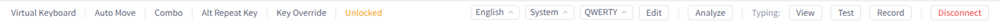

**Status indicators** (left side)

- **Device name**: Shows the name of the connected keyboard
- **Loaded label**: The label of the loaded snapshot (shown only when a snapshot is loaded)
- **Auto Move**: Status of automatic key advancement after assigning a keycode (shown only when enabled)
- **Locked / Unlocked**: Keyboard lock status (prevents accidental changes to dangerous keycodes)
- **Sync status**: Cloud sync status (shown only when sync is configured)
- **Hub connection**: Pipette Hub connection status (shown only when Hub is configured)
- **Recording**: Shown while Typing Record (§4.3) is active

**Quick Settings** (right side, shown when a keyboard is connected)

Inline selectors for common per-session preferences. A `|` separator divides them from the mode buttons.

- **Language**: Switch the UI language. Opens a dropdown of built-in languages and installed language packs (see §6.3)
- **Theme**: Switch the color theme. Options include System, Light, Dark, and any installed theme packs (see §6.4)
- **Key Labels**: Switch the key label set for the current keyboard. Options reflect the installed Key Labels store in drag order (see §6.2). Each option in the open dropdown carries a trailing **Write** / **View** tag — the short form of the Key Labels modal's **Keymap Write** / **View Only** type label — so you can tell which sets can bulk-rewrite the keymap before picking one
- **Edit / Done**: Toggle edit mode. Replaces the selectors with **Language Packs**, **Theme Packs**, and **Key Labels** management modal buttons for installing, syncing, or reordering entries

**Action buttons** (right side)

- **Key Tester**: Toggle button for Matrix Tester mode (requires matrix tester support; hidden when Typing Test is active)
- **Analyze**: Jumps straight to the Analyze page (§1.4) for the connected keyboard; hidden when Typing Test is active. Back returns to the editor
- **Typing:** — a labeled group of three buttons (requires matrix tester support):
  - **View**: Toggle button to enter view-only mode — a compact window showing only the keyboard layout (see §4.3). Hidden while Typing Test is active
  - **Test**: Toggle button for Typing Test mode
  - **Record**: Opens the **Recording Settings** modal (see **Typing Record**, §4.3)
- **Disconnect button**: Disconnects from the keyboard and returns to the device selection screen (hidden while Typing Test is active)
